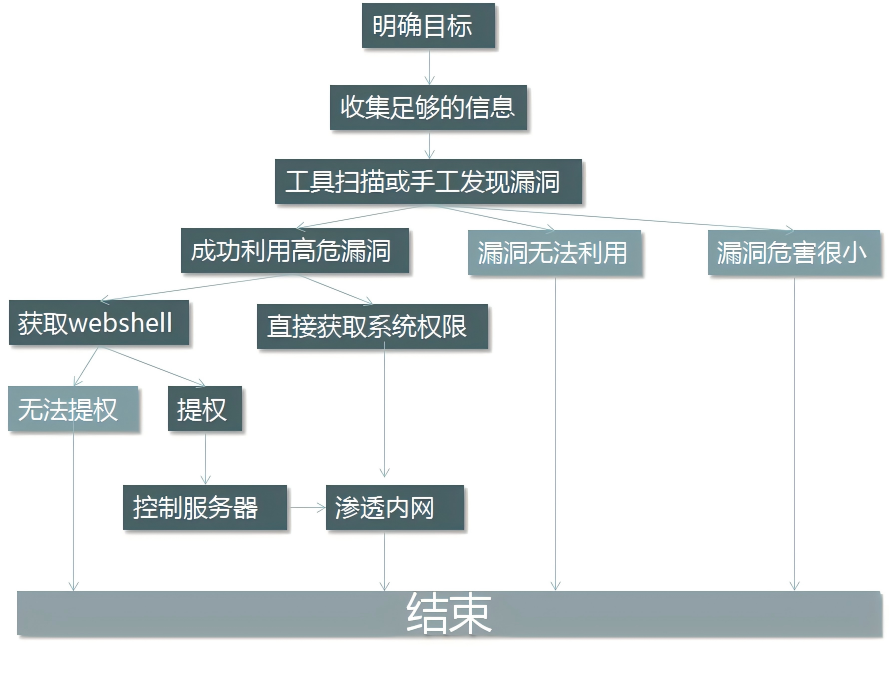

# Web服务

Web服务是一种基于互联网的标准化技术，允许不同平台、不同语言的应用程序通过网络协议相互通信和数据交换，是基于B/S架构的网页服务。生活中最常见的示例，使用浏览器访问百度的网站时，百度提供的就是一个Web服务。最常见的用于提供Web服务的软件包括httpd、Nginx、Tomcat等Web应用程序，HTTP（超文本传输协议）是Web服务最常用的底层传输协议

互联网上会描述Linux是专门提供服务的操作系统，但实际提供服务的并不是Linux系统本身，而是运行在Linux系统上的各种应用程序，Linux只是一个出于通用目的而设计的资源管理平台。需要注意的是，httpd是Web应用程序，而HTTP是网络传输协议，两者名称相似，但完全不是同一个概念

## 一、HTTP协议

### 1.1 http协议介绍

超文本传输协议（HTTP）是一个用于传输超媒体文档（例如 HTML）的应用层协议。HTTP遵循经典的C/S模型，客户端打开一个连接以发出请求，然后等待直到收到服务端端响应。HTTP是无状态协议，这意味着服务端不会在两个请求之间保留任何数据（状态）。尽管通常基于TCP/IP层，但它可以在任何可靠的传输层上使用，也就是说，该协议不会像UDP那样静默的丢失消息

1. 超文本

   包含有超链接（Link）和各种多媒体元素标记（Markup）的文本，这些超文本之间彼此链接，形成Web，因此又被称为网页（Web Page），这些链接用URL表示。HTML是最常见的超文本标记语言

2. URL

   HTTP 请求的内容通称为"资源"。"资源"这一概念非常宽泛，它可以是一份文档，一张图片，或所有其他你能够想到的格式。每个资源都由一个URI来进行标识。一般情况下，资源的名称和位置由同一个URL（统一资源定位符，它是 URI 的一种）来标识，URL由协议、主机、端口（默认为80）和文件路径四部分组成

### 1.2 URL的语法（URL）

Uniform Resource Locator，统一资源定位符

- **方案或协议**

  `http://`<span>w</span>ww.example.com:80/path/index.html?key1=value1&key2=value2#Document

  `http://`告诉浏览器使用何种协议。对于大部分 Web 资源，通常使用 HTTP 协议或其安全版本，HTTPS 协议。另外，浏览器也知道如何处理其他协议。例如， mailto: 协议指示浏览器打开邮件客户端；ftp:协议指示浏览器处理文件传输

- **主机**

  http://`www.example.com`:80/path/index.html?key1=value1&key2=value2#Document

  `www.example.com`既是一个域名，也代表管理该域名的机构。它指示了需要向网络上的哪一台主机发起请求。当然，也可以直接向主机的 IP address 地址发起请求

- **端口**

  http://<span>w</span>ww.example.com`:80`/path/index.html?key1=value1&key2=value2#Document

  `:80`是端口。它表示用于访问 Web 服务端上资源的技术“门”。如果访问的该 Web 服务端使用 HTTP 协议的标准端口（HTTP 为 80，HTTPS 为 443），则通常省略端口号

- **路径**

  http://<span>w</span>ww.example.com:80`/path/index.html`?key1=value1&key2=value2#Document

  `path/index.html` 是 Web 服务端上资源的路径。如果没有指定访问路径，那将会直接访问WEB服务端的根，此时服务端反馈到客户端的文件就是管理员指定的默认网页文件

- **查询**

  http://<span>w</span>ww.example.com:80/path/index.html`?key1=value1&key2=value2`#Document

  `?key1=value1&key2=value2` 是提供给 Web 服务端的额外参数。这些参数是用 & 符号分隔的键/值对列表。Web 服务端可以在将资源返回给用户之前使用这些参数来执行额外的操作。每个 Web 服务端都有自己的参数规则，想知道特定 Web 服务端如何处理参数的唯一可靠方法是询问该 Web 服务端所有者

- **片段**

  http://<span>w</span>ww.example.com:80/path/index.html?key1=value1&key2=value2`#Document`

  `#Document` 是资源本身的某一部分的一个锚点。锚点代表资源内的一种“书签”，它给予浏览器显示位于该“加书签”点的内容的指示。例如，在 HTML 文档上，浏览器将滚动到定义锚点的那个点上；在视频或音频文档上，浏览器将转到锚点代表的那个时间。值得注意的是 # 号后面的部分，也称为片段标识符，永远不会与请求一起发送到服务端

### 1.3 http工作原理

1. 用户输入域名->浏览器跳转->浏览器缓存->Hosts文件->DNS解析（递归查询|迭代查询）

   ```bash
   客户端向服务端发起查询->递归查询
   服务端向服务端发起查询->迭代查询
   ```

2. 浏览器向服务端发起TCP连接（三次握手）

   ```bash
   客户端 --> 请求包连接 syn=1 seq=x --> 服务端
   客户端 <-- 响应客户端 syn=1 ack=x+1 seq=y <-- 服务端
   客户端 --> 建立连接 ack=y+1 seq=x+1 --> 服务端
   ```

3. 客户端发起http请求

   ```bash
   1. 请求的方法：GET获取
   2. 请求的Host主机：www.baidu.com
   3. 请求的资源：/index.html
   4. 请求的端口：默认http是80、https是443
   5. 请求携带的参数：属性（请求的类型、压缩、认证、浏览器信息等）
   6. 请求最后的空行	
   ```

4. 服务端响应的内容

   ```bash
   1. 服务端使用的WEB服务软件版本
   2. 服务端响应请求文件的类型
   3. 服务端响应请求的文件是否进行压缩
   4. 服务端响应请求的主机是否进行长连接
   ```

5. 客户端向服务端发起TCP断开（四次挥手）

   ```bash
   客户端 -->断开请求 fin=1 seq=x          --> 服务端
   客户端 <--响应断开 fin=1 ack=x+1 seq=y  <-- 服务端
   客户端 <--断开连接 fin=1 ack=x+1 seq=z  <-- 服务端
   客户端 -->确认断开 fin=1 ack=z+1 seq=sj --> 服务端
   ```

### 1.4 访问网站分析

1. 浏览器分析超链接中的URL

2. DNS请求

   PC向DNS服务端发出DNS QUERY请求`www.qq.com`的A记录，DNS的A记录表示将域名绑定到IP

   

3. DNS回复

   DNS服务端回复DNS response，解析出`www.qq.com`域名对应的2条A记录

   

4. TCP三次握手

   PC获取到`www.qq.com`的IP地址后，向该IP发起TCP三次握手

   

5. HTTP GET请求

   在TCP三次握手的连接上，PC向`www.qq.com`服务端发起GET请求主页

   

6. 服务端响应

   `www.qq.com`服务端回应浏览器HTTP/1.1 200 OK，返回主页数据包

7. TCP四次挥手

   完成数据交互过程，TCP四次挥手断开连接

### 1.5 长连接与短连接

短连接：HTTP 1.0，一次TCP连接只能发起一次http请求

长连接：HTTP 1.1，在一次TCP连接中，可以发起多次http请求


打开百度的首页可以看到浏览器请求了58个资源，如果以短连接的方式发起58个requests，那需要发起58次TCP连接，而长连接仅需要在一次TCP连接里，发起58次http请求即可

HTTP 1.1 一次请求对应一次响应，HTTP 2.0 从串行请求变成了并行请求，批量执行请求与响应

### 1.6 http请求头示例

```bash
GET / HTTP/1.1
Host: www.baidu.com
User-Agent: Mozilla/5.0 (Windows NT 10.0; Win64; x64; rv:140.0) Gecko/20100101 Firefox/140.0
Accept: text/html,application/xhtml+xml,application/xml;q=0.9,*/*;q=0.8
Referer: https://mdsec.net/auth/488/Home.ashx
Accept-Language: zh-CN,zh;q=0.8,zh-TW;q=0.7,zh-HK;q=0.5,en-US;q=0.3,en;q=0.2
Accept-Encoding: gzip, deflate, br, zstd
Connection: keep-alive
Cookie: BAIDUID=56727D61545CCDB7BED1F2D2B31B6A4B:FG=1; BIDUPSID=56727D61545CCDB7790E200FC30...
Upgrade-Insecure-Requests: 1
Sec-Fetch-Dest: document
Sec-Fetch-Mode: navigate
Sec-Fetch-Site: none
Sec-Fetch-User: ?1
```

- GET：http的请求方法，用于从Web服务端获取一个URL资源。每个http请求的第一行都由以空格为间隔的3个项目组成，GET、POST是最常见的两种http方法，因特网上常用的http版本为1.1和2
- Referer：用于标识发起请求的原始URL。例如，用户从百度首页点击贴吧，会从百度首页跳转到百度贴吧的站点，此时Referer字段的值理论上就应该是百度首页的URL
- Host：访问的目标主机域名。Host字段是HTTP/1.1协议中强制要求的请求头字段，在HTTP/2协议中Host被替换为伪头字段authority，功能相同
- Accept：声明客户端浏览器支持的MIME类型。不同MIME类型直接通过`,`相隔，部分MIME类型尾部携带有q参数，例如`application/xml;q=0.9`，q参数表示权重（优先级），权重取值范围在0~1之间，默认为1（最高），表示100%的权重。从示例的http请求头中查看，客户端浏览器期望Web服务端最优先返回的是`text/html`类型的数据
- Accept-Encoding：声明客户端浏览器支持的压缩方式。部分场景下Web站点的数据可能会比较大，直接传输数据会比较占用网络带宽，现在很多主流的浏览器都已经支持压缩功能
- Accept-Language：声明客户端浏览器期望Web服务端响应的语言
- Upgrade-Insecure-Requests：声明客户端浏览器可以处理https请求。在http和https请求中承担一个过渡作用，该指令让浏览器自动升级请求从http到https，或者访问的https请求中又包含有其他的http请求，浏览器都能够处理
- User-Agent：用户代理用于标识http请求的软件类型、操作系统、版本等信息。一般情况下UA可以被用于解决不同版本的浏览器兼容性问题，服务端根据UA返回不同格式的页面，例如，移动端精简版、桌面完整版。早期不同版本的浏览器向服务端发起请求时，服务端根据浏览器的不同版本返回不同页面，例如，新版本的浏览器就返回更优雅页面，而旧版本的浏览器可能无法解析最新的页面，因此服务端会给旧版本的浏览器转发更简单的页面，如果旧版本的浏览器也想获取最新的页面，修改自身UA后再向服务端发起请求即可
- Cookie：客户端状态管理，Cookie是由服务端生成并发送到浏览器的一小块文本数据，浏览器会将其存储在本地，并在后续请求中自动附加该Cookie发送给同一域名下的服务端。Cookie可以用于记录用户登陆状态、用户偏好等信息，其生命周期也可以手动设置，简单一点理解，Cookie就像是服务端为客户端颁发的一个临时的身份证明
- X_FORWARDED_FOR：客户端使用代理或负载均衡的方式链接到服务端时，此参数用于显示客户端最原始的IP地址
- Authorization：客户端访问受保护的资源时，需要向服务端证明自身的合法身份和权限，通过Authorization字段向服务端提交认证凭据，例如账户密码、令牌等
- Origin：此字段主要用于跨域场景下标识请求的来源信息，应由协议（Scheme）、域名（Host）、端口（Port）三部分组成（如`https://example.com:8080`），用于明确请求的初始来源。跨域请求（Cross-Origin Request）指的是浏览器在访问一个URL时，该站点下运行的网页脚本（如JS、Ajax）尝试访问另一个域名，这违反了浏览器的同源策略（Same-Origin Policy），同源策略是浏览器最基本的安全机制，要求网页只能访问当前页面的协议、域名、端口完全相同的资源，例如`https://example.com/page1`与`https://example.com/page2`。默认情况下浏览器会拦截跨域请求的响应，除非目标服务端明确允许该跨域访问
- Fetch Metadata规范：于2019年由W3C发起的草案，被用于增强Web安全性并辅助服务端识别请求上下文，目前支持度还没有特别高，部分旧版本浏览器可能并不支持这些参数
  - Sec-Fetch-Dest：声明请求的目标资源类型，即客户端期望获得何种类型的资源。document表示HTML页面
  - Sec-Fetch-Mode：定义请求的网络模式，描述跨域策略。navigate表示页面导航、页面切换请求，并且给客户端的回复也应该是一个HTML的页面，navigate请求仅在浏览器切换页面时创建
  - Sec-Fetch-Site：标识请求来源与目标域名之间的关系，简单理解就是当前页面与上一页面之间的关系。例如，从百度首页点击网盘跳转到百度网盘，从域名上的变化来看，即从`www.baidu.com`到`pan.baidu.com`，理论上Sec-Fetch-Site的属性应该是same-site（同站点），但实际上其属性值是cross-site（跨站点），这可能与百度站点的代理配置有关。再例如，打开浏览器后在地址栏手动输入`www.baidu.com`，此时由用户直接触发，与上一页面没有任何关联，Sec-Fetch-site的属性值是none（用户直接触发，地址栏输入、书签跳转）
  - Sec-Fetch-User：标记导航请求是否由用户主动触发。此参数只有两个属性值，为?1时表示True，由用户主动触发，例如鼠标单击或键盘操作，值为?0是表示False，由浏览器自动跳转
  

### 1.7 http响应头示例


```bash
HTTP/1.1 200 OK
Bdpagetype: 1
Bdqid: 0xbc17941700431e44
Connection: keep-alive
Referer Policy: strict-origin-when-cross-origin
Content-Encoding: gzip
Content-Type: text/html; charset=utf-8
Date: Sat, 19 Jul 2025 13:23:32 GMT
Server: BWS/1.1
Set-Cookie: H_PS_PSSID=60279_62327_631...; path=/; expires=Sun, ...; domain=.baidu.com
Set-Cookie: BDSVRTM=8; path=/
Set-Cookie: BD_HOME=1; path=/
Strict-Transport-Security: max-age=172800
Traceid: 1752931412283933594613553464430104354372
X-Ua-Compatible: IE=Edge,chrome=1
X-Xss-Protection: 1;mode=block
```

- Connection：keep-alive表示在完成http传输后仍保持TCP连接状态。此参数被用于提高http交互的效率，在完成http传输后是可以断开TCP连接的，在产生新的http连接时再重新建立TCP连接即可，但TCP连接的建立需要经过三次握手，这就会影响http交互的效率

- Referrer Policy：指定Referrer的策略，此参数由服务端进行配置，默认情况下不启用此参数。将参数值设置为`strict-origin-when-cross-origin`时，对于同源的请求会发送完整的URL作为引用地址，此功能可以用于防盗链

- Content-Encoding：服务端内容的压缩格式。与请求头中的Accept-Encoding参数相呼应

- Content-Type：服务端内容MIME类型。与请求头中的Accept参数相呼应

- Server：服务端Web的程序版本

- Vary：用于指导代理服务端如何根据客户端的请求头信息缓存差异化内容。为了优化全国甚至全球不同地域的用户体验，Web服务端需要使用CDN技术加快客户端的访问速度，CDN技术一般只用于缓存Web站点的静态数据，并且CDN节点（即代理服务端）需要定时向Web服务端同步数据，Vary参数被用于设置数据同步的策略。例如，客户端的请求会先到CDN节点（即代理服务端），当客户端浏览器无法识别压缩数据时，就只能向客户端回复源码数据，这就需要CND节点上同时具备压缩数据和非压缩数据

- Set-Cookie：用于指示客户端存储指定的Cookie数据，并在后续请求中自动携带该数据发送回服务端。http协议本身无状态，无法区分连续请求是否来自同一用户，Set-Cookie通过在客户端存储标识信息（如Session ID），实现跨请求的状态跟踪。Set-Cookie的核心价值在于突破http无状态限制，通过客户端存储实现用户状态跟踪
  - Expires：用于设置Cookie的有效时间

  - Secure：此参数强制浏览器仅通过 HTTPS 加密连接传输 Cookie，防止数据在HTTP明文传输中被窃取或篡改

  - HttpOnly：此参数用于防止客户端脚本程序（如JS）访问Cookie，降低跨站脚本攻击（XSS）导致敏感信息泄露的风险

- Access-Control-Allow-Origin：明确告知浏览器允许哪些外部源（Origin）访问当前服务器的资源。与请求头中的Origin参数相呼应

- Location：此字段用于重定向机制，其主要作用是指示客户端在接收到特定响应后自动跳转至新的URL地址

- WWW-Authenticate：WWW-Authenticate与`401 Unauthorized`响应绑定，告知客户端应如何提供认证凭证，并强制要求客户端提供有效的身份凭证（如用户名/密码、令牌等）。若未携带该头部，浏览器不会弹出认证对话框

### 1.8 http方法

以下描述的所有的http方法，都假定是由客户端主动向服务端发起请求

1. GET

   通常用于向服务端获取特定资源

2. POST

   POST方法起初是用于向服务端输入数据的，实际上通常会用它来支持HTML的表单，表单中填好的数据通常会被发送给服务端处理

3. HEAD

   与GET方法的行为非常类似，但服务端在响应中只返回首部。这允许客户端在未获取实际资源的情况下，对资源首部进行检查，遵循HTTP/1.1规范，服务端开发者必须确保HEAD返回的首部与GET请求所返回的首部完全相同。因此，这种方法可用于检查某一资源在向其提交GET请求前是否存在

4. PUT

   向服务端写入/更新数据。PUT方法试图使用包含在请求主体中的内容，向服务端创建一个由请求的URL命名的新资源，若URL已存在则执行替换操作。攻击者同样可以通过这个方法上传恶意脚本来攻击应用程序

5. TRACE

   主要用于诊断，即用于验证请求是否如愿穿过了请求/响应链。多数情况下TRACE方法实用性并不高，想使用TRACE方法时服务端也可能不支持

   TRACE客户端发起一个请求时，这个请求可能要穿过防火墙、代理、网关或其他一些设备或程序，每个中间节点都可能会修改原始的HTTP请求。对于TRACE方法的请求，服务端应该在响应主体中返回其收到的原始请求报文，这样客户端就可以査看在所有中间HTTP应用程序组成的请求/响应链上，原始报文是否、以及如何被毁坏或修改过

6. OPTIONS

   OPTIONS方法请求服务端提供对其资源有效的方法。例如，服务端通常支持什么方法、或者对某些特殊资源支持哪些方法，服务端通常返回一个包含Allow字段的响应，并在其中列出所有有效的方法

7. DELETE

   请求服务端删除URL所指定的资源

### 1.9 响应状态码

- 状态码分类

  | 整体范围  | 已定义范围 | 含义       |
  | --------- | ---------- | ---------- |
  | 100 ~ 199 | 100 ~ 101  | 信息提示   |
  | 200 ~ 299 | 200 ~ 206  | 成功       |
  | 300 ~ 399 | 300 ~ 305  | 重定向     |
  | 400 ~ 499 | 400 ~ 415  | 客户端错误 |
  | 500 ~ 599 | 500 ~ 505  | 服务端错误 |

- 常见状态码

  | 状态码                    | 含义                                                         |
  | ------------------------- | ------------------------------------------------------------ |
  | 100 Continue              | HTTP/1.1协议中的一种临时性信息响应，主要用于客户端与服务器在大数据量传输场景下的协同控制。当客户端需发送大型请求体时（如文件上传），可先发送请求头并附加`Expect: 100-continue`字段，服务端收到请求后如果愿意接受请求体，则返回`100 Continue`状态码，通知客户端发送剩余数据，若拒绝则返回`417 Expectation Failed`。此状态码的目的在于避免客户端在服务器拒绝请求时仍发送大量无效数据，节省带宽和计算资源 |
  | 200 OK                    | 访问成功                                                     |
  | 201 Created               | PUT请求的响应报文返回201状态码，表示请求已经成功提交         |
  | 301 Moved Permanently     | 永久跳转                                                     |
  | 302 Found                 | 临时跳转                                                     |
  | 304 Not Modified          | 本地缓存。指示浏览器使用缓存中保存的所请求资源的副本         |
  | 307 Temporary Redirect    | 临时跳转。与302的区别在于307明确要求客户端在重定向时不得修改原始的请求方法。例如，若原始请求使用POST方法，重定向后也必须使用POST方法发起请求 |
  | 400 Bad Request           | 客户端错误。表示服务端因请求中存在语法或结构问题而无法处理   |
  | 401 Unauthorized          | 认证错误。客户端尝试访问受保护的资源时未提供有效的身份凭证   |
  | 403 Forbidden             | 权限不足。与401的未认证或认证失败不同，403表示已认证但权限不足 |
  | 404 Not Found             | 请求的资源不存在                                             |
  | 405 Method Not Allowed    | 请求方法异常。客户端使用的请求方法对目标资源无效             |
  | 500 Internal Server Error | 服务端错误                                                   |
  | 502 Bad Gateway           | 找不到后端主机。502表示网关或代理服务器尝试将请求转发给上游服务器（源站）时，未能获取有效响应 |
  | 503 Service Unavailable   | 服务端过载。此响应码通常表示服务器运行正常，但Web程序无法响应合法请求，问题可能是暂时的，而非永久性故障 |
  | 504 Gateway Timeout       | 请求超时。504表示网关或代理服务器在等待上游服务器（源站）响应时超时，导致客户端请求失败 |

- **http相关术语**

  pv：页面浏览量；一次浏览产生了多少个http请求就代表产生了多少个pv

  uv：独立设备；uv指同一时间网站被多少个硬件设备访问

  ip：独立ip；ip指同一时间访问网站的公网ip数量

## 二、渗透测试术语

1. 肉鸡：被攻击者入侵并被长期驻扎的计算机或服务端
2. 抓鸡：通过用户占有率高的程序的漏洞，使用自动化方式获取肉鸡的行为
3. Webshell：一种植入在Web服务端上的恶意脚本或程序，其本质是恶意脚本木马，通过伪装成ASP、PHP、JSP等正常网页文件，利用Web程序执行攻击者指令。比较常见的表现形式是在浏览器上开启一个shell会话
4. 漏洞：硬件、软件、协议等可利用的安全缺陷
5. 木马：一种伪装成合法程序或文件的恶意软件，其核心目的是在用户不知情的场景下潜入系统，为攻击者提供远程控制权限
6. 提权：将操作系统上的低权限用户提升为管理员权限的方法
7. 后门：攻击者为了对已经入侵成功的机器进行长期的控制，在机器上种植一段能够绕过正常安全认证机制、秘密获取系统或程序访问权限的通道或程序。木马也属于后门的一种
8. 跳板：使用肉鸡IP实施攻击，更好的隐藏自己的身份信息
9. 旁站入侵：即同一台服务端上的其他网站（旁站）的入侵，成功入侵后通过提权跨目录等手段拿到目标网站的权限，是横向渗透获取目标网站控制权的攻击方式。其核心原理是利用服务端上多个站点共享底层资源（如文件系统、网络权限）的安全弱点
10. 黑盒测试：在授权的情况下，模拟黑客的攻击方法和思维方式，来评估计算机网络系统可能存在的安全风险。黑盒测试不同于黑客入侵，其考验的是综合的能力（OS、Datebase、Script、code、思路、社工），思路与经验积累往往决定成败
11. 白盒测试：由内部发起，测试者可以通过正常渠道向被测单位取得各种资料，也能够与单位的其它员工进行面对面的沟通。黑盒测试偏向传统的渗透测试，白盒测试偏向代码审计
12. APT攻击：Advanced Persistent Threat（高级可持续性攻击），是指组织或者小团体利用先进的攻击手段对特定目标进行长期持续性网络攻击的攻击形式
13. POC：Proof of Concept（概念验证），常指一段漏洞验证的代码
14. EXP：全称Exploit，指利用系统漏洞进行攻击的动作
15. Payload：指成功Exploit后，真正在目标系统执行的代码或指令
16. Shellcode：是Payload的一种，由于其建立正向/反向shell而得名。正向shell指的是攻击者主动连接受害者、反向shell指的是受害者主动连接攻击者，反向shell主要用于解决防火墙禁止外部请求的问题
17. Cookie：Cookie是服务端发送到用户浏览器并保存在本地的一小块数据。浏览器会存储cookie并在下次向同一服务端再发起请求时携带并发送到服务端上。通常，它用于告知服务端两个请求是否来自同一浏览器——如保持用户的登录状态。Cookie 使基于无状态的 HTTP 协议记录稳定的状态信息成为了可能
18. Session：服务端状态管理，Cookie和Session都由服务端创建，Cookie由客户端浏览器本地保存，Session由服务端保存。Session用于存储用户数据（如登录凭证、购物车）。客户端仅保存一个Session ID，通常通过Cookie传递，服务端通过该ID查找对应的Session数据
19. CMS：内容管理系统，俗称后台

> **木马与病毒的区别**

木马的核心目的是在用户不知情的情况下，为攻击者提供远程控制权限，因此木马一般会伪装成正常文件，运行时无明显异常，长期潜伏于系统后台。木马的工作模式采用C/S架构，木马被植入受害者设备后会自动开启端口监听，攻击者可通过主动连接或被动连接的方式远程控制受害者主机

病毒具备极强的繁殖性、传染性、破坏性。与木马类似的是，病毒也可以通过将自身伪装成正常文件实现长时间的潜伏；与木马不通的是，病毒无须为攻击者提供远程控制权限，通过预设触发机制，病毒可离线在受害者机器上触发运行。病毒能够像生物病毒一样复制自身，并通过插入其他程序代码、存储介质、网络等渠道传播，最终实现数据破坏、系统瘫痪等目标

### 2.1 网络安全常识

1. 动态语言与静态语言的区别

   动态语言：服务端与客户端代码不一致，例如：ASP、PHP、ASPX、JSP

   静态语言：服务端与客户端代码一致，例如：HTML

2. 常见的脚本语言

   | 脚本语言                   | 说明                                                         |
   | -------------------------- | ------------------------------------------------------------ |
   | ASP（Active Server Pages） | 微软早期推出的服务器脚本环境，用于在IIS上成成动态网页        |
   | ASP.NET（ASPX）            | ASP的全面升级版，基于微软.NET Framework的Web开发框架，支持编译执行和面向对象设计 |
   | PHP                        | 开源的跨平台脚本语言，主要用于Web开发                        |
   | JSP（Java Server Pages）   | Oracle推出的Java技术栈动态网页标准，运行于Tomcat、Jetty等Servlet容器 |

3. 常见的数据库

   |   数据库   | 默认端口 |
   | :--------: | :------: |
   |   Access   |    无    |
   |   MySQL    |   3306   |
   |   Oracle   |   1521   |
   |   MSSQL    |   1433   |
   | SQLServer  |   1433   |
   | PostgreSQL |   5432   |
   |   Redis    |   6379   |
   |  MongoDB   |  27017   |
   |    TiDB    |   4000   |
   | OceanBase  |   2881   |

4. 常见的数据库与脚本语言的搭配

   | 脚本语言 | 数据库        |
   | -------- | ------------- |
   | ASP      | Access，MSSQL |
   | ASPX     | MSSQL，Oracle |
   | JSP      | MSSQL，Oracle |
   | PHP      | MySQL         |

5. 常见的系统-脚本语言-中间件组合

   | 系统                   | 脚本语言       | 中间件           |
   | ---------------------- | -------------- | ---------------- |
   | Windows2003/2008/2012+ | ASP、ASPX、PHP | IIS6.0/7.0+/7.5+ |
   | Windows/Linux+         | PHP            | Apache/Nginx     |
   | Windows/Linux+         | JSP            | Tomcat+          |

6. 常见的Web编码

   - URL编码

     | 编码字符 | 代表含义 |
     | -------- | -------- |
     | %3d      | =        |
     | %25      | %        |
     | %20      | 空格     |
     | %0a      | 换行     |
     | %00      | 空字节   |

     另一个值得注意的编码字符是"+"号，它也代表URL编码的空格

   - Unicode编码

   - HTML编码

   - Base64编码

   - 十六进制编码

### 2.2 渗透测试流程

[明确目标] -> [信息收集] -> [漏洞探测] -> [漏洞验证] -> [信息分析] -> [获取所需] -> [信息整理] -> [输出报告]



1. 明确目标

   确认范围（IP、域名、内外网等）、规则（渗透程度、渗透时间、能否修改上传、能否提权等）、需求（应用程序漏洞、业务逻辑漏洞、人员权限管理漏洞等），根据需求和自身技术能力确定是否能做，能做多少

2. 信息收集

   开放搜索：利用Google Hack和搜索引擎尝试获取后台URL、未授权URL、敏感URL、域名注册人员信息、网站发帖人ID、管理员人员信息等

   主动扫描：获取目标IP、网段、域名、端口、操作系统版本、端口对应的程序、程序版本等，尝试是否能够探测到防护设备

3. 漏洞探索

   通过收集的信息判断系统版本、程序版本是否存在历史漏洞、测试是否已应用最新版本的补丁，判断目标已开放的端口是否对应其默认程序、网络通信是否加密等

4. 漏洞验证（POC）

   将探测出的漏洞全部验证一边，结合实际情况搭建模拟环境进行测试，测试成功后应用于目标上

5. 信息分析

   定制攻击路径，根据验证的漏洞准备对应的Exploit用于精准打击，检测是否有防护设备，以及如何绕过防御机制、绕过检测机制，准备经过测试的攻击代码和工具，找到最终目标的薄弱入口

6. 获取所需

   根据信息分析实施攻击，获取目标内部信息（网络连接、VPN、路由、拓扑等），进一步渗透到内网、敏感目标，完成动作之后清理相关的访问日志、操作痕迹。拿下最终目标后可以通过驻扎手法留下后门，便于长期隐蔽控制目标系统，一般对客户做渗透测试不需要留下持久化后门

7. 信息整理

   整理渗透工具：渗透过程中使用到的代码、POC、Exploit等

   整理收集信息：渗透过程中收集到的信息

   整理漏洞信息：渗透过程中测试出的漏洞信息、脆弱位置信息

8. 形成报告

   围绕渗透目标整理资料形成报告，对漏洞成因、验证过程、漏洞危害进行分析，对所有测试出的问题提出合理、高效、安全的解决方案

**渗透测试与入侵的区别**

渗透测试：出于保护系统的目的，全面的找出测试目标的安全隐患

入        侵：出于拿到系统权限的目的，不择手段的、甚至采用具有破坏性的操作

## 三、自动化工具

### 3.1 路径探测

路径探测的自动化工具，比如BurpSuite、御剑等，都可以根据服务端的响应码Satus来进行判断目标路径是否存在

#### 3.1.1 BurpSuite

BurpSuite是一个多功能性工具，本身并不是专为目录探测功能而设计，但可以通过其Intruder提供的自定义变量和字典功能，遍历探测目标路径

1. 首先访问目标站点，使用BurpSuite进行抓包，转发到Intruder

   

2. [Intruder] -> [Positions]；设置自定义变量

   

3. [Intruder] -> [Payloads]；添加字典文件

   

4. [Intruder] -> [Start attack]；开始攻击

   

#### 3.1.2 御剑

御剑是一款国产Web目录扫描工具，主要用于探测网站隐藏的目录和敏感文件，如后台登录页、配置文件、数据库备份等，其核心原理是通过字典暴力破解路径，通过分析HTTP响应状态码识别有效资源


#### 3.1.3 dirsearch.py

dirsearch是一个基于Python的开源命令行工具，专为Web目录和文件扫描设计，通过暴力破解发现隐藏资源，如后台管理页面、备份文件、敏感接口等，适用于渗透测试和漏洞挖掘

1. 下载dirsearch工具源码

   ```bash
   wget https://github.com/maurosoria/dirsearch/archive/refs/tags/v0.4.3.tar.gz
   ```

2. 准备dirsearch工具需要的运行环境

   ```bash
   tar -xzf dirsearch-0.4.3.tar.gz
   cd dirsearch-0.4.3/
   source ~/myenv/bin/activate    # 此步骤需要先创建Python虚拟环境，后续会提到如何创建
   pip install -r requirements.txt
   pip install setuptools -i https://mirrors.aliyun.com/pypi/simple/ --trusted-host mirrors.aliyun.com
   ```

3. 使用dirsearch脚本对目标进行路径探测

   ```bash
   python3 dirsearch.py -u http://192.168.0.13:99/pikachu/ -e php,html,js -w ./db/dicc.txt -t 20 -x 404,403 -o /home/hebor/tools/result.txt
       -u：指定目标URL
       -e：扫描指定扩展名，如html、php
       -w：使用自定义字典文件，默认使用内置字典，内置字典位于db/dict.txt
       -t：设置线程数，默认线程数20，建议线程数低于50，低性能电脑建议线程数低于30
       -x：排除状态码，如404、403
       -o：将结果保存到指定文件
   ```

### 3.2 密码爆破

密码爆破可能需要对多个变量进行遍历，例如，账号和密码需要分别进行匹配、密码和经过算法计算后的密文需要分别进行匹配等，大部分情况下需要考虑到多个变量

#### 3.2.1 BurpSuite

BurpSuite的操作步骤与前文的路径探测操作步骤大体上基本类似，在一些细节功能选项上有部分差异，

1. 访问目标站点，使用BurpSuite进行抓包，转发到Intruder

2. [Intruder] -> [Positions] -> [Cluster bomb]；攻击类型需要选择Cluster bomb，默认的攻击类型是Sniper，选择攻击类型后仍需要定义变量

   
   
3. [Intruder] -> [Payloads] -> [Payload set]；选中账号的变量并设置字典

   
   
4. [Intruder] -> [Payloads] -> [Payload set]；选中密码的变量并设置字典

   

### 3.3 http测试

#### 3.3.1 Postman

Postman本身是一款跨平台的API开发与测试工具，广泛应用于接口调试、自动化测试及团队协作。对于渗透测试而言，Postman更多的可以被应用在测试Web站点的http请求参数，下面以访问pikachu靶场的登录页面为例，查看下Postman的基本用法

1. [Create new request] -> [Headers]；配置请求头部参数，Postman的GET方法具备一些默认的Header参数

   

2. 在请求头部添加Cookie参数，重新发起请求即可直接访问登录后页面

   
