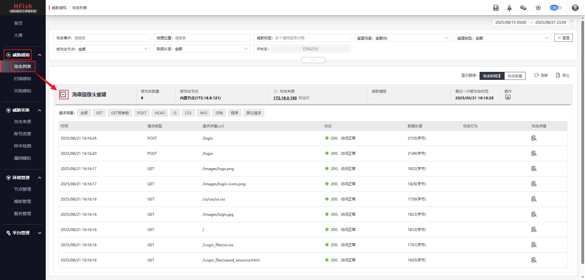
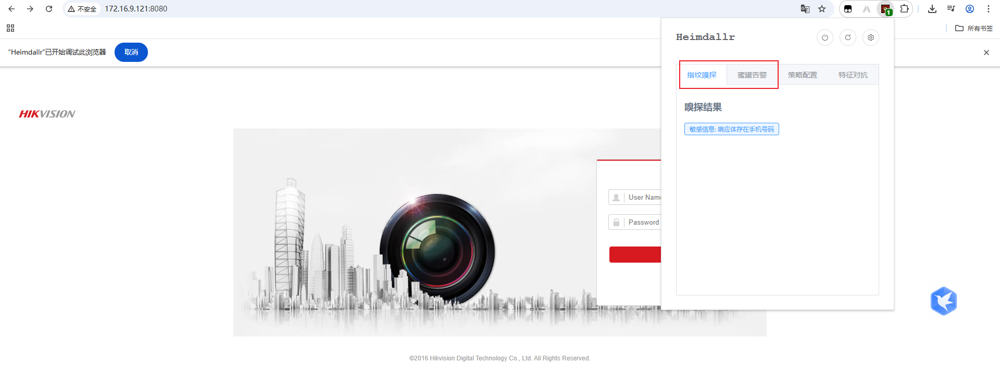
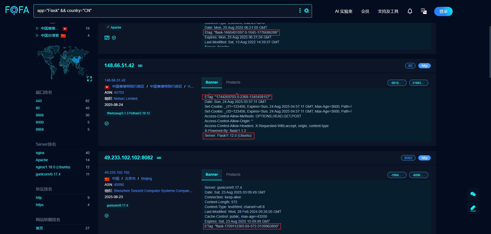

# 信息收集

信息收集的本质就是收集企业资产信息，企业的业务资产信息又可以大致分为5大类：

1. Web应用
2. APP应用
3. PC端应用
4. 小程序应用
5. 微信公众号应用
6. 其他产品等

信息收集篇章是将业务资产中每一类应用单独提取出来，对每一类应用进行细分描述。信息收集本身分为2类：主动收集与被动收集

- 主动收集：攻击者通过本地信息收集工具向目标发送测试请求，通过对端的响应信息判断信息状态
- 被动收集：攻击者通过网络空间、Google Hack等一些第三方公开平台检索目标相关信息，而非通过本地机器发起请求测试

# Web应用

## 一、信息收集工具

即便是工具，也有商用和个人的分类，商用工具通过团队进行维护，数据的准确性和全面性理论上更佳，代价则是需要支付一定的费用才能获取更详细的信息。信息收集工具虽然按分类记录，但每种工具并不是只具备单一的作用，只不过每种工具都有自己擅长的方向，需要按照实际场景灵活应用

### 1.1 业务资产

业务资产小节主要以企业公开信息为主，主要是一些企业公开的运营信息，通过企业公开的知识产权信息里，可以获取到企业的网站、APP、微信公众号等信息，部分历史域名、在用域名也能通过知识产权信息获取到。网站、APP、微信公众号可能会具备自己独立的服务，例如，网站用于企业宣传、APP才是企业核心业务；微信公众号的运营同样需要外接一些站点接口和服务接口，这个时候每个渠道都可能是一个新的测试方向，任意一个渠道的安全问题都可能会跟公司安全问题挂钩


| 标签     | 名称     | 地址                        |
| -------- | -------- | --------------------------- |
| 企业信息 | 天眼查   | https://www.tianyancha.com/ |
| 企业信息 | 小蓝本   | https://www.xiaolanben.com/ |
| 企业信息 | 爱企查   | https://aiqicha.baidu.com/  |
| 企业信息 | 企查查   | https://www.qcc.com/        |
| 企业信息 | 国外企查 | https://opencorporates.com/ |
| 企业信息 | 启信宝   | https://www.qixin.com/      |

### 1.2 单域名查询

单域名查询就是比较简单的DNS、IP解析，在允许接入网络的情况下查询域名，可以通过备案信息查询，同一家企业的多个网站的网站主备案号是一致的，通过官方站点查询企业备案号的前缀就可以查到该企业下备案的所有域名，没有备案的网站是查不出域名的

除了直接的查询手段以外，也可以通过域名注册服务商的域名购买页面，查询目标系统的域名信息，例如，在腾讯云域名注册页面搜索关键词"baidu"，能检索出一些与关键词相关的域名，这些域名也有可能与目标系统相关，也可以对检索出的域名进行查询访问，只不过这种方式就比较倾向于碰运气

| 标签         | 名称             | 地址                                 |
| ------------ | ---------------- | ------------------------------------ |
| 备案信息     | 备案信息查询     | http://www.beianx.cn/                |
| 备案信息     | 备案管理系统     | https://beian.miit.gov.cn/           |
| 注册域名查询 | 腾讯云注册服务商 | https://buy.cloud.tencent.com/domain |
| DNS反向解析  | IP反向查询域名   | https://x.threatbook.cn/             |
| DNS反向解析  | IP反向查询域名   | http://dns.bugscaner.com/            |

### 1.3 多域名解析

针对单域名站点通过备案信息、知识产权、域名注册、反向解析的方式进行查询。针对多域名则需要从历史数据、证书查询、网络空间、威胁情报、枚举解析五个方面方面入手，每一个域名所代表的可能都是一个新的网站或程序

- 历史数据：当一个子域名解析到某个IP，并在互联上生效过，这个子域名与IP的解析对应关系就会被记录到历史数据中，通过历史数据可以查询到使用过哪些子域名与IP的解析对应
- 证书查询：证书查询仅限于https站点，例如百度首页、百度贴吧使用的是同一个证书，那么反向通过证书即可查询到该证书下面绑定的所有子域名
- 网络空间：本质上就是第三方提供的一个专门用于爬取互联数据的平台，通过这个平台能够获取到目标的一些信息
- 威胁情报：由广大用户提交数据，由平台进行整理，最后从平台上可能可以检索到目标的相关信息
- 枚举解析：利用字典暴力破解子域名信息，最有效、最常见的方式

| 标签        | 名称                    | 地址                                   |
| ----------- | ----------------------- | -------------------------------------- |
| DNS数据查询 | dnsdumpster             | https://dnsdumpster.com/               |
| 网络空间    | FOFA                    | https://fofa.info/                     |
| 网络空间    | 全球鹰                  | http://hunter.qianxin.com/             |
| 网络空间    | 360                     | https://quake.360.cn/quake/            |
| 网络空间    | 钟馗之眼                | https://www.zoomeye.org/               |
| 网络空间    | 零零信安                | https://0.zone/                        |
| 网络空间    | Shodan                  | https://www.shodan.io/                 |
| 网络空间    | Censys                  | https://censys.io/                     |
| 网络空间    | ONYPHE                  | https://www.onyphe.io/                 |
| 网络空间    | FullHunt                | https://fullhunt.io/                   |
| 网络空间    | Soall Search Engine     | https://soall.org/                     |
| 网络空间    | Netlas                  | https://app.netlas.io/responses/       |
| 网络空间    | leakix                  | https://leakix.net/                    |
| 网络空间    | DorkSearch              | https://dorksearch.com/                |
| 威胁情报    | VirusTotal 在线查杀平台 | https://www.virustotal.com/gui/        |
| 威胁情报    | VenusEye 威胁情报中心   | https://www.venuseye.com.cn/           |
| 威胁情报    | 绿盟科技 威胁情报云     | https://ti.nsfocus.com/                |
| 威胁情报    | IBM情报中心             | https://exchange.xforce.ibmcloud.com/  |
| 威胁情报    | 天际友盟安全智能平台    | https://redqueen.tj-un.com             |
| 威胁情报    | 华为安全中心平台        | https://isecurity.huawei.com/sec       |
| 威胁情报    | 安恒威胁情报中心        | https://ti.dbappsecurity.com.cn/       |
| 威胁情报    | AlienVault              | https://otx.alienvault.com/            |
| 威胁情报    | 深信服                  | https://sec.sangfor.com.cn/            |
| 威胁情报    | 丁爸情报分析师的工具箱  | http://dingba.top/                     |
| 威胁情报    | 听风者情报源 start.me   | https://start.me/p/X20Apn              |
| 威胁情报    | GreyNoise Visualizer    | https://viz.greynoise.io/              |
| 威胁情报    | URLhaus 数据库          | https://urlhaus.abuse.ch/browse/       |
| 威胁情报    | Pithus                  | https://beta.pithus.org/               |
| 威胁情报    | 微步在线 情报社区       | https://x.threatbook.cn/               |
| 威胁情报    | 奇安信 威胁情报中心     | https://ti.qianxin.com/                |
| 威胁情报    | 360 威胁情报中心        | https://ti.360.cn/#/homepage           |
| 枚举解析    | 在线子域名查询          | http://tools.bugscaner.com/subdomain/  |
| 枚举解析    | DNSGrep子域名查询       | https://www.dnsgrep.cn/subdomain       |
| 枚举解析    | 工具强大的子域名收集器  | https://github.com/shmilylty/OneForAll |
| 证书查询    | CertificateSearch       | https://crt.sh/                        |

#### 1.3.1 OneForAll安装

使用kali系统安装OneForAll

1. 进入python虚拟环境

   ```bash
   source ~/myenv/bin/activate
   # 原本虚拟环境故障的情况下可以新建一个虚拟环境，安装独立的pip工具
   # curl -sS https://bootstrap.pypa.io/get-pip.py | python 
   ```

2. 克隆OneForAll项目

   ```bash
   git clone https://gitee.com/shmilylty/OneForAll.git
   ```

3. 安装相关依赖

   ```bash
   cd OneForAll/
   apt install python3-dev python3-pip python3-testresources -y
   python3 -m pip install -U pip setuptools wheel -i https://mirrors.aliyun.com/pypi/simple/
   pip3 install --ignore-installed -r requirements.txt -i https://mirrors.aliyun.com/pypi/simple/
   pip install --upgrade fire    # 使用python 3.13.7版本需要更新此模块
   pip install --upgrade exrex    # 使用python 3.13.7版本需要更新此模块
   python3 oneforall.py --help
   ```

4. 从[补天](https://www.butian.net/)找个公益SRC进行测试

   ```bash
   python oneforall.py --target jiandian.net run
   ```
   
   扫描结果存放在`./results/`目录下，默认生成`.csv`格式文件

### 1.4 Web架构资产

Web架构资产以指纹信息的收集为主，指纹信息用于标识一个Web架构的资产信息，包括程序语言、框架源码、中间件、数据库、操作系统，指纹识别本质上也是基于国内的、常见的网站程序进行信息收集、识别，小众、冷门的程序、高端的、自研的程序，以及黑色产业定制程序都无法通过指纹信息进行识别

通过指纹信息能否识别目标信息，识别不了目标信息可能是什么原因导致，这些都需要测试者自身思考，针对不同的目标应当灵活应用不同的测试方法

| 标签     | 名称             | 地址                                       |
| -------- | ---------------- | ------------------------------------------ |
| 指纹识别 | 在线CMS指纹识别  | http://whatweb.bugscaner.com/look/         |
| 指纹识别 | Wapplayzer       | https://githb.com/AliaslO/wappalyzer       |
| 指纹识别 | TideFinger 潮汐  | http://finger.tidesec.net/                 |
| 指纹识别 | 云悉指纹         | https://www.yunsee.cn/                     |
| 指纹识别 | WhatWeb          | https://github.com/urbanadventurer/WhatWeb |
| 指纹识别 | 数字观星Finger-P | https://fp.shuziguanxing.com/#/            |

> **补充：内网如何识别CMS**

内网由于无法连接物联网，无法通过在线工具进行检测，因此需要用到离线工具进行触发，比较常见的、好用两款工具如CMSmap、CMSeek，通过[棱角社区](https://forum.ywhack.com/bountytips.php)可以查看更多工具

## 二、后端源码

源码是安全测试中的重要组成部分，获取源码能够提高渗透测试的成功率，对于黑盒测试而言也能通过了解源码的架构体系来提供更多思路。后端源码小节旨在对Web架构资产的更细分化，通过目标的指纹信息能够判断出目标的后端源码类型。源码本身又分为两种：开源和闭源

- 开源：指的是源代码公开，允许互联网用户自由查看、修改、分发和改进的软件。比如，简单易用的提供源码下载的网站有站长之家、脚本之家，专业的开源软件交流网站有Github、Gitee，
- 闭源：指的是源代码保密，用户仅能使用软件而无权修改或查看内部逻辑

### 2.1 指纹识别-开源

比较知名的开源源码应用场景相对较多，因此指纹识别的信息收集也更容易查找到对应的源码信息，例如，通过指纹识别确认目标站点使用的CMS类型为Z-Blog，Z-Blog作为开源的CMS建站软件，攻击者可以直接从官网获取目标系统的后端源码。对于源码最简单的利用方式就是可以根据官网的代码目录结构进行分析，目标站点是否也具备对应的目录呢？目录下面是否也存在相同的文件呢？

### 2.2 指纹识别-闭源

指纹识别工具并不是万能的，无法识别目标系统的后端源码类型也是正常的，无法识别目标后端源码的情况下就要从源码本身的特性、开发者或管理员的一些“陋习”入手，比较常见的[源码泄露集合](https://www.secpulse.com/archives/124398.html)整理：

- 网站备份压缩文件

  部分开发者喜欢图省事，将网站的备份压缩文件直接放在网站的根目录下，攻击者通过御剑这类的目录爆破工具有可能直接看到压缩备份文件。当然，这个备份压缩文件也有可能是网站管理员的恶意钓鱼文件，攻击者也可能会成为上钩的鱼

- Git源码泄露

  Git是目前开发者之间非常流行的一个开源的分布式版本控制软件，Git在执行目录初始化的时候会在当前目录下自动创建一个`.git`的隐藏目录，用于记录代码的变更记录等。开发者在发布代码的时候，如果没有将`.git`目录删除，攻击者可以利用它来恢复源代码

- SVN源码泄露

  与Git架构不同的开源的集中式版本控制软件，类似的是SVN管理本地代码过程中，会自动生成一个`.svn`的隐藏目录，用于包含重要的源代码信息。网站管理员在发布代码时，没有使用“导出”功能，而是直接复制代码目录到Web服务器，这就导致`.svn`目录被暴露在外网环境，可以利用`.svn/entries`文件获取服务器源码

- DS_Store文件泄露

  DS_Store是Mac下Finder用于保存如何展示文件、目录的数据文件，每个目录下对应一个。如果将`.DS_Store`上传部署到服务器，可能造成文件目录结构泄露，特别是备份文件、源代码文件

- composer.json文件泄露

  composer.json是PHP项目中用于​​Composer依赖管理工具的核心配置文件，由于开发者不良习惯和配置疏忽，composer.json文件中的部分字段可能会记录一些敏感信息，例如明文账号密码、源码官网链接、Web程序的版本信息等。攻击者可以直接通过访问此文件查看文件内容，例如`http://www.example.com/composer.json`

#### 2.2.1 Git源码泄露

1. 确认目标站点是否存在`.git`目录。直接访问目标的`.git`目录即可，例如浏览器访问`http://www.example.com/.git/`

2. 安装GitHack工具

   ```bash
   wget https://github.com/lijiejie/GitHack/archive/refs/heads/master.zip
   unzip master.zip
   cd GitHack-master/
   ```

3. 使用GitHack工具获取目标信息

   ```bash
   python GitHack.py http://www.example.com/.git/
   ```

   GitHack工具大多数情况下并不能将目标的所有代码全部抓取出来，即便目标存在`.git`问题。根据抓取的源码文件再进一步分析文件中是否存在敏感URL、敏感数据泄露等问题

#### 2.2.2 SVN源码泄露

1. 确认目标站点是否存在`.svn`目录。直接访问目标的`.svn`目录即可，例如浏览器访问`http://www.example.com/.svn/`

2. 安装SvnHack工具

   ```bash
   wget https://github.com/callmefeifei/SvnHack/archive/refs/heads/master.zip
   unzip master.zip
   cd SvnHack-master/
   ```

3. 使用SvnHack工具获取目标信息

   需要注意，SvnHack工具由于开发时间缘故，只能支持在python 2版本运行

   ```bash
   python SvnHack.py -u http://www.example.com/.svn/entries --download
   ```

#### 2.2.3 DS_Store文件泄露

1. 确认目标站点是否存在`.DS_Store`文件。直接访问目标的`.DS_Store`文件即可，例如浏览器访问`http://www.example.com/.DS_Store`

2. 安装ds_store_exp工具

   ```bash
   wget https://github.com/lijiejie/ds_store_exp/archive/refs/heads/master.zip
   unzip master.zip
   cd ds_store_exp-master/
   ```

3. 使用ds_store_exp工具获取目标信息

   ```bash
   python ds_store_exp.py http://www.example.com/.DS_Store
   ```

   由于DS_Store文件是Mac操作系统专属文件，通过ds_store_exp工具也无法直接获取到目标后端源码，ds_store_exp工具获取的是目标系统的目录架构。Git文件泄露与SVN文件泄露也具备类似的问题，在代码开发时，只有在IDE内新建、编写的文件才会被`.git`记录，从其他地方直接复制到IDE内的数据文件不会被`.git`记录，因此通过GitHack也无法获取到这部分文件数据

### 2.3 源码获取方式

虽然源码只分为开源和闭源两种，但不同的应用场景下仍会产生更加复杂的问题，例如，一些小众的开源代码仍不易获取、或闭源代码可能引用了部分开源代码内容，在不同的场景下应该采用合适的思路：

1. 通过开源社区尝试获取源码

   无法通过指纹信息直接识别出目标系统的CMS类型时，可以通过浏览器的开发者工具查看目标网站的一些前端代码文件，筛选出一些关键文件的名称、文件内的一些特殊代码信息，通过这些信息在github、gitee、oschina等一些开源社区进行搜索，有可能直接找出开发者上传的源代码。例如，Z-Blog的源码文件中存在一个`zblogphp.php`文件，使用浏览器访问目标站点时启用开发者工具，可以看到响应文件中会返回此文件，那么通过此文件名直接在github中进行搜索，可以找到对应源码。当然，除了源码以外，还有可能会搜索到与关键词相关的一些其他干扰信息，例如Z-Blog站点的主题、二次修改的CSS代码等，攻击者需要判断哪些信息才是需要的信息，查找出的源码最好是能够与目标站点的目录结构有个大致的对应关系

   

   使用这种方式获取源码时一定要注意，用于搜索的关键词一定要具有特殊性，不要使用`admin.php`、`login.php`等通用文件名或图片类可替换文件，虽然也可能搜索到目标相关信息，但搜索结果可能出现海量信息，仅凭人工很难进行过滤。避开通用性的同时，应该查找一些可确认的、具备特殊性的脚本文件

   由于一些编程语言特性问题，例如URL`http://zby.zjyc.edu.cn/api/encryptedTrans/getUnencryptedUrlList`，`getUnencryptedUrlList`这个关键词算是比较具备特殊性了，但建议不要使用此关键词进行搜索，因为这个关键词没有后缀，无法确认它到底是个文件还是个参数。以Java语言为例，跟HTML的网站根目录资源路径不同，HTML的URL资源路径是在服务端机器上实际存在的，每个目录、文件都是可操作的，但Java不同，Java存在一个“路由”的概念，在URL中展示出来的资源路径它可能并不是一个实际的文件，而是通过“路由”实现的一个参数

2. 通过Google Hack尝试获取更多信息

   “不要重复造轮子”是软件开发领域的核心原则，复用质量更高的成熟代码能够提高软件开发效率，因此不同开发者之间可能会引用其他人的代码，而部分开发者会在自己的代码中留下ID、邮箱等个人信息，通过抓包或开发者工具查看响应字段内容，就可能获取到一些开发者留下的个人信息，通过这些个人信息也可以使用Git或Google Hack进行搜索，例如`site:Github.com smtp @qq.com`

3. 其他行业开发使用对口资源站获取

   除了常见的、常规的建站需求，也会存在一些非法的或大型企业的定制需求，这类定制需求就无法通过常规代码满足需求，这种场景下就需要开发者进行自研或二次开发的源码，这类源码只会局限在一小部分开发者之间流传，无法通过常规途径获取，大概率也无法通过指纹识别检测

   对于这类源码的获取，早期使用最多的就是通过[互站网](https://www.huzhan.com/)进行获取源码，现在站点似乎已经经过部分整改，可能无法在像早期一样获取到需要的源码。对于这类源码的收集，可以尝试通过国际版bing搜索一些与目标站点相关的关键词，例如搜索“棋牌建站”，baidu无法查找

## 三、JS前端源码

不同于后端源码，前端源码无需考虑获取方式，任何前端代码都可在浏览器中直接看到真实的源代码，前端代码中又以JavaScript为主。通过分析目标的JS源码可以获取更多的URL地址、JS代码逻辑用于后期的安全测试，例如JS的加密算法、APIkey配置、验证逻辑等，这些都有可能成为JS的安全问题。URL的获取是可以显著的帮助到攻击者查看到网站更多的路径，通过直接访问这些路径查看信息是否对渗透有帮助，获取更多的信息

**JS相关信息**

1. 常见的JS框架：Vue、NodeJS、jQuery、Angular等
2. 如何判断是否为JS开发应用：浏览器插件Wapplayzer、一般cookie中有connect.sid、会引入多个JS文件

### 3.1 人工分析

人工分析主要靠阅读代码和过滤关键词来快速查找URL信息，阅读代码需要一定的安全开发基础，此处就可以以过滤关键词查找URL为主要目标

**JS常见的关键词**

- `src=`
- `path=`
- `method:"get"`
- `http.get("`
- `$.ajax`
- `http://service.httppost`
- `http://service.httpget`

多数时候搜索可能无法直接获取到URL信息，需要通过代码解读、换算后获取URL信息


### 3.2 半自动化分析

BurpSuite自带的target功能或插件都能够帮助攻击者提高人工分析的效率，插件本质上就是将BurpSuite捕获到的包进行过滤或特殊标识，使攻击者在观察报文的时候节省一些精力，但对标识的报文还是需要攻击者人工核对是否有用

#### 3.2.1 自有功能target

1. [Target] -> [选中目标右击鼠标] -> [Engagement tools] -> [Find scripts]；过滤目标的脚本文件

   

   

#### 3.2.2 BurpSuite插件

BurpSuite插件分为官方插件和第三方插件，官方的JS插件有两个推荐：JS Link Finder & JS Miner；第三方插件有两个推荐：[HaE](https://github.com/gh0stkey/HaE) & [Unexpected_information](https://github.com/ScriptKid-Beta/Unexpected_information)

- Unexpected_information：用于标记请求包中的一些敏感信息、JS接口和一些特殊字段，防止人工疏忽了一些关键数据包，使用它可能会带来意外收获
- HaE：基于BurpSuite插件JavaAPI开发的请求高亮标记与信息提取的辅助型插件。该插件可以通过自定义正则的方式匹配响应报文或请求报文

1. 安装官方插件

   [Extensions] -> [BApp Store] -> [JS Miner]；JS Link Finder插件的安装方式类似，不做展示，需要注意的是，JS Link Finder插件依赖Jython环境，Jython又依赖Python库，因此需要提前准备好Python环境和Jython的JAR包，且Jython的JAR包需要使用完整版的`jython-standalone-2.7.0.jar`而非标准版的`jython-installer-2.7.4.jar`

   

2. 安装第三方插件

   [Extensions] -> [Installed] -> [Add] -> [Extension file (.jar)] -> [Select file] -> [Next] -> [Close]；第三方插件的安装步骤基本一致

   

   

### 3.3 自动化分析

#### 3.3.1 FindSomething

FindSomething是一款基于浏览器插件的​​被动式信息泄漏检测工具，主要用于在访问网页时自动提取和分析网页源码（特别是JavaScript文件）中的敏感信息，从前端源码中自动分析网站的其他URL路径、手机号、邮箱号、IP等敏感信息

自动化分析工具是效率最快的分析方式，但分析结果却不可尽信，对于自动化分析的结果可以在浏览器上直接尝试测试，或通过抓包的方式再人工核对一遍结果是否属实


#### 3.3.2 JSFinder

[JSFinder](https://github.com/Threezh1/JSFinder)是一款用作快速在网站的js文件中提取URL、子域名的工具，通过脚本参数实现不同的功能

```bash
python JSFinder.py -u http://114.34.75.48:5000/#/signin
   -d：深度爬取
   -f：批量指定URL
   -ou：将爬取到的URL输出到指定文件
   -oS：将爬取到的子域名输出到指定文件 
```

#### 3.3.3 URLFinder

[URLFinder](https://github.com/pingc0y/URLFinder)是一款快速、全面、易用的页面信息提取工具。用于分析页面中的js与url，查找隐藏在其中的敏感信息或未授权api接口。能够比JSFinder提取到更多信息，但信息是否有效暂不清楚，也被称作JSFinder的“升级版”

```bash
./URLFinder -u http://114.34.75.48:5000/#/signin -s 200,403 -m 3
    -u：指定目标URL
    -s：显示指定状态码，all为显示全部
    -m：指定抓取模式：
        1：正常抓取（默认）
        2：深入抓取（URL深入一层，JS深入三层，防止抓偏）
        3：安全深入抓取（过滤delete，remove等敏感路由） 
    -f：批量url抓取，需指定url文本路径
    -o：结果导出到csv、json、html文件，需指定导出文件目录
```

#### 3.3.4 JSINFO-SCAN

[JSINFO-SCAN](https://github.com/p1g3/JSINFO-SCAN?tab=readme-ov-file)是一款与JSFinder类似的工具，递归爬取域名(netloc/domain)，以及递归从JS中获取信息的工具

```bash
python jsinfo.py --target www.baidu.com --keywords baidu
    --target：目标域名，可传入单个域名或域名文件
    --keywords：域名中的关键词，用于收集根域名以及扩充子域名
    --black_keywords：黑名单关键字，当返回包中含有这些关键字则不再进行二次爬取，用于某些商城页面避免爬到无用链接
```

#### 3.3.5 FFUF

[FFUF](https://github.com/ffuf/ffuf/releases)（Fuzz Faster U Fool）是一款基于Go语言开发的高速Web模糊测试工具，专为渗透测试和安全研究设计，以高性能、灵活性和易用性著称。在kali 2025.2版本中已经内置了FFUF 2.1.0版本程序，只需要准备http[字典](https://wordlists.assetnote.io/)即可


FFUF工具与前面4个自动化分析工具存在功能差异，前面4个自动化工具都属于被动式JS信息提取工具，FFUZ属于主动式模糊测试工具，它通过字典文件向目标URL发起请求，并根据响应状态码、大小、内容差异判断资源是否存在，本质上也属于爆破工具

**核心差异定位**

| 维度 | FFUF | URLFinder |
| :-: | :-: | :-: |
| 主要功能 | ​主动式模糊测试工具​​ | 被动式JS信息提取工具 |
| ​核心目标 | 通过字典爆破发现隐藏资源（目录、文件、参数） | 从JavaScript文件中自动提取URL、接口和敏感信息 |
| 工作模式 | 主动发送大量请求探测目标 | 静态分析JS代码内容，无需主动请求 |
| 技术类别 | 攻击性探测（Fuzzing） | 情报提取（Intelligence Gathering） |

一般情况下，客户端去访问一个站点首页时，服务端不会直接把所有代码文件全部都回复给客户端。例如，用户登录前访问服务端与用户登录后从服务端获取到的代码文件肯定是不一样的。URLFinder工具是对服务端回复的JS文件进行分析以过滤信息，FFUF则是通过字典爆破尝试主动探测服务端没有回复的代码文件

```bash
ffuf -w httparchive_js_2025_07_27.txt -u https://www.jolma.cn/FUZZ
    -w：指定字典文件路径
    -u：指定目标URL，目标URL后面必须添加FUZZ占位符，用于标识从此路径下开始爆破
    -e：指定文件扩展名，如.php、.bak，减少无效请求
    -mc：匹配特定状态码，如200
    -fc：过滤无效响应，如404
    -rate 50：限制每秒请求数，避免触发WAF封锁
    -t 5：控制并发线程数
    -o：爆破结果输出到指定文件
```

#### 3.3.6 Packer-Fuzzer

[Packer-Fuzzer](https://github.com/rtcatc/Packer-Fuzzer)是一款针对​​前端打包工具（如Webpack）构建的网站​​的自动化安全扫描工具。其核心目标是通过分析打包后的JavaScript文件，提取API及参数，并支持对未授权访问、敏感信息泄露、CORS、SQL注入、水平越权、弱口令、任意文件上传7大常见漏洞，适用于渗透测试与安全服务中对现代前端框架站点的快速检测

与此前自动化工具不同的是，Packer-Fuzzer工具是专门针对前端打包工具进行扫描的工具，而JS代码的打包经常会用到Webpack工具，一旦前端代码没有使用打包工具，那么Packer-Fuzzer工具是没有用的


```bash
python PackerFuzzer.py -u http://124.221.255.239/
```

Packer-Fuzzer工具会自动生成扫描报告，存放在`./reports/`目录中

## 四、服务架构

服务架构（Service Architecture）是指将复杂的软件系统分解为一系列相互独立、松耦合且可复用的服务组件，并通过标准化接口进行通信和协作的设计模式。简单一点理解就是将软件开发从以前的所有功能集中在一个臃肿的软件程序上，变更为将各个功能拆分到不同的软件程序上，比较常见的系统架构中会出现如：Web服务、中间件、数据库等功能组件程序

- Web服务：Apache、Nginx、IIS、lighttpd、OpenResty等
- 应用服务：Tomcat、JBoss、Weblogic、Websphere等
- 数据库：MySQL、SQL Server、Oracle、Redis、MongoDB等

Web服务与应用服务之间类似于被包含的关系，Web服务的核心功能是处理HTTP请求，但并非所有Web服务程序都可直接等同于应用服务，应用服务涵盖了更广泛的功能，除了能够处理HTTP请求，还需要提供业务逻辑支持和系统集成能力

目标系统使用的Web服务，最简单的方式可以通过浏览器的开发者模式查看服务端的响应头，响应头中可能会存在一个Server字段，这个字段可以被隐藏，因此这种方式并不是100%有效的


### 4.1 端口扫描

业务系统只要对外提供服务，它就需要对外监听端口，例如Web服务使用http协议进行数据传输，http协议默认监听的就是80端口。一些时候通过浏览器的开发者工具无法观察到Server字段，此时可以通过端口扫描来判断目标系统开放的端口，从而做进一步的判断。端口扫描本身并不只是用于Web渗透，通过端口扫描的结果可以得到目标主机对外开放的端口，从而反推其端口对应的默认服务程序，以及对应的渗透方式与思路，端口扫描能够为攻击者提供更多的思路。例如，当Web渗透困难时，是否能够对mysql/3306进行注入、提权、爆破等测试呢？

目前比较常用的端口扫描工具有Nmap、Masscan、网络空间

#### 4.1.1 常见程序的默认端口

| 端口                              | 服务                  | 渗透用途                                                     |
| --------------------------------- | --------------------- | ------------------------------------------------------------ |
| tcp 20,21                         | FTP                   | 允许匿名的上传下载、爆破、嗅探、win提权、远程执行(proftpd 1.3.5)、各类后门(proftpd，vsftp 2.3.4) |
| tcp 22                            | SSH                   | 可根据已搜集到的信息尝试爆破，v1版本可中间人，ssh隧道及内网代理转发，文件传输等等 |
| tcp 23                            | Telnet                | 爆破、嗅探，一般常用于路由、交换登陆，可尝试弱口令           |
| tcp 25                            | SMTP                  | 邮件伪造，vrfy/expn查询邮件用户信息，可使用smtp-user-enum工具来自动跑 |
| tcp/udp 53                        | DNS                   | 允许区域传送、dns劫持、缓存投毒、欺骗以及各种基于dns隧道的远控 |
| tcp/udp 69                        | TFTP                  | 尝试下载目标及其的各类重要配置文件                           |
| tcp 80-89,443,8440-8450,8080-8089 | 各种常用的Web服务端口 | 可尝试经典的topn、vpn、owa、webmail、目标oa、各类Java控制台、各类服务器Web管理面板、各类Web中间件漏洞利用、各类Web框架漏洞利用等等…… |
| tcp 110                           | POP3                  | 可尝试爆破、嗅探                                             |
| tcp 111,2049                      | NFS                   | 权限配置不当                                                 |
| tcp 137,139,445                   | Samba                 | 可尝试爆破以及smb自身的各种远程执行类漏洞利用，如，ms08-067、ms17-010、嗅探等…… |
| tcp 143                           | IMAP                  | 可尝试爆破                                                   |
| udp 161                           | SNMP                  | 爆破默认团队字符串，搜集目标内网信息                         |
| tcp 389                           | LDAP                  | ldap注入，允许匿名访问，弱口令                               |
| tcp 512,513,514                   | Linux rexec           | 可爆破，rlogin登陆                                           |
| tcp 873                           | Rsync                 | 匿名访问，文件上传                                           |
| tcp 1194                          | OpenVPN               | 想办法钓VPN账号，进内网                                      |
| tcp 1352                          | Lotus                 | 弱口令，信息泄漏、爆破                                       |
| tcp 1433                          | SQL Server            | 注入、提权、sa弱口令、爆破                                   |
| tcp 1521                          | Oracle                | tns爆破、注入、弹shell…                                      |
| tcp 1500                          | ISPmanager            | 弱口令                                                       |
| tcp 1723                          | PPTP                  | 爆破，想办法钓VPN账号，进内网                                |
| tcp 2082,2083                     | cPanel                | 弱口令                                                       |
| tcp 2181                          | ZooKeeper             | 未授权访问                                                   |
| tcp 2601,2604                     | Zebra                 | 默认密码zerbra                                               |
| tcp 3128                          | Squid                 | 弱口令                                                       |
| tcp 3312,3311                     | kangle                | 弱口令                                                       |
| tcp 3306                          | MySQL                 | 注入、提权、爆破                                             |
| tcp 3389                          | Windows rdp           | shift后门[需要03以下的系统]、爆破、ms12-020                  |
| tcp 3690                          | SVN                   | svn泄露，未授权访问                                          |
| tcp 4848                          | GlassFish             | 弱口令                                                       |
| tcp 5000                          | Sybase/DB2            | 爆破、注入                                                   |
| tcp 5432                          | PostgreSQL            | 爆破，注入、弱口令                                           |
| tcp 5900,5901,5902                | VNC                   | 弱口令爆破                                                   |
| tcp 5984                          | CouchDB               | 未授权导致的任意指令执行                                     |
| tcp 6379                          | Redis                 | 可尝试未授权访问，弱口令爆破                                 |
| tcp 7001,7002                     | WebLogic              | Java反序列化，弱口令                                         |
| tcp 7778                          | Kloxo                 | 主机面板登录                                                 |
| tcp 8000                          | Ajenti                | 弱口令                                                       |
| tcp 8009                          | tomcat Ajp            | Tomcat-Ajp协议漏洞                                           |
| tcp 8443                          | Plesk                 | 弱口令                                                       |
| tcp 8069                          | Zabbix                | 远程执行、SQL注入                                            |
| tcp 8080-8089                     | Jenkins，JBoss        | 反序列化、控制台弱口令                                       |
| tcp 9080-9081,9090                | WebSphere             | Java反序列化/弱口令                                          |
| tcp 9200,9300                     | ElasticSearch         | 远程执行                                                     |
| tcp 11211                         | Memcached             | 未授权访问                                                   |
| tcp 27017,27018                   | MongoDB               | 爆破、未授权访问                                             |
| tcp 50070,50030                   | Hadoop                | 默认端口未授权访问                                           |

#### 4.1.2 Nmap

最知名、功能最强大的开源网络扫描工具之一，被用于主机探测、端口扫描、安全审计和服务枚举。nmap端口扫描的状态有3种结果：open（端口开放）、close（端口闭合）、filtered（被过滤），filtered状态有可能是由于安全设备策略导致，无法精准判断目标端口是否启用

**Nmap常用参数**

| 参数    | 作用                                                         |
| ------- | ------------------------------------------------------------ |
| -sS     | 默认模式（需要root权限），发送SYN包，收到SYN/ACK则判为开放，立刻发送RST终止连接 |
| -sT     | 发起完整的TCP三次握手，无需root权限，易被服务端日志记录      |
| -sV     | 主动探测端口运行的服务类型、名称及版本信息                   |
| -p      | 指定扫描端口范围<br />-p 80,443：扫描80、443端口<br />-p 1-1000：扫描1~1000端口<br />-p-：扫描全端口 |
| -O      | 启用操作系统检测，结合TCP/IP栈特征猜测目标操作系统，提升准确率需配合`-sV` |
| -sn     | 仅主机发现，不做端口扫描                                     |
| -T[0-5] | 性能与时序设置，-T4 常用快速模式、-T0/-T1 极慢模式，用于规避IDS检测 |
| -oN     | 标准输出到文件                                               |
| -v      | 增加输出详细度                                               |
| -Pn     | 无ping扫描，忽略主机发现阶段，直接进入端口扫描，应对禁ping主机有效 |

#### 4.1.3 Masscan

Masscan号称是当前速度最快的互联网级端口扫描器，设计初衷是在极短时间内扫描整个互联网的特定端口（如全网HTTP服务器）。它采用异步无状态扫描技术（不建立完整TCP连接），配合自定义TCP/IP栈实现超高吞吐量（可达到每秒百万级数据包），特别适合大规模网络普查、紧急漏洞扫描（如Log4j、Heartbleed）等场景

**Masscan常用参数**

| 参数        | 作用                                                         |
| ----------- | ------------------------------------------------------------ |
| -p          | 指定端口范围，此为必选项<br />-p 80,443<br />-p 0-65535<br />-p U:53 |
| --top-ports | 扫描最常见端口                                               |
| --range     | 指定目标IP范围，例如 10.0.0./8，192.168.0.1-192.168.1.254    |
| -oJ         | JSON格式输出                                                 |

### 4.2 WAF识别

WAF的识别对于安全测试而言，能够使攻击者将精力和时间投入到其他更具可能性的入口，WAF全称Web应用防火墙（Web Application Firewall），专用于Web资产的防护，识别到WAF对于攻击者而言大部分时候只有两种可能，对自身能力进行评估后选择绕过WAF或放弃渗透，截至目标为止，专业级WAF基本上是无法被绕过的，即便极少部分能绕过的一些功能都是毫无意义的

WAF大致分为4类：

- 云WAF：百度安全宝、阿里云盾、长亭雷池、华为云、亚马逊云等
- 硬件WAF：绿盟、安恒、深信服、知道创宇等商业产品
- 软件WAF：宝塔、安全狗、D盾等
- 代码级WAF：开发者在应用程序中手写的过滤规则，一般是写死在代码中

4类WAF中属云WAF防护能力最强，云WAF采用的防护技术和更新效率是最高的，其次是硬件WAF，虽然硬件WAF的防护能力同样强大，但在扩展性上略逊于云WAF，一般而言，攻击者最有可能绕过的也就只有软件WAF和代码级WAF

#### 4.2.1 wafw00f

WAF指纹识别与检测的标杆工具，专为渗透测试和红队行动设计。它通过发送HTTP/S请求，分析目标网站的响应特征（如状态码、响应头、内容模式等），快速判断目标是否受 WAF 保护，并精准识别其具体类型（如 Cloudflare、Akamai、Fortinet 等）

**wafw00f常用参数**

| 参数              | 作用                                             |
| ----------------- | ------------------------------------------------ |
| -v / --verbose    | 显示详细检测过程                                 |
| -a / --findall    | 尝试所有检测方法提高准确性                       |
| -r / --noredirect | 禁止重定向跟踪（避免被 CDN 干扰）                |
| -o / --output     | 结果输出到文件：-o json=<文件> 或 -o text=<文件> |
| -p / --proxy      | 通过代理发送请求（格式：http://127.0.0.1:8080）  |
| -l / --list       | 查看支持识别的 WAF 厂商列表，用于比对结果        |
| -V / --version    | 查看软件版本                                     |

#### 4.2.2 identYwaf

[identYwaf](https://github.com/stamparm/identYwaf)是一个基于盲推断识别网页防护类型（即waf）的识别工具。盲推断是通过检查由一组预定义的攻击性（非破坏性）有效载荷引起的响应来完成的，其中这些有效载荷仅用于触发其间的web保护系统。目前它支持80多种不同的保护产品，同时知识库也在不断扩大

```bash
python identYwaf.py https://jmhewang.com
	--version：查看工具版本
	--proxy：指定代理服务器
	--post：使用post主体发送有效载荷
```

### 4.3 蜜罐识别

蜜罐是一种安全威胁的检测技术，其本质在于引诱和欺骗攻击者，通过记录攻击者的操作行为、攻击手法，为安全研究人员提供一手情报。对于攻击者而言需要通过蜜罐识别技术来发现和规避蜜罐，蜜罐按照交互程度可以分为三类：低交互蜜罐、中交互蜜罐、高交互蜜罐，也根据模拟的目标进行分类，例如：数据库蜜罐、工控蜜罐、物联网蜜罐、Web蜜罐等

蜜罐的[识别原理](https://mp.weixin.qq.com/s/FrpE2doSoa3AmKjPv-ikNw)此处不做详细记录，此处暂时只需要将精力放在如何识别蜜罐即可。蜜罐的识别方式可以使用工具或人工识别，但直接通过网络空间、网络绘测平台测试能够得到更多信息，可惜网络空间这种方式具备一定的时效性，可能无法立马识别出新部署的蜜罐

#### 4.3.1 HFish

[HFish](https://hfish.net/#/)是一款社区型免费中低交互蜜罐，侧重企业安全场景，从内网失陷检测、外网威胁感知、威胁情报生产三个场景出发，增加用户在失陷感知和威胁情报领域的能力。HFish支持基本网络服务、OA系统、NAS存储系统、Web服务器、运维平台、安全产品、无线AP、邮件系统等90多种蜜罐服务

1. 使用CentOS在线部署一个HFish蜜罐进行测试

   ```bash
   [root@hebor ~]# firewall-cmd --add-port=4433/tcp --permanent
   [root@hebor ~]# firewall-cmd --add-port=4434/tcp --permanent
   [root@hebor ~]# firewall-cmd --reload
   [root@hebor ~]# bash <(curl -sS -L https://hfish.net/webinstall.sh)
   ```

2. 完整安装后通过以下网址、账号密码登录

   ```bash
   登陆链接：https://[ip]:4433/web/
   账号：admin
   密码：HFish2021
   ```

3. [环境管理] -> [节点管理] -> [节点] -> [展开]；通过节点管理可以观察到节点启用的蜜罐信息

   

4. [威胁感知] -> [攻击列表] -> [节点] -> [展开]；查看被攻击的节点，以及节点被攻击的详情

   

5. [威胁实体] -> [账号资源]；查看被用于暴力破解的账号与密码的排名

   

#### 4.3.2 Heimdallr

[Heimdallr](https://github.com/Ghr07h/Heimdallr)是一款致力于被动嗅探浏览器流量，用于提示漏洞框架指纹、告警拦截蜜罐请求、对抗浏览器特征追踪（浏览器持久化、webRTC、Canvas画布等）的Chrome插件。Chrome版本需高于Chrome v96，部分代码逻辑不适配edge和firefox，不可混用于非Chrome浏览器

此浏览器插件的识别准确率暂时有待观察，无论Heimdallr的告警是否属于蜜罐告警都需要产生警惕，指纹嗅探的告警也有可能是蜜罐



#### 4.3.3 quake_rs

[quake_rs](https://github.com/360quake/quake_rs)由360 quake官方出品的工具，用于连接quake查看目标IP的相关信息，可以用于识别目标IP是否为蜜罐。需要注意的是，使用此工具进行查询时需要消耗quake的账号积分，因此在直接使用此工具前还需要先绑定个人quake账号，并确保积分足够的情况下进行查询

1. 初始化quake_rs，apikey需要到Quake的个人中心查看

   ```bash
   quake init apikey
   ```

2. 蜜罐识别

   ```bash
   quake honeypot 172.16.9.121
   ```

#### 4.3.4 人工识别

1. 端口多且具备一定的规律性

   蜜罐的功能是用于模拟操作系统或服务，但蜜罐本身也只是一个程序，只要是软件程序它就需要运行在硬件或操作系统上，考虑到成本的话安装蜜罐的节点本身可能就不会很多，如果蜜罐数量较多的话，那么蜜罐节点对外开放的端口就会比较密集

2. 使用http或https访问蜜罐会下载文件

   通过浏览器使用http或https协议访问一些非Web服务的蜜罐端口，可能会直接下载文件，通过这种方式进行判断目标是否为蜜罐，但同样需要注意，下载的文件也可能是防御者故意给出的木马文件

3. 指纹信息对应分析

   正常的服务具备特定的指纹信息，蜜罐返回的指纹与正常服务不一致，通过对比[常规指纹信息](https://mp.weixin.qq.com/s/FrpE2doSoa3AmKjPv-ikNw)也可以进行判断

### 4.4 CDN

CDN全称为内容分发网络，一般情况下企业会将自身业务的静态数据且不重要的数据，缓存在全球各个CDN节点上，主要用于加速全球用户访问业务的效率，以及减轻主节点的压力。从安全视角来看，CDN还能够作为用户与主节点之间的“中间层”，将主节点的真实IP隐藏起来

因此，对于攻击者而言，如果目标系统购买了CDN加速，在信息收集阶段就需要解决获取目标的真实IP的问题，如果获取不到目标的真实IP，所有的测试都只是针对CDN节点的测试，毫无意义

#### 4.4.1 CDN的分类

对于互联网上的Web服务，大致可以分为3种访问方式

1. 传统访问：没有购买CDN加速的情况下，用户访问域名 -> DNS解析 -> 访问目标主机
2. 普通CDN：用户访问域名 -> DNS解析 -> CDN节点调度接入 -> 访问目标主机
3. 带WAF的CDN：用户访问域名 -> DNS解析 -> WAF CDN节点调度接入 -> 访问目标主机

国内比较常见的CDN服务商

<table>
    <tr>
    	<td>阿里云</td>
        <td>百度云</td>
        <td>七牛云</td>
    </tr>
    <tr>
        <td>又拍云</td>
        <td>腾讯云</td>
        <td>Ucloud</td>
    </tr>
    <tr>
        <td>360</td>
        <td>网宿科技</td>
        <td>ChinaCache</td>
    </tr>
</table>

国外比较常见的CDN服务商

<table>
    <tr>
    	<td>CloudFlare</td>
        <td>StackPath</td>
        <td>Fastly</td>
    </tr>
    <tr>
    	<td>Akamai</td>
        <td>CloudFront</td>
        <td>Edgecast</td>
    </tr>
    <tr>
    	<td>CDNetworks</td>
        <td>Google</td>
        <td>Cloud</td>
    </tr>
    <tr>
    	<td>CacheFly</td>
        <td>Keycdn</td>
        <td>Udomain</td>
    </tr>
</table>
#### 4.4.2 CDN的配置

以阿里云的CDN配置为例，常见的CDN的配置需要关注3个方向


1. 加速域名-需要启用加速的域名

   域名的配置决定了具体使用CDN加速的站点，阿里云对于域名的配置分为子域名和泛域名两种，泛域名加速是指使用通配符做加速域名以实现所有的次级域名的加速效果。例如：`.aliyundoc.com`是一个泛域名，而`developer.aliyundoc.com`是这个泛域名对应的次级域名，`image.developer.aliyundoc.com`是这个泛域名对应的三级域名。

   当管理员将`.aliyundoc.com`泛域名作为加速域名时，所有此泛域名的次级域名均可以解析到全站加速上添加的泛域名`.aliyundoc.com`的加速，例如`example.aliyundoc.com`、`demo.aliyundoc.com`等。但，泛域名加速不支持三级域名加速，即不支持`image.developer.aliyundoc.com`的加速，如果要实现三级域名的加速，那么加速域名需要配置次级域名

   简而言之，泛域名加速配置可以实现全体次级域名的加速，但无法实现跨次级域名实现三级域名的加速，同时，加速的站点越多也就意味者成本越高，系统管理员需要衡量用户体验与成本之间的平衡点。对于攻击者而言，只要目标不是全站、全覆盖的CDN加速配置，就可以通过遍历访问目标站点的子域名、三级域名，尝试获取到目标的真实IP，一般情况下子域名与主域名是有可能处于同一台服务器上或同一个网段内

2. 加速区域-需要启用加速的地区

   阿里云的CDN加速对于地区的划分只分为3部分：全球、中国、非中国内地，通过加速地区来获取目标的真实IP的思路更加简单：

   - 如果是中国加速，那么使用国外IP访问目标即可获取真实IP
   - 如果是非中国内地加速，直接访问目标即可获取真实IP
   - 全球加速则需要考虑其他方法

   部分CDN服务商提供的加速地区可能会区分的更加细致，但思路是不变的，目标使用了哪些地区的加速，攻击者就返过来使用没有加速的地址的IP去访问目标即可跳过CDN节点的IP

3. 加速类型-需要启用加速的资源

   证书。关于加速类型，小迪老师的课程中没有详细描述，只提到了“证书”，基于对CDN原理的理解，是否可以通过访问未被加速的资源而访问到目标的真实IP呢？被加速的资源、未加速的资源、证书，三者之间是否存在什么明确的关联关系或区别呢？

#### 4.4.3 CDN绕过

在进行CDN绕过之前，首先需要确认目标是否存在CDN加速，最常见的检测CDN的方式是超级PING或nslookup，使用超级PING检测结果为同一个IP时，大概率可能是目标的真实IP，检测结果为多个不同的IP时，表示目标使用了CDN加速


基于CDN的配置小节内容，一旦目标使用了全球、全覆盖的CDN加速配置，除非先把目标的CDN加速流量打光，否则攻击者基本上就很难主动获取到目标的IP，此时就需要换个思路，是否能使目标主动像攻击者发送数据来获取目标的真实IP

##### 4.4.3.1 主动漏洞

主动漏洞指的是使目标服务器主动出网连接攻击者机器，这种情况一般需要目标服务器本身就提供了向外部网络请求数据的功能，例如，在github的个人仓库中编辑的文章引用了外部图床服务器的图片。假设github是目标服务器、图床服务器是攻击者机器的话，当目标服务器主动向攻击者机器请求数据时，在攻击者机器的日志记录中就能够获取到目标服务器的IP

```bash
# kali模拟攻击者监听
python -m http.server    # http.server是python内置的一个模块，用于快速创建一个简单的http服务器

# centos模拟目前服务器请求
curl http://172.16.9.33:8000
```

在kali的前台日志中就可以直接观察到请求的来源IP

##### 4.4.3.2 敏感文件

敏感文件指的是暴露了大量敏感信息的配置文件，在软件开发、调试过程中开发人员会需要时刻关注服务器上的各个软件版本、根目录、语言版本等信息，一些编程语言会通过部分函数来快速获取服务端软、硬件信息帮助开发者调试，例如PHP语言的phpinfo()函数

开发者可以通过这些函数快速获取服务端信息，攻击者同样也可以，因此，如果软件程序开发完成后，开发者没有对这些敏感文件进行妥善处理，攻击者可以通过爆破、访问等手段直接获取到敏感文件中的信息，就能够直接获取到目标IP、网站根目录等敏感信息


##### 4.4.3.3 邮件系统

邮件系统是绕过CDN非常好用的一种方式，无论是云服务器或本地虚拟机，在配置DNS解析时比较常见的记录类型一般都是A、CNAME等，而邮件服务器的记录类型是MX，MX的记录类型一般不支持CDN加速，即邮件服务器一般不支持CDN加速。基于邮件系统的特性，可以通过先获取到邮件服务器的IP，再对网段进行查找、判断主服务器节点IP

邮件服务器的IP获取具备两种常见方式：主动发起和被动接收

1. 主动发起

   主动向目标邮箱发起邮件的方式必须使用攻击者自己的邮件服务器，不能使用第三方邮件服务器。攻击者通过向目标邮件服务器上一个不存在用户邮箱发送邮件，由于用户不存在邮件会发送失败，目标邮件服务器会向攻击者邮件服务器回复一个异常通知，此时攻击者就拿到了目标邮件服务器的真实IP

   主动发起方式可以作为被动接收方式无效时的一个补充思路，主动发起方式可能会产生一些未知的意外情况。之所以需要使用攻击者自己的邮件服务器，以网易邮箱为例，使用网易邮箱向目标邮件服务器发起邮件时，目标邮件服务器会给网易邮件服务器回复邮件，再由网易邮件服务器回复到个人邮箱，这个时候即便能看到发件人的IP，这个IP也不是目标邮件服务器的IP

2. 被动接收

   邮件服务器如果向外部用户发送邮件，那么邮件头部的源码中会包含此邮件服务器的真实IP。根据这个条件来看，想要收到目标邮件服务器的信息，需要先获取到一个有效的注册用户。比较常见的邮件触发点有：

   - RSS订阅
   - 邮箱注册、激活处
   - 邮箱找回密码
   - 产品更新的邮件推送
   - 某业务执行后发送邮件通知
   - 员工邮箱、邮件管理平台等入口出的忘记密码

访问墨者学院首页的找回密码连接，通过邮箱找回密码，并填写个人邮箱，再通过个人邮箱查看邮件原文或邮件信头等方式，查看原始数据可以获取到目标邮件服务器的IP


通过邮件服务的方式获取目标的真实IP需要注意两个地方，发件人和邮件原始信息。观察邮件原始信息是为了获取到邮件服务器的IP，但邮件服务器除了使用自建的邮件服务器以外，还可以单独申请一个邮件域名，然后使用第三方的邮件服务，因此观察发件人邮箱是为了判断这个邮箱到底是不是目标的邮件服务器转发的数据，如果使用的第三方的邮件服务器转发的数据，即便获取到了IP也是没用的

例如，访问FOFA的找回密码连接，通过个人邮箱查看FOFA的邮件就会发现发件人的域名是`baimaohui.net`，这并不是FOFA站点的域名，这就意味着FOFA使用的邮件服务器可能就是一个第三方邮件服务器，而墨者学院的邮件发件人使用的域名是`mail.mozhe.cn`，这与墨者主站的域名一致


##### 4.4.3.4 参考工具

除了通过上述思路绕过CDN获目标IP以外，还可以尝试使用第三方接口查询工具获取目标IP，第三方工具的底层原理不得而知，但每种方式各有利弊，还是需要攻击者自身判断获取到的哪个IP才是有效IP

| 作用       | 链接                                    |
| ---------- | --------------------------------------- |
| 超级PING   | http://www.17ce.com/                    |
| 超级PING   | https://ping.chinaz.com/                |
| 接口查询IP | https://get-site-ip.com/                |
| 接口查询IP | https://fofa.info/extensions/source     |
| 国外请求   | https://tools.ipip.net/cdn.php          |
| 国外请求   | https://boce.aliyun.com/detect          |
| IP社区库   | https://www.cz88.net/geo-public         |
| 全网扫描   | https://github.com/Tai7sy/fuckcdn       |
| 全网扫描   | https://github.com/boy-hack/w8fuckcdn   |
| 全网扫描   | https://github.com/Pluto-123/Bypass_cdn |

##### 4.4.3.5 全网扫描

在思路以及第三方接口查询工具都失利的情况下，基本上就只剩下”以量打量“这种方式，我们已知CDN节点是收费的，那么只要将目标服务器的CDN流量耗光，就不存在CDN加速节点了，就能够获取到目标的真实IP。”全网扫描“使用了与”以量打量“类似的思路，全网扫描基于真实站点的特殊标识符与特征信息，在全网中查找与真实站点具备相似特征的IP节点

全网扫描并非真正意义上的在整个互联网中进行查询与过滤，即便需要在互联网上进行扫描，考虑到主机性能、时效性等因素，也要尽可能缩小查找范围，因此全网扫描具备一个大概的操作流程

1. 判断目标的CDN服务商

   查询目标的CDN服务商可以通过第三方工具实现：`https://tools.ipip.net/cdn.php`
   
   
   
   此站点可能由于规避法律风险，目前比较常见的一些域名都无法查询出CDN服务商，可以考虑通过其他方式或付费进行查询，结果可能会好一些

2. IP库筛选地址段

   通过CDN服务商名称来进行IP库筛选过滤，但同样，IP库大部分也都是付费服务，社区版的IP库检索的信息也可能是有缺陷的。IP库的筛选对于查询结果是影响比较大的，如果在意精准性，可以考虑付费查询。IP库一般支持两种方式查询：通过IP筛选地区 或 通过地区筛选IP

3. 配置范围扫描

   全网扫描工具一般都需要至少提供几个关键信息，例如目标URL、目标站点独有的关键词、IP范围等，常见的一些扫描工具如fuckcdn、w8fuckcdn、Bypass\_cdn等。此处由于暂时没有公网CDN测试站点可以用于演示，不做笔记记录，工具的使用方法在github都有记录
   
   | 特性           | fuckcdn                    | w8fuckcdn                    | bypass_cdn         |
   | -------------- | -------------------------- | ---------------------------- | ------------------ |
   | **核心思路**   | 主动爆破子域名             | 被动收集+智能验证            | 综合全平台检查     |
   | **自动化程度** | 中等                       | 高                           | 非常高             |
   | **验证机制**   | 基础响应验证               | 强虚拟主机验证               | 多种方式验证       |
   | **数据源**     | 主要依赖本地字典爆破       | 依赖在线API和数据集          | 本地+在线API混合   |
   | **优势**       | 思路直接，容易理解         | 误报率相对较低，更智能       | 方法最全面，覆盖广 |
   | **劣势**       | 方式单一，可能产生大量流量 | 依赖部分在线服务（可能失效） | 执行时间可能较长   |

## 五、开发框架

开发框架实际上可以归类到CMS指纹识别中，但不同语言的不同开发框架之间都存在差异，因此单独记录。前期学习信息收集思路时，指纹识别能够识别的CMS类型，其所使用的一些技术和工具大多是以PHP语言开发的程序为主，如果换成Python、Java或其他语言开发的程序，指纹识别大概率无法正常获取信息，出于两方面的原因，一是使用Python、Java开发的程序比较少、二是使用Python、Java开发的程序一般不公开

框架像是一个骨架（模板），它是一个提供了基础结构和一套规则的软件半成品，旨在支持并简化应用程序的开发，使用框架进行开发就必须遵循它已经定好的结构和规则，基于这个前提进行程序开发，整个流程是由框架主导

框架将通用的、重复性的底层技术细节（如数据库操作、网络通信、安全验证等）提前封装好，让开发者能够更专注于实现产品的核心业务逻辑，同时也具备缩短程序开发周期、统一团队成员代码风格和结构等优势。一般情况下Web程序开发分为3种模型：

1. 入门级开发模型，功能代码全手写

   由于程序员水平参差不齐，没有第三方团队的帮助检测，是最容易出现漏洞的模型

2. 结合开发框架的模型，以框架为核心实现功能

   由第三方或团队开发的封装代码框架，一般内置过滤机制，主要针对框架本身的漏洞

3. 开发框架结合组件的模型，以框架为核心、组件为辅助实现功能

   由第三方开发的封装代码框架，结合专门实现某一功能的组件，主要针对框架和组件两者本身的漏洞

对于安全方面，如果程序采用框架开发，那么代码的安全性就取决于框架本身的过滤机制，通过框架开发程序就意味着程序内的很多逻辑都是通过框架本身的代码实现的。因此，通过识别目标的开发框架，可以查找框架是否存在过滤机制问题，判断是否能够通过历史漏洞进行攻击

### 5.1 框架识别

#### 5.1.1 离线工具

[CMSeek](https://github.com/Tuhinshubhra/CMSeeK)和[GotoScan](https://github.com/NewBe3three/gotoscan#)都是比较好用的本地指纹识别工具，既可以识别外网目标也可以识别内网目标，在脱离互联网的环境下可以使用离线工具判断目标的CMS类型

1. 从github下载源码压缩包和gotoscan.exe可执行文件
2. 将源码压缩包解压后，移动gotoscan.exe可执行文件到解压目录下的/cmd/gotoscan/目录下
3. 启用cmd，运行gotoscan.exe，查询完成后会在当前目录下新建一个文本文件，并将查询结果保存在文件中

```cmd
gotoscan.exe -host http://xiaodi8.com
	-host：测试一个目标，需要在域名前加上https或者http
	-cmsjson：指定CMS指纹特征json文件，默认为当前目录下的cms.json文件
	-hosts：指定测试多个目标存放的txt文件，一行一个目标
```

#### 5.1.2 Python框架

**Django识别方式**

1. 通过浏览器插件Wappalyzer识别

2. 通过捕获请求报文的`Set-Cookie`参数的值进行判断，其值一般会含有`csrftoken`

   

**Flask识别方式**

1. 通过浏览器插件Wappalyzer识别

2. 通过捕获请求报文的`Etag`参数的值进行判断，其值一般会含有`flask`，部分站点也会直接在`Server`参数中展示

   

#### 5.1.3 PHP框架

**ThinkPHP识别方式**

1. 通过浏览器插件Wappalyzer识别

2. 特殊的报错信息（颜表情）

   

3. 通过捕获请求报文的`X-Password-By`参数的值进行判断，这个参数或参数值可以被隐藏

   

4. 通过站点的icon图片进行判断

   

5. 通过获取源码信息进行反向识别，源码是否基于ThinkPHP框架进行开发

**Laravel识别方式**

1. 通过浏览器插件Wappalyzer识别

2. 通过捕获请求报文的`Set-Cookie`参数的值进行判断，其值一般会含有`XSRF-TOKEN`、`laravel_session`

   

**Yii识别方式**

1. 通过浏览器插件Wappalyzer识别

2. 通过捕获请求报文的`Set-Cookie`参数的值进行判断，其值可能会含有`YII_CSRF_TOKEN`

   

在不清楚目标程序使用的开发框架的情况下直接使用漏洞扫描工具意义不大，漏扫工具一般是判断目标的逻辑，如果目标程序使用框架开发，框架本身不存在漏洞的情况下漏扫工具一般也无法识别到漏洞，框架本身不存在漏洞的情况下，如果被漏扫工具扫描到漏洞，一般是由于开发者没有按照框架的标准语法编写代码导致的漏洞

#### 5.1.4 Java组件与框架

作为现如今仍最具影响力的语言之一，Java需要了解52类110个主流的Java组件和框架，通过框架结合组件的方式能够在Java开发中快速实现某些功能，在这些主流组件里存在小一半的组件出现过历史漏洞

**Fastjson/Jackson**

在提交JSON数据包中修改测试：

- Fastjson组件会把01解析成1
- Jackson组件在解析01时会抛出异常

更多判断方式参考[浅谈黑盒识别Fastjson/Jackson组件](https://forum.butian.net/share/1679)

**Shiro**

1. 请求包的cookie中存在rememberMe字段，该字段需要在用户勾选`rememberMe`选项且登录成功后才会产生

   

2. 响应包中存在`Set-Cookie: rememberMe=deleteMe`，此参数可被隐藏，无需用户登录即可触发

   

3. 请求报中存在`rememberMe=x`时，响应包中存在`rememberMe=deleteMe`

4. 有时服务端不会主动返回`rememberMe=deleteMe`，直接发包即可，将Cookie内容改为`rememberMe=1`，若响应包中有`rememberMe=deleteMe`，则基本可以确定网站使用Apache shiro

**Struts2**

一般使用Struts2框架，后缀带do或action，在URL或响应包的Cookie里都有可能找到对应特征，可以尝试进行利用


**Springboot**

1. springboot框架开发的Web程序默认使用的icon是小绿叶

   

2. springboot框架默认报错页面存在特殊的报错信息和`Whitelabel Error Page`字符

   

**Solr**

1. Web程序具有一个特殊的icon

   

2. Solr默认运行在8983端口，这是Solr的管理页面

   

