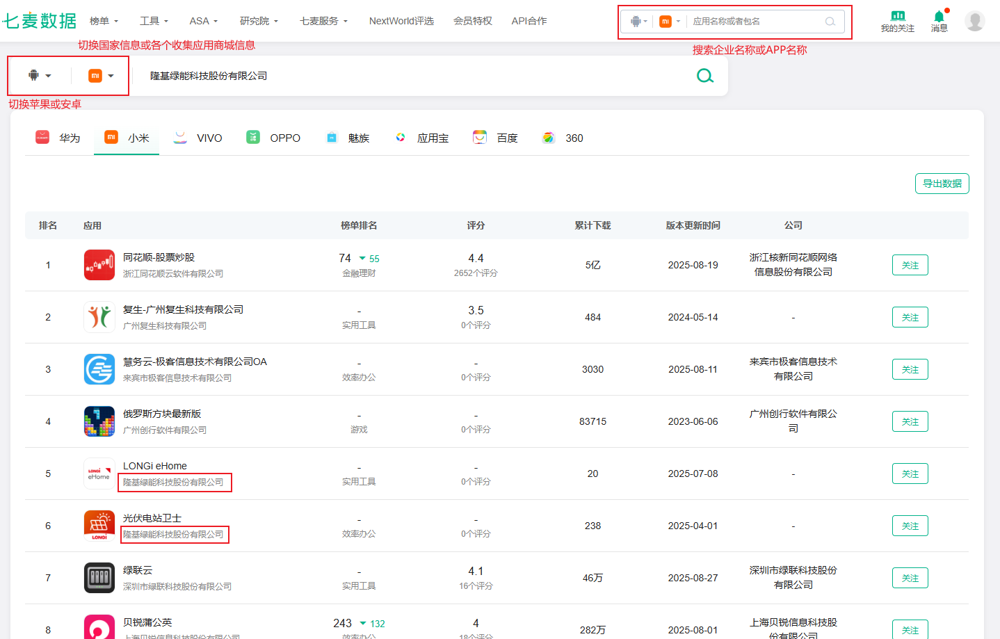
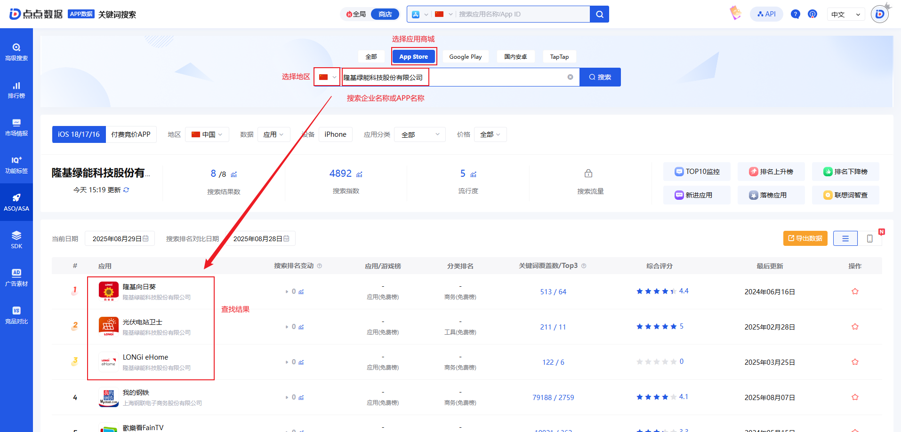
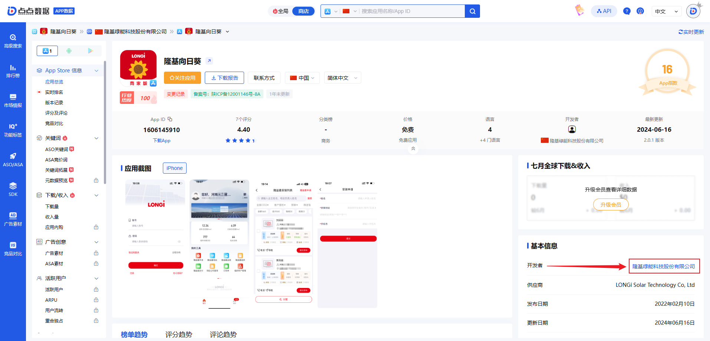
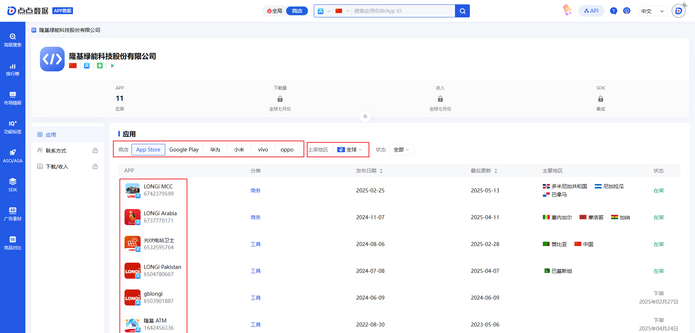
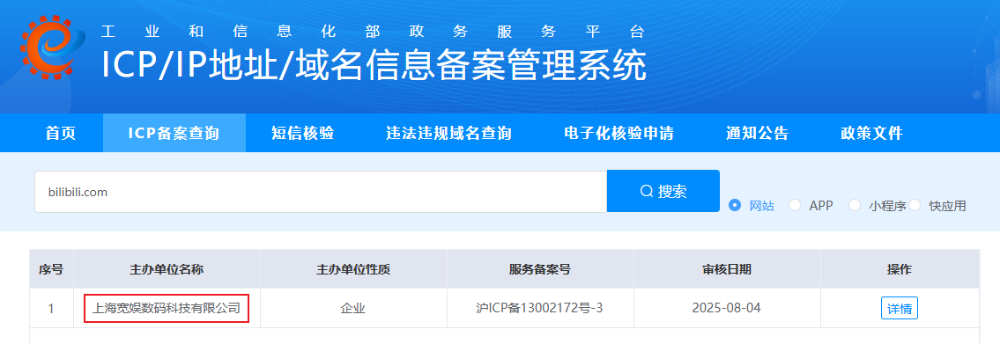
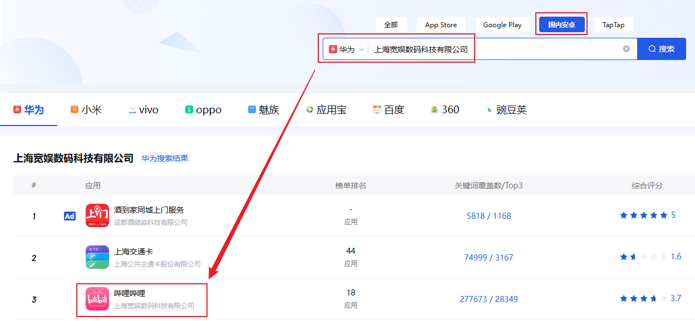
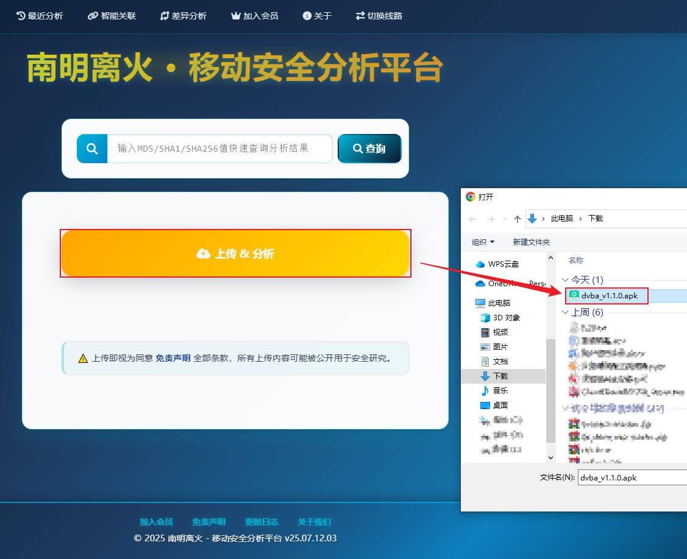
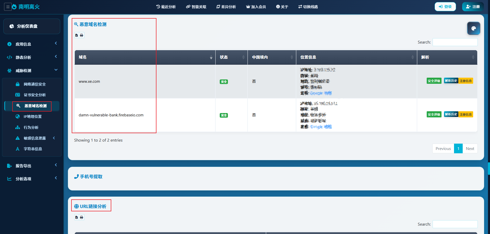

# APP应用

在信息收集章节中只涉及到目标APP资产信息打点，APP安全的问题会在后续章节具体学习。APP应用的信息收集主要解决两个问题：如何获取目标APP程序、如何通过目标APP提取目标资产信息

一般情况下拿到一个目标，目标的信息会以几种形式展示，例如，域名、IP、企业名称、APP程序等。信息收集的目的就是为了从某一个信息中以点打面，通过某一个信息获取到其他资产信息。例如，通过APP程序提取出目标的域名、IP等信息

## 一、获取APP程序

常见的一些可以用于获取目标APP程序的方式：通过企业知识产权获取APP、通过移动应用数据分析平台获取APP、通过备案信息获取APP

### 1.1 企业知识产权

通过企查查、爱企查、小蓝本等平台从企业知识产权信息中获取APP信息，企查查和爱企查在Web应用的信息收集章节中已经记录过如何使用，此处不做记录

### 1.2 移动应用数据分析平台

比较常用的移动应用数据分析平台是[七麦](https://www.qimai.cn/)数据和[点点](https://app.diandian.com/)数据，在这两个平台上可以通过企业名称获取APP





以点点数据的查询结果为例，点击查看某一个具体的软件信息，查看开发者相关信息，就可以看到该企业开发过的、在这个平台上能看到的所有软件





### 1.3 备案信息

一般情况下常规网站和灰色网站都会直接提供APP程序的下载，常规网站的APP通过备案信息查询同样能够获取到，灰色网站则因为无法备案、无法获取APP上架应用商城的资质，就只能将APP程序放在网站上或内部传播。以二次元大学“bilibili”为例，在它的官网上直接提供了APP下载链接


通过备案信息查找APP，主要是考虑到目标站点没有直接提供APP的场景，这种情况下可以先通过目标域名查询备案信息，再通过备案信息获取到企业名称，最后通过企业名称再到移动应用数据分析平台查找是否存在对应的APP





## 二、提取APP资产信息

能够从APP程序中获取到的信息很多，但渗透测试方向更偏向关注APP的配置文件和网络数据包，从两者中获取URL、API、OSS Key（或者其他的敏感Key）、JS等敏感信息。这些信息可以分别通过三种方式获取：抓包、APP静态分析、APP动态分析

**常用的APP分析工具**

| 工具           | 类型     | 链接                                                     |
| -------------- | -------- | -------------------------------------------------------- |
| 摸瓜           | 在线站点 | https://mogua.co/                                        |
| 南明离火       | 在线站点 | https://www.zhihuaspace.cn:8888/                         |
| AppInfoScanner | 离线工具 | https://github.com/kelvinBen/AppInfoScanner              |
| MobSF          | 离线工具 | https://github.com/MobSF/Mobile-Security-Framework-MobSF |

### 2.1 APP静态分析

APP静态分析指的是APP在不运行的情况下，通过一些工具对APP进行反编译，获取到APP的部分源码信息，通过对源码信息按照特定的方法进行提取、分析获取到敏感数据。APP静态分析工具有两个在线站点工具、两个本地离线工具，站点类工具使用简单且无需占用本地PC计算资源，但上传APP就意味着数据公开，并且还有可能涉及到在线站点的一些收费问题，因此主要推荐使用的还是两种离线工具

由于[补天](https://www.butian.net/)的公益SRC上比较难找到适合作为演示的APK程序，所以用github上的开源测试程序[DVBA](https://github.com/rewanthtammana/Damn-Vulnerable-Bank)进行演示，两种离线工具的使用方式非常简单且类似，仅演示一种

>  **南明离火**

南明离火本身是基于[MobSF](https://github.com/MobSF/Mobile-Security-Framework-MobSF)进行的二次开发，MobSF的静态分析功能与南明离火的使用方式类似，所以在静态分析中不展示MobSF的使用方式

1. 上传APK程序

   
   
2. 获取分析数据

   
   
   虽然通过分析工具能够获取到相当一部分的域名信息、URL链接信息，但部分信息是APP程序本身引用的一些外部接口，例如`https://www.xe.com`链接大概是被用于支持开发者用爱发电的支付接口，对安全测试者而言，这些外部接口无法为目标系统的信息收集提供直接的帮助

> **AppInfoScanner**

一款适用于以HW行动/红队/渗透测试团队为场景的移动端（Android、iOS、WEB、H5、静态网站）信息收集扫描工具，可以帮助渗透测试工程师、攻击队成员、红队成员快速收集到移动端或者静态WEB站点中关键的资产信息并提供基本的信息输出,如：Title、Domain、CDN、指纹信息、状态信息等

```bash
python app.py android -i ./dvba_v1.1.0.apk    # APK文件是提前上传到脚本同目录下的
	# android：扫描Android应用的APK文件 
```

AppInfoScanner扫描的结果与南明离火的扫描结果又可能会不一样，实际上静态分析工具的扫描结果取决于工具本身的搜索规则，规则匹配不到自然无法获取数据，数据本身也可以通过加密的方式来规避规则匹配，所以在使用静态分析工具对APP程序进行分析时，可以使用多种工具进行测试

### 2.2 抓包

在抓包技术小节中已详细描述如何对模拟器进行抓包，此处不做演示。APP程序的抓包需要判断对方是否使用http协议传输数据，进而选择不同的抓包工具，但需要注意的是，无论使用什么抓包工具，能捕获到的数据一定是APP程序需要与外部服务端进行网络通讯的数据（即网络传输），APP程序本地运行的代码、本地数据无法通过抓包技术捕获到

并且，即便APP程序提供的功能可以产生网络传输，但大都数情况下都需要在用户触发此功能时，才会真正的产生网络传输。因此，如果想通过网络抓包的方式尽可能捕获到全面一点的数据，那么在开启抓包后，攻击者还需要尽可能的把APP程序的所有功能都点击、使用一遍，来触发APP程序的网络传输

### 2.3 APP动态分析

动态分析工具使用MobSF，且为了避免前期过于复杂的理解和操作，建议直接将MobSF安装在有模拟器的机器上，可以将MobSF和模拟器都安装在虚拟机中，或安装在物理机上，MobSF会自动检测模拟器环境

#### 2.3.1 MobSF安装

MobSF本身的安装步骤并不复杂，大部分的时间都耗费在处理系统环境问题上。MobSF的安装方式多种多样，[MobSF官方文档](https://mobsf.github.io/docs/#/running_mobsf_docker)中首要推荐使用Docker的方式安装MobSF，Docker的部署方式能够避免与MobSF相关的一些系统环境问题，但Docker Desktop要求windows系统需要更新到指定版本才能正常使用，部分老旧的PC上可能已经不支持Windows更新到最新版本

在本人机器测试过程中，安装Docker Desktop所需环境后，VMware的linux类型虚拟机似乎运行异常，包括kali、centos，因此后续未使用Docker Desktop，但经过测试，MobSF的docker镜像能够正常在Docker Desktop中运行，只不过MobSF最新的镜像需要科学上网获取，或者使用第三方镜像仓库[轩辕镜像](https://xuanyuan.cloud/)获取

##### 2.3.1.1 windows安装

直接在物理机上安装MobSF时需要注意，原本系统上的各种安全工具所需要的系统环境各不相同，直接在系统上安装MobSF可能会破坏原有工具的运行环境。直接在系统上安装MobSF就需要采用MobSF的开发环境要求来准备系统环境，MobSF对于Windows系统的开发环境要求如下：

- 安装 [Git](https://git-scm.cn/downloads)
- 安装 [Python](https://www.python.org/downloads/) 3.12+
- 安装 [OpenJDK](https://www.oracle.com/cn/java/technologies/downloads/#jdk24-windows) 21+ 并配置 JAVA_HOME 环境变量。
- 安装 [Microsoft Visual C++](https://visualstudio.microsoft.com/zh-hans/) 生成工具
- 安装 [OpenSSL](https://slproweb.com/products/Win32OpenSSL.html)（非轻量级）
- 根据 wiki 说明下载并安装 [wkhtmltopdf](https://wkhtmltopdf.org/downloads.html)
- 将包含 wkhtmltopdf 二进制文件的文件夹添加到环境变量 PATH

系统环境要求统一可以通过安装预编译二进制程序解决，安装过程基本上都是鼠标点击下一步即可。MobSF本身的安装过程中，用户在运行`setup.bat`之前，关闭任何打开的MobSF文件夹或编辑任何与MobSF相关的文件，其中任何一种情况都可能导致权限错误，从而中断安装

在执行`setup.bat`脚本的过程中，MobSF会不断检测系统环境是否已经配置就位，即便程序已经安装好，但如果不符合MobSF预设的安装路径，在执行`setup.bat`的过程中也会有错误提示，按照错误提示进行修改即可

```cmd
cd .\Mobile-Security-Framework-MobSF-4.4.2\
.\setup.bat    # 开始安装
.\run.bat      # 运行MobSF
```

 MobSF在安装完成后会输出`REST API Key`和默认的账户密码`mobsf/mobsf`，MobSF运行后默认监听本地的8000端口

##### 2.3.1.2 Docker Desktop

从Docker官网下载安装[Docker Desktop](https://www.docker.com/products/docker-desktop/)，安装过程与正常的二进制文件安装类似，Docker Desktop安装完成后按照提示安装所需环境即可

```cmd
wsl -install    # 安装WSL子系统
wsl -update     # 更新WSL子系统
docker pull docker.xuanyuan.run/opensecurity/mobile-security-framework-mobsf:latest    # 拉取MobSF镜像到本地
```

##### 2.3.1.3 OpenSSL编译安装

OpenSSL的获取途径分为[官网](https://www.openssl-library.org/source/)或[github](https://github.com/openssl/openssl)，但无论是哪种途径，官方都不直接提供预编译二进制文件，所以需要用户自行编译安装或直接使用第三方编译版本程序，最常见的维护的第三方编译版本的社区是[​​Shining Light Productions​​](https://slproweb.com/products/Win32OpenSSL.html)，第三方编译版本安装方式比较简单，以下主要记录OpenSSL编译安装的方式

1. 系统环境准备

   - 安装[Visual Studio](https://visualstudio.microsoft.com/zh-hans/)，安装时需要勾选“使用 C++ 的桌面开发”
   - 安装[Perl​](https://strawberryperl.com/)，安装Perl时需要添加环境变量到系统PATH
   - 安装[NASM](https://www.nasm.us/)

2. 准备OpenSSL程序

   - 从Github下载OpenSSL的zip压缩包
   - Win+R搜素“x64 Native Tools Command Prompt for VS”​​，以管理员身份运行

   ```cmd
   # 64位编译，指定安装路径
   perl Configure VC-WIN64A no-asm --prefix="C:\Program Files\OpenSSL"
       VC-WIN64A：声明目标平台为64位，目标平台为32位时使用`VC-WIN32`
       no-asm：禁用汇编加速，可选项，用于避免兼容问题
       --prefix：自定义安装目录，默认安装到`C:\Program Files\OpenSSL`
    
   # 编译与安装
   nmake    # 编译（耗时约 20-30 分钟），在Native Tools Command上似乎无法不全，但能够正常使用
   nmake test    # 可选步骤，运行测试
   nmake install    # 安装
   
   # Win+R输入sysdm.cpl
   [高级] -> [环境变量] -> [Path] -> [编辑] -> [添加OpenSSL的bin目录路径]
   ```

#### 2.3.2 MobSF动态分析


### 2.4 三种方式对比

| 差异 | APP静态分析                                                  | 抓包                                                         | APP动态分析                                                  |
| ---- | ------------------------------------------------------------ | ------------------------------------------------------------ | ------------------------------------------------------------ |
| 优势 | 数据提取覆盖面全                                             | 直接获取真实的业务数据，无误报                               | 1、直接观察到APP的实际行为，结果真实可靠<br />2、绕过简单加密，可以直接在内存中提取解密后的代码、密钥、数据 |
| 劣势 | 1、无法获取运行时数据<br />2、提取的数据可能不准确<br />3、对加密的数据可能无法提取 | 1、极易被绕过，APP可以通过SSL Pinning（证书绑定）阻止抓包<br />2、数据可能被加密，即便抓到数据也可能需要先进行解密<br />3、视野局限，只能看到网路传输数据 | 效率较低，所有的数据都需要攻击者手动交互产生，与抓包类似，同样可能无法触发APP的所有功能，从而导致数据覆盖面不全 |

