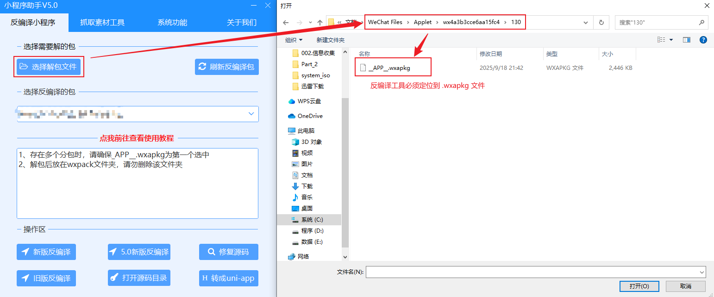
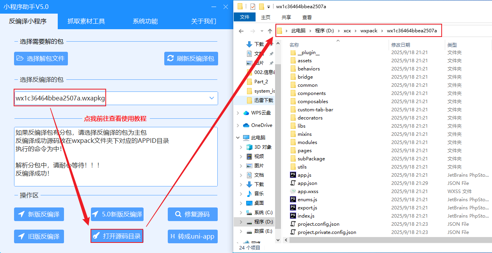

# 小程序

与APP应用相似，在信息收集章节中也只涉及到目标小程序的资产信息打点，主要用于解决两个问题：如何获取目标小程序、如何通过目标小程序提取目标资产信息

在国内市场环境下，小程序主要在微信、百度、支付宝、抖音几个平台使用较多，最常见的就是微信小程序和支付宝小程序。获取小程序的方式最简单，在哪个平台使用小程序，就到哪个平台上搜索关键词即可

相比较Web应用和APP应用，小程序上可做的操作比较少，此章节主要涉及到抓包和反编译方面的操作和思路，抓包早期演示，主要演示反编译过程，提供一种信息收集的思路

## 一、小程序结构

小程序组成结构主要由三部分组成：主体结构、页面文件、目录结构，小程序包含一个描述整体程序的APP和多个描述各个页面的Page

1. 主体结构

   一个小程序的主体部分（即APP）由三个文件组成，必须放在项目的根目录下

   | 文件     | 必须 | 作用                                                         |
   | -------- | ---- | ------------------------------------------------------------ |
   | app.js   | 是   | 全局逻辑入口。注册小程序应用，管理应用生命周期、全局数据及方法 |
   | app.json | 是   | 全局配置文件。配置页面路径、窗口表现、标签栏、网络超时等全局设置 |
   | app.wxss | 否   | 全局样式文件。定义全局通用样式，部分组件可能不受其影响       |

2. 页面文件

   一个小程序页面由四个文件组成

   | 文件     | 作用     |
   | -------- | -------- |
   | xxx.js   | 页面逻辑 |
   | app.json | 页面配置 |
   | app.wxml | 页面结构 |
   | app.wxss | 页面样式 |

3. 目录结构

   项目整体目录结构

   | 目录                | 作用                                                         |
   | ------------------- | ------------------------------------------------------------ |
   | pages/              | 页面集合。存放所有小程序页面，每个页面通常由 `.wxml`、`.wxss`、`.js`、`.json`四个文件组成 |
   | images/             | 静态资源目录。用于存放图片、音频、视频等静态资源文件         |
   | pages/index/        | 首页目录。用户进入小程序首先看到的页面，改目录下通常包含`index.js`、`index.json`、`index.wxml`、`index.wxss`四个文件 |
   | logs/               | 日志目录。通常指小程序中用于展示运行日志的页面，也指小程序运行过程中记录日志的行为和能力，目录下同样包含`logs.js`、`logs.json`、`logs.wxml`、`logs.wxss`四个文件，通过`wx.getLogManager()`等API进行日志记录 |
   | utils/              | 工具模块。存放可复用的工具函数、通用模块或第三方库           |
   | project.config.json | 项目配置。 配置项目的开发者工具设置、项目名称、AppID等       |
   | sitemap.json        | 搜索索引设置。用于配置小程序及其页面是否允许被微信索引       |

使用[凡科建站](https://qz.fkw.com)可以创建一个测试微信小程序，创建的测试小程序可以本地学习使用，但发布到微信官方的小程序必须具备资质才能发布

## 二、提取小程序资产信息

### 2.1 抓包

微信小程序的抓包需要借助Proxifier工具结合BurpSuite工具使用，通过Proxifier将微信应用程序的流量代理转发到BurpSuite，由BurpSuite捕获http协议流量，如果小程序使用的不是http协议传输，可以考虑使用另外的抓包工具捕获数据，详细的使用方法已经在抓包技术小节中有演示，此处不做记录

- 对抓到的IP或域名进行Web安全测试
- 对抓到的IP或域名进行API安全测试
- 对抓到的IP或域名进行端口服务测试

如果通过Proxifier+BurpSuite在捕获微信小程序的数据包时，在BurpSuite的HTTP History记录的条目只是闪烁一下就消失，这可能是由于HTTP History默认的过滤规则隐藏了，例如默认不显示静态资源请求，通过调整过滤条件即可恢复

### 2.2 反编译工具

通过反编译工具可以获取小程序的源码，对小程序源码架构主要对4个方面进行分析测试

- 资产信息收集（无法通过抓包获取的域名或IP）
- 敏感配置信息（例如敏感Key信息等）
- 未授权访问测试
- 源码安全问题（代码审计）

网上存在大量的反编译教程，但这类教程大多存在几个问题：使用的反编译工具大多来自未知来源的第三方、工具稳定性不可靠、工具用法比较复杂，诚然这类工具最大的优势在于完全免费，只要使用者肯花时间学习调试，这类工具就是最优选

考虑到处理问题的效率，推荐可以将[小程序多功能助手](https://xcx.siqingw.top/)作为参考工具之一，小程序多功能助手是一款收费的小程序反编译工具，其优势在于收费不高的同时能够保障反编译的稳定性。在小程序多功能助手官网提到，使用此工具进行反编译时，只能使用低于4.0版本的微信，微信4.0以上版本无法获取小程序包，其官网提供了工具的[使用教程](https://www.kancloud.cn/ludeqi/xcxzs/3234080)与[运行环境](https://www.kancloud.cn/ludeqi/xcxzs/2607635)要求

按照小程序的代码组织方式分类，小程序又被分为单包与分包两种策略，单包指的是所有代码和资源都放在一个包内，分包指的是代码被拆分到1个主包和多个分包中，分包的目的是优化启动速度和突破体积限制，两种组织方式的反编译操作也不同

#### 2.2.1 单包反编译

首次反编译建议不要选择知名度较高的小程序，反编译的过程中可能会碰到非常多超出能力外的问题，反编译流程演示只是为了明确小程序在反编译以后能够通过信息收集手法从哪些文件如何提取信息

1. 文件管理打开

   

2. 清空微信小程序的缓存数据

   此处文件管理器的资源路径也需要注意，通过微信的[文件管理] -> [打开文件夹]，默认会访问到`WeChat Files\wxid_xxxx`，需要回退到上一父目录再访问Applet目录

   

3. 访问目标小程序，使其重新生成缓存数据

   

4. 小程序助手选择解包文件

   

5. 解包成功后刷新反编译包，选中反编译包，根据实际情况选择反编译类型，部分老版本的小程序可能不支持新版反编译，5.0新版反编译修复了反编译结果为html文件和js文件、没有app.json等问题，但5.0新版反编译必须手动合并分包，如果反编译后目录无源码文件夹，请查看软件所在目录是否包含中文，如果包含请将中文目录修改成英文

   

6. 查看反编译结果

   反编译结果存放在“小程序助手”软件安装根目录下的`wxpack\APPID\`，也可以直接通过[打开源码目录]查看反编译结果

   

   部分场景下使用非5.0新版反编译时，从反编译的结果可以看出与之前小节提到的小程序的组成结构并不相符，例如反编译结果并没有app.json、app.wxss文件，这通常是因为反编译工具没有完全处理“中间文件”导致的

   | 文件                        | 说明                                                         | 目标文件                       |
   | --------------------------- | ------------------------------------------------------------ | ------------------------------ |
   | app-config.json             | 所有配置信息的汇总（包含app.json和各个页面的page.json）      | `app.json`、各页面 `page.json` |
   | app-service.js              | 所有JS逻辑的汇总（包含app.js、各页面的page.js及其他JS）      | `app.js`、各页面 `page.js`     |
   | page-frame.js（或类似文件） | 所有WXML结构和全局WXSS样式的汇总（也可能包含公共样式）       | 各页面 `.wxml`、`app.wxss`     |
   | app-wxss.js（或类似）       | 另一种可能存放WXSS样式信息的文件（其内容与page-frame.html类似，缺少头尾标签） | 各页面 `.wxss`                 |

7. 通过微信开发者工具打开小程序反编译的结果

   通过官网下载、安装[微信开发者工具](https://developers.weixin.qq.com/miniprogram/dev/devtools/download.html)，然后通过微信开发者工具打开反编译结果，在安装微信开发者工具后也可以通过小程序助手“[系统功能] -> [微信开发者]”跳转到微信开发者工具

   

   使用微信开发者工具打开反编译结果后，在微信开发者工具上可能会出现各式各样的报错，这些问题只能具体发现、具体解决，谨记一点，目前的主要目标是需要从小程序的源码中收集到有效信息，只要能够获取到有效信息，无论是否报错、以及后续的可视化调试工具是否可用，这些都可以跳过的

8. 微信开发者工具调试

   通过小程序结构小节中提到的知识点，app.wxss文件用于编写小程序的页面样式，这并不是渗透测试所关心的数据，因此除了app.wxss文件以外的三个文件都可以进行信息收集

   在微信开发者工具中启用可视化调试，然后对小程序下的目录结构文件逐个进行检索，可以查看文件代码内容的同时，也可以看到小程序上产生的变化，反过来也可以通过小程序的变化可以判断出该文件代码用于实现小程序的哪些功能

   

   

所有通过抓包能够捕获的资源路径，都可以直接在发编译后的微信开发者工具中找到程序的具体代码文件，通过微信开发者工具在可视化工具下查看源码时还有可能会有意想不到的收获。例如，一些需要先登陆才能操作的小程序，通过源码和可视化工具可以直接越过身份验证，查看敏感信息，例如商品列表、订单信息等，实现未授权访问

#### 2.2.2 分包反编译

相比较单包反编译，多包反编译需要注意的是，由于代码被拆分到1个主包和多个分包中，在使用小程序多功能助手选择解包文件时，必须确保\_APP\_.wxapkg主包是第一个包，分包顺序任意选中即可。分包反编译大致上与单包反编译操作流程类似，此处仅记录差异点

1. 小程序助手选择解包文件

   

2. 查看反编译结果

   

3. 分包手动合并

   分包反编译需要手动将分包与主包内容进行合并，也就是将后缀带有编号的目录下的内容复制到主包目录中，按照小程序多功能助手的官方教程，需要先通过微信开发者工具打开主包目录，然后根据app.json文件的配置，将分包下的目录复制到主包中

相比较单包反编译，分包反编译的可视化功能更容易出问题，无法直观的通过微信开发者工具看到每个代码文件所代表的页面。然而，这并不影响攻击者直接通过代码文件查找敏感信息，例如，通过微信开发者工具自带的搜索功能查找`AccessKeyID`、`SecretKey`等带有`Key`、`ID`敏感词的字段

> **微信4.0以上版本**

无论使用什么类型的反编译工具，首先都需要拿到小程序的相关信息，网上大部分教程应该都是使用的微信4.0以下版本，大多是通过微信的设置打开文件管理，访问文件管理的存储路径下的Applet目录，但微信4.1.0.18版本已经没有文件管理选项了，并且存储位置下也没有Applet目录

通过Everything搜索可以在`C:\Users\hebor\AppData\Roaming\Tencent\xwechat\radium\Applet\packages\`目录下找到类似的小程序缓存数据，例如`.wxapkg`文件，删除该目录下的所有文件后，重新访问微信小程序，小程序的缓存数据也会在该目录下自动创建，并以`wx....`的命名形式展示。不同的是，即便只访问了一个微信小程序，也会在`packages`目录下自动生成多个`wx....`目录

然而，即便在微信4.0以上的版本中找到类似的数据文件，目前的工具暂时无法对数据进行反编译
