# 自动化工具

本小节全文描述自动化工具的部署和使用，用于提升渗透测试的效率，自动化工具很多，笔录中不会全部记录，其他各类红蓝队优秀工具集合：

https://github.com/guchangan1/All-Defense-Tool

此项目集成了网络上很多优秀的开源攻防武器项目，包含信息收集工具（自动化利用工具、资产发现工具、目录扫描工具、子域名收集工具、指纹识别工具、端口扫描工具、各种插件....etc...），漏洞利用工具（各大CMS、OA利用工具、中间件利用工具、反序列化利用工具、数据库利用工具等项目........），内网渗透工具（隧道代理、密码提取、木马免杀、域渗透.....）、应急响应工具、甲方运维工具、等其他安全攻防资料整理，供攻防双方使用

## 一、武器库部署F8x

[F8x](https://github.com/ffffffff0x/f8x)项目用于解决解决系统环境、安全工具的安装问题，在拿到一个干净的系统后（比如，物理机重装系统、云主机VPS等），首先需要解决的就是安全工具的安装，而安全工具又依赖各种开发环境，这些都是需要用户手动解决的问题。F8x通过其命令参数能够实现快速部署各种开发环境、安全工具，f8x基本上不需要任何依赖，或者说它就是为了帮助用户安装各种依赖而生的

大多数场景下，在不同的云购买一些 vps 服务器用于部署红 / 蓝队设施，不能做到开箱即用，使用 f8x 可以快速部署所需要的各类服务。同时兼顾到本地 VM 虚拟机的需求，可以选择走 socket 代理进行安装部署，Proxychains-ng 也会自动安装，只需做好 Proxychains-ng 配置即可

笔录中不会用f8x命令的所有选项参数，f8x支持的所有选项参数请查看其[说明文档](https://github.com/ffffffff0x/f8x/blob/main/README.zh-cn.md)。经简单测试，f8x工具确实能够简化基础环境的安装问题，但部分软件包在安装过程中仍会安装失败，命令执行完成后仍需要手动确认安装过程的信息

### 1.1 配置与使用

1. 安装

   ```bash
   wget -O f8x https://raw.githubusercontent.com/ffffffff0x/f8x/main/f8x
   mv f8x /usr/local/bin/f8x && chmod +x /usr/local/bin/f8x    # 将f8x添加到环境变量
   f8x -h
   ```

2. 安装基本环境（包括gcc、make、git、vim等）

   ```bash
   f8x -b
   ```

3. 安装docker

   ```bash
   f8x -docker
   ```

## 二、网络空间AsamF

[AsamF](https://github.com/Kento-Sec/AsamF)是一款集成多个网络资产测绘平台的一站式企业信息资产收集工具，集成了Fofa、Quake、Hunter、Shodan、Zoomeye、Chinaz、0.zone及爱企查等网络资产测绘平台。AsamF在使用之前，至少需要在AsamF集成的网络资产测绘平台上有注册过帐号，AsamF需要通过各个平台的Key来实现查询

AsamF工具除了可以用于一站式查询，还支持搜索结果导出。大多数网络资产测绘平台的数据导出都是收费功能，通过AsamF工具可以避免费用问题，但AsamF工具只能解决搜索结果导出的问题，如果用户本身连搜索权限都有限，AsamF工具也无法解决

现在AsamF工具似乎也无法避免费用问题了，使用各平台的API Key进行查询时，需要使用积分或购买查询点数

### 2.1 配置与使用

1. 安装

   ```bash
   wget https://github.com/Kento-Sec/AsamF/releases/download/v0.2.5/AsamF_linux_amd64
   chmod +x AsamF_linux_amd64
   ./AsamF_linux_amd64 info    # 使AsamF自动生成配置文件
   ```

2. 获取用户key（以quake为例）

   AsamF项目的介绍中虽然还保留有爱企查的使用方式介绍，但0.2.5版本的帮助手册上已经没有爱企查的使用参数了，再使用工具时建议安装工具后查看实际版本对应的测绘平台，再收集测绘平台的用户key

   

3. 修改AsamF的配置文件

   每个测绘平台的用户Key要求可能不一样，各个平台的用户Key要求按照配置文件内的要求写入即可，不同平台对于用户Key的写入语法可能也要求不同，建议自行探索后编写

   ```bash
   vim ~/.config/asamf/config.json
   {
           "fofaemail": {
                   "1":"xxxx@xxx.com"
           },
           "fofakey": {
                   "1":"xxxx"
           },
           "quakekey": [
                   "xxxx-xxxx-xxxx-xxxx-xxxx",
                   ""
           ],
           "hunterkey": [
                   "xxxx",
                   ""
           ],
           "zoomeyekey": [
                   "xxxx",
                   ""
           ],
           "shodankey": {
                   "1":"xxxx"
           },
           "chinaz": {
                   "1":"xxxx"
           }
   }
   ```

4. 使用AsamF

   ```bash
   ./AsamF_linux_amd64 -h    # 查看AsamF支持的测绘平台
   ./AsamF_linux_amd64 q -h    # 查看特定测绘平台支持的参数
   ./AsamF_linux_amd64 q -q "weblogic"    # 使用测绘平台查询时仍需遵循对应的查询语法
   ```

   部分测绘平台需要充值才具备查询权限，查询结束后AsamF会将查询结果保存在本地文件中，kali linux默认的保存路径是`/home/hebor/asamf/quake_weblogic_result_20250922105350.csv`，这个表格中记录的中文字符可能存在乱码问题，将编码格式修改为UTF-8或GBK即可

## 三、企查信息ENScan

[ENScan_Go](https://github.com/wgpsec/ENScan_GO)是一款基于各大企业信息API的工具，用于解决在HW/SRC场景下遇到的各种针对国内企业的信息收集难题，一键收集控股公司ICP备案、APP、小程序、微信公众号等信息聚合导出。ENScan_Go在首次使用时需要使用-v参数生成配置文件信息后进行配置

使用程序可能导致⌈账号异常⌋，登录后谨慎使用工具进行搜索

### 3.1 配置与使用

1. 安装

   ```bash
   wget https://github.com/wgpsec/ENScan_GO/releases/download/v1.3.1/enscan-v1.3.1-linux-amd64.tar.gz
   tar -xzf enscan-v1.3.1-linux-amd64.tar.gz
   ./enscan-v1.3.1-linux-amd64 -v    # 首次使用生成配置文件
   ```

2. 获取用户key（以爱企查为例）

   爱企查禁止用户浏览器使用开发者工具，因此需要通过脚本文件或浏览器插件的方式获取Cookie，此处使用Firefox浏览器的Cookie Editor插件，实现导入导出Cookie信息

   

   使用Cookie Editor插件获取的Cookie信息是一个json文件，ENScan工具的配置文件要求使用键值对的方式写入，因此Cookie Editor获取的Cookie信息还需要进一步处理

3. 修改ENScanp配置文件

   ```bash
   vim config.yaml
   version: 0.6
   user_agent: "Mozilla/5.0 (Windows NT 10.0; Win64; x64; rv:143.0) Gecko/20100101 Firefox/143.0"                  # 自定义 User-Agent（可设置为获取Cookie的浏>览器）
   app:
     miit_api: ''          # HG-ha的ICP_Query (非狼组维护 https://github.com/HG-ha/ICP_Query)
   cookies:
     aiqicha: 'KEY1=VALUE1; KEY2=VALUE2; KEY3=VALUE3 ...'           # 爱企查   Cookie
     tianyancha: ''        # 天眼查   Cookie
     tycid: ''             # 天眼查   CApi ID(capi.tianyancha.com)
     auth_token: ''        # 天眼查   Token (capi.tianyancha.com)
     tyc_api_token: ''     # 天眼查   官方API Key(https://open.tianyancha.com)
     risk_bird: ''         # 风鸟     Cookie
     qimai: ''             # 七麦数据 Cookie
   ```

   从配置文件中可以注意到，不同的站点对用户Key的要求不一样，要求Cookie时需要使用完整的Cookie值，要求Token时只需要Token值，部分的Token值可能会写在Cookie里，只是Cookie值中的一个键值对

4. 使用ENScan

   ```bash
   ./enscan-v1.3.1-linux-amd64 -h    # 查看帮助信息
   ./enscan-v1.3.1-linux-amd64 -n "目标企业名称"    # 查询企业信息
   ```

   查询结果涵盖企业名称、法人代表、网站名称、网址、域名、备案号、APP等信息，输出结果的概述会直接输出到命令行，同时会在`./outs/xxxx.xlsx`路径下输出一份表格

## 四、综合架构

### 4.1 ARL

[ARL](https://github.com/Aabyss-Team/ARL)资产侦察灯塔系统，旨在快速侦察与目标关联的互联网资产，构建基础资产信息库。 协助甲方安全团队或者渗透测试人员有效侦察和检索资产，发现存在的薄弱点和攻击面。灯塔ARL的官方开源项目于2024年5月13日停止维护支持，官方建议购买斗象科技企业版产品。对于个人而言仍可以使用开源的历史版本进行研究或学习

#### 4.1.1 配置

1. 安装ARL

   ARL的安装支持源码安装和Docker安装，通过ARL的自动化脚本可以一键式安装。ARL的源码安装只支持特定版本的CentOS、Rocky、Ubuntu系统，通过自动化脚本使用Docker安装ARL时，脚本声明仅支持国外主机，这可能跟网络环境有关

   ARL的自动化脚本不仅只有安装功能，还提供了更新源、安装依赖软件等功能，即便不通过自动化脚本使用Docker安装ARL，也可以先安装依赖

   - 使用自动化脚本安装ARL

     ```bash
     wget https://raw.gitcode.com/msmoshang/ARL/raw/master/misc/setup-arl.sh
     chmod +x setup-arl.sh
     sudo ./setup-arl.sh
     ```

   - 通过github的Docker脚本安装ARL

     ```bash
     # 1.先通过setup-arl.sh脚本安装Docker及其依赖环境
     # 2.使用Docker安装ARL
     git clone https://github.com/honmashironeko/ARL-docker.git
     cd ARL-docker/
     chmod +x setup_docker.sh
     source ~/myenv/bin/active
     sudo bash setup_docker.sh
     ```

     整个安装过程涉及到Docker和python环境，如果使用非root账户配置，需要格外注意sudo的使用和python虚拟环境的配置。科学上网似乎也无法通过Docker直接拉取ARL的镜像，此处我使用云主机拉取镜像、导出镜像到本地使用的方式安装ARL（因为个人想把工具集中存放在一个虚拟机上）

2. ARL的启停

   ARL容器启动后默认监听5003端口，默认账号密码是`admin/honmashironeko`

   ```bash
   docker-compose down    # 关闭ARL命令
   docker-compose up -d    # 启动 ARL 命令
   vim config-docker.yaml    # 编辑配置文件
   ```

#### 4.1.2 使用

1. 创建扫描任务

   

2. 查看扫描详情

   

3. 自定义配置

   

工具考虑到法律风险问题，并不自带指纹信息，且不允许扫描类似`edu.cn`的域名。作为个人工具使用的话，指纹信息可以自定义导入，信息越丰富就越能对目标系统进行精准识别，包括PoC信息、策略信息也是如此

### 4.2 Nemo

[Nemo](https://github.com/hanc00l/nemo_go)用于进行自动化信息收集，通过集成常用的信息收集工具和技术，实现对内网及互联网资产信息的自动收集，提高隐患排查和渗透测试的工作效率

Nemo官方指南声明，Docker方式建议只用于测试和临时使用，由于默认Docker里的用户是root，在获取指纹截图调用chrome有一定安全风险，如果需要长期使用，会建议使用VPS安装方式。同时为更好的发挥分布式Worker的作用，可以在具备多个VPS的情况下，独立部署安装Worker（详细见[安装手册](https://github.com/hanc00l/nemo_go/blob/main/v3/docs/install.md)）

#### 4.2.1 配置

1. 安装Nemo

   ```bash
   wget https://github.com/hanc00l/nemo_go/releases/download/v3.2.0/nemo_linux_amd64.tar
   mkdir nemo
   tar -xvf nemo_linux_amd64.tar -C nemo
   cd nemo
   sudo docker-compose up -d
   ```

2. nemo的启停

   nemo容器启动后默认监听5000端口，默认账号密码是`nemo/nemo`

   ```bash
   docker-compose down    # 关闭ARL命令
   docker-compose up -d    # 启动 ARL 命令
   vim config-docker.yaml    # 编辑配置文件
   ```

   Server端运行后，默认会启用以下端口：

   - 5000：Http，web界面
   - 5001：RPC接口，用于worker将任务结果保存到server
   - 5002：Redis安全代理隧道，用于Worker与Server通信
   - 5500：MCP Server监听地址
   - 27017：mongodb数据库，用于数据存储，默认在127.0.0.1上开放；
   - 6379：服务器Redis，用于存储任务队列，默认在127.0.0.1上开放；使用Redis安全代理隧道后，该端口不需要暴露到公网

   Worker不会开启对外的任务监听端口，但默认开启本地socks5转发和本地Redis转发，监听地址将为本地127.0.0.1

   - 5010：本地socks5转发，用于chrome-headless支持带验证的socks5代理；如果该端口被占用，会自动递增1个可使用的端口
   - 16379：本地Redis转发，worker通过与Server建立Redis安全隧道后，会在该端口进行redis代理

#### 4.2.2 使用

1. 设置API Token

   Nemo本身也需要依赖第三方测绘平台获取信息，通过配置API Token的方式调用第三方测绘平台接口，配置必须先保存、再测试

   

   

   FOFA状态失败是因为没有F点了，chinaz失败可能是由于API设置异常

2. 定义任务模板

   

   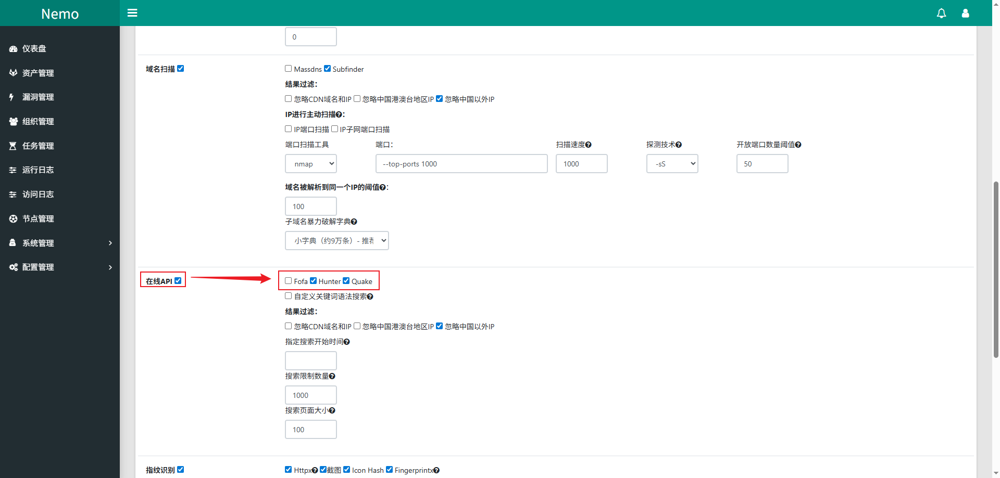

3. 新建任务

   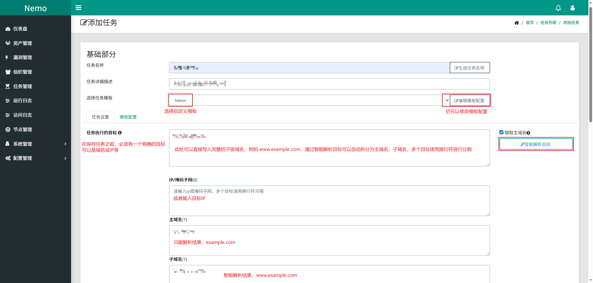

   访问任务名称可以查看任务执行详情，主要在于“在线API”的执行状态，也可以用于验证在线API的配置是否生效

Nemo相比较ARL的优势在于它除了利用自身工具进行信息收集以外，还可以通过API Key的方式接入第三方测绘平台，信息收集更加全面，但如果用户Key在第三方测绘平台上本身就不具备搜索权限，Nemo相比较其他工具是不具备明显优势的

自动化的信息收集平台能够帮助攻击者快速了解目标的一些常见信息，这种方式比较适用于对批量目标进行快速的信息打点，单独围绕某一个目标进行信息收集时，手工收集的信息会更加准确、全面


## 五、Github的其他用法

在Web应用小节中就有提到，通过Github搜索一些代码中的特殊文件名、代码片段、特定邮箱，可以尝试获取到一些敏感信息、源码信息。除了通过文件名、邮箱搜索以外，当然也可以使用一些通用的敏感词，搜索特定范围内的信息

### 5.1 敏感信息搜索

github资源搜索语法

| 语法                     | 说明                                 |
| ------------------------ | ------------------------------------ |
| in:name test             | 仓库标题含有关键词                   |
| in:description test      | 仓库描述含有关键词                   |
| in:readme test           | ReadMe文件含有关键词                 |
| stars:>3000 test         | stars数量大于3000，搜索关键词        |
| stars:>1000..3000 test   | stars数量在1000~3000之间，搜索关键词 |
| forks:>3000 test         | forks数量大于1000，搜索关键词        |
| forks:>1000..3000 test   | forks数量在1000~3000之间，搜索关键词 |
| size:>=5000 test         | 指定仓库大于5000k(5M)的搜索关键字    |
| pushed:>2019-02-12 test  | 发布时间大于2019-02-12的搜索关键字   |
| created:>2019-02-12 test | 创建时间大于2019-02-12的搜索关键字   |
| user:test                | 用户名搜索                           |
| language:java test       | 在java语言的代码中搜索关键字         |
| user:test in:name test   | 组合搜索，用户名为test且标题含有test |

1. 基于域名搜索

   直接搜索目标相关的域名、通用关键词（例如password），尝试获取敏感信息,在不同的项目中查找与目标接近的信息进行测试。这种方式也比较看运气，搜索不到任何信息的情况同样存在

   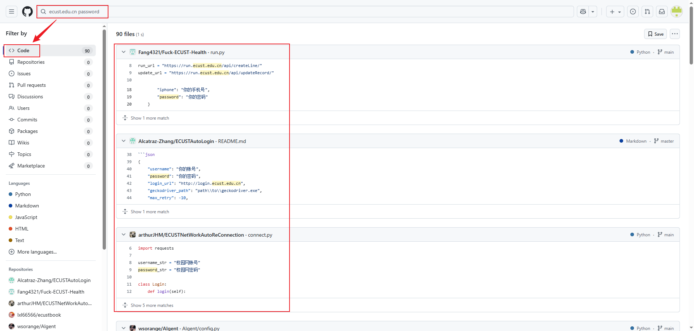

2. 基于邮箱搜索

   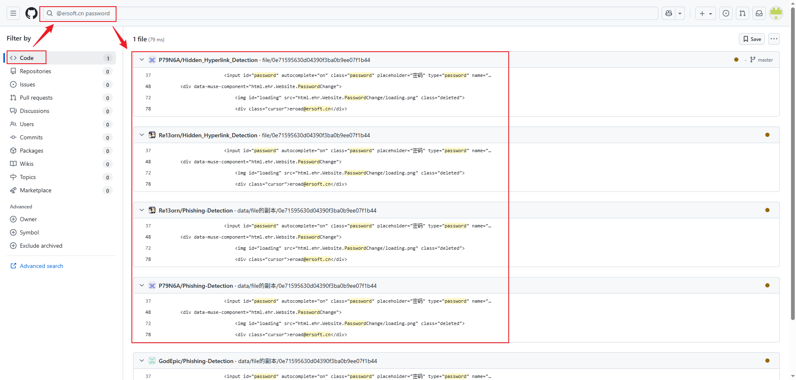

3. 基于用户名搜索

   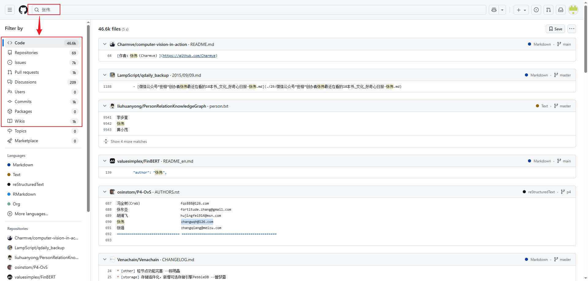

### 5.2 信息泄露监控

Github上的搜索是对截至到目前为止的信息进行检索，没有获取到有效信息时是很正常的，搜索姿势不对或者目标上传的信息中没有敏感信息，但如果目标作为攻击者的一个长期测试目标时，就需要持续关注目标的相关信息中是否存在敏感信息泄露，此时就需要一些自动化工具进行持续监测

#### 5.2.1 Github-Monitor

GITHUB MONITOR是vipkid安全研发团队打造的用于监控Github代码仓库的系统。通过该系统可以及时发现企业内部代码泄露、从而降低由于代码泄露导致的一系列安全风险。用户仅需通过简单的任务配置，即可在分钟级发现代码泄露的情况

1. 安装

   ```bash
   # 拉取源码文件
   git clone https://github.com/VKSRC/Github-Monitor.git
   cd Github-Monitor
   cp .env.docker .env    # 这个文件中保存有初始邮箱和账号密码设置
   
   # 提前通过第三方镜像站下载Docker镜像
   sudo docker pull docker.1ms.run/library/mysql:5.7
   sudo docker pull docker.1ms.run/library/ubuntu:18.04
   sudo docker image tag 5107333e08a8 mysql:5.7
   sudo docker image tag f9a80a55f492 ubuntu:18.04
   
   # 默认的Dockerfile步骤中，在安装PyNaCl包时缺少cffi依赖会一直报错
   vim Dockerfile
   RUN pip3 install cffi>=1.4.1 -i https://mirrors.aliyun.com/pypi/simple/ --trusted-host mirrors.aliyun.com    # 在运行pip install -r /requirement.txt之前添加此命令
   sudo docker-compose up -d
   ```

2. Github生成token

   Github Monitor使用Github REST API v3接口进行搜索，需要预先配置Token进行认证。然后进入[Token配置页面](https://github.com/settings/tokens)创建Token，将Token添加到Github Monitor中

   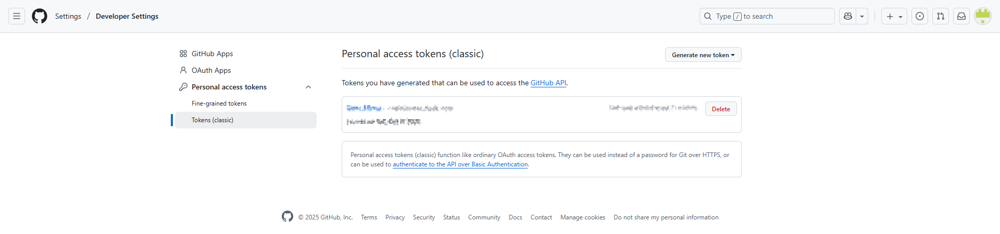

3. 登录

   首次使用浏览器访问`http://127.0.0.1:8001`即可看到页面，默认账号密码是`admin/password123!@#`，通过Github-Monitor安装目录下的`.env`文件进行配置修改

   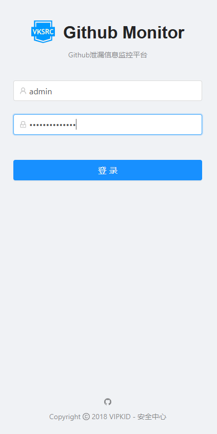

4. [Token管理] -> [添加Token]

   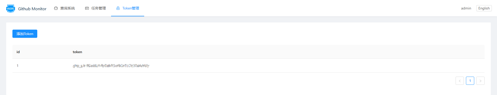

5. [任务管理] -> [创建任务]

   Github-Monitor的关键词与手动在Github上使用的关键词相同，或者说如果要对任务或关键词进行验证，可以使用先在Github上手动验证过的关键词，任务状态异常或查询系统信息异常时，可以尝试重启容器后重试运行任务

   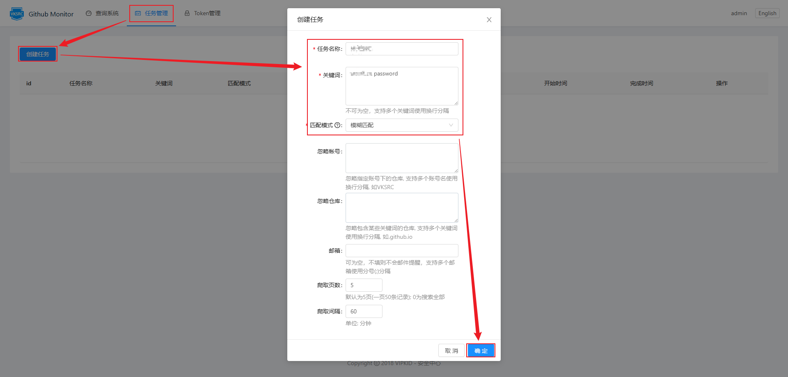

   缺省情况下是每60分钟就会爬取一次Github的数据

6. 查看查询结果

   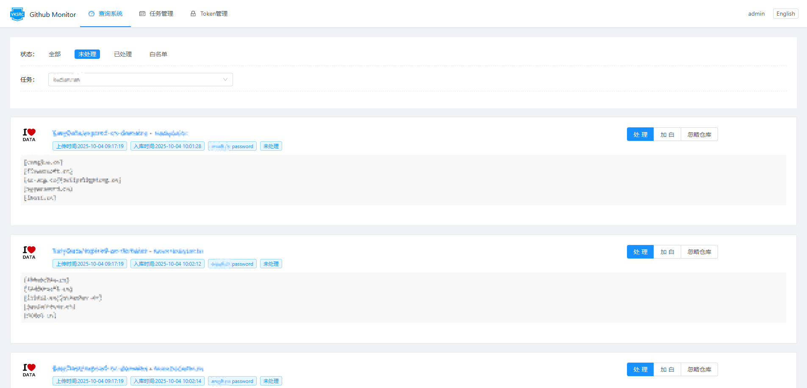

#### 5.2.2 gshark

偏向蓝队代码监测

1. 安装

   ```bash
   # 拉取源码文件
   git clone https://github.com/madneal/gshark
   ```

2. 登录

3. 搜索关键词“免杀”

#### 5.2.3 FireEyeGoldCrystal

1. 安装

   ```bash
   # 拉取源码文件
   git clone https://github.com/NHPT/FireEyeGoldCrystal.git
   ```

2. 登录

3. 搜索关键词“CVE”

## 六、网盘信息收集

相比较Github可能会泄露的源码信息、敏感信息，网盘上的信息就更加冗杂，包括招标文件、人员信息、业务产品、程序源码等信息，一般第三方网盘搜索工具都无法使用各网盘官方的接口进行搜索，搜索出的结果是否与目标相关也犹未可知，因此网盘信息收集的方式用的不多，只能作为一种补充方式

### 6.1 网盘搜索器


### 6.2 混合盘

## 七、网络空间其他用法

### 7.1 证书

1. [查看网站信息] -> [连接安全] -> [证书有效] -> [详细信息] -> [证书层次结构]；获取目标证书域名

   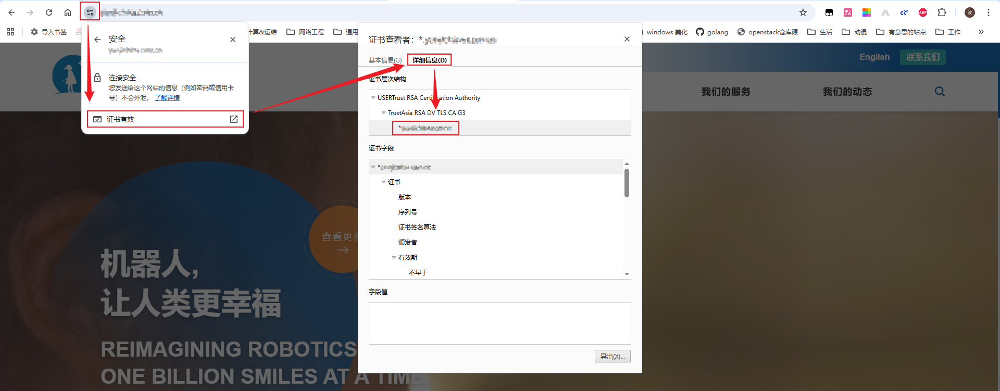

2. 使用网络空间的证书搜索语法

   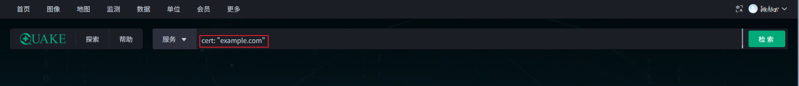

### 7.2 图标

1. [查看网页源码] -> [搜索"ico"] -> [打开链接] -> [图片另存为...]；获取目标站点logo图片

   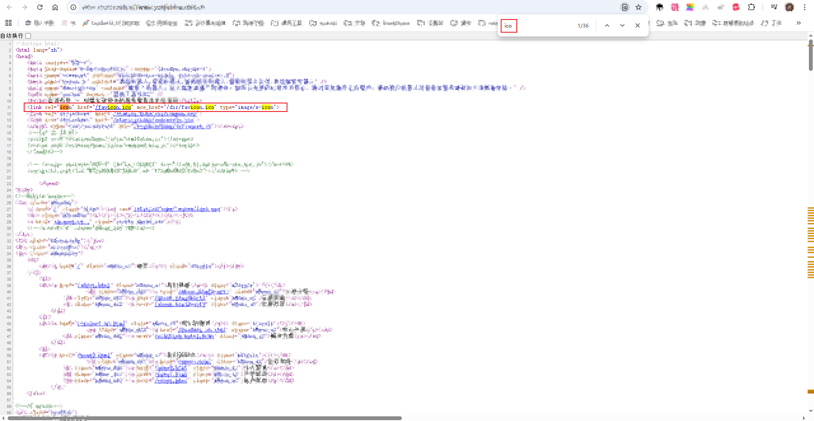

2. 使用网络空间的图标搜索

   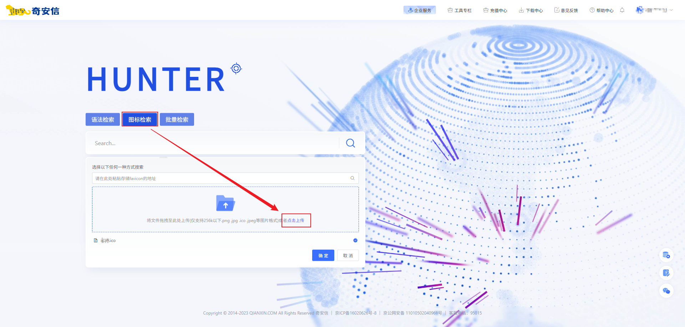

### 7.3 邮箱

hunter.io是一个专注于查找和验证电子邮件地址的专业在线工具平台，通过域名、公司名、邮箱等任一信息，可以反向查找对应的其他信息，站在攻击者视角可以聚焦于邮箱信息的获取，邮箱可以进一步进行暴破。hunter.io站点需要注册账号后使用，账号似乎无法使用163邮箱

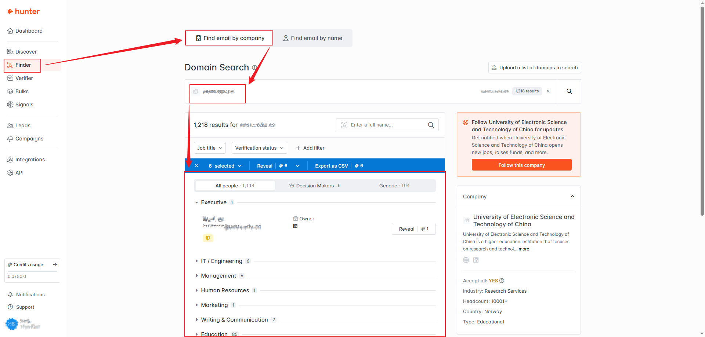
