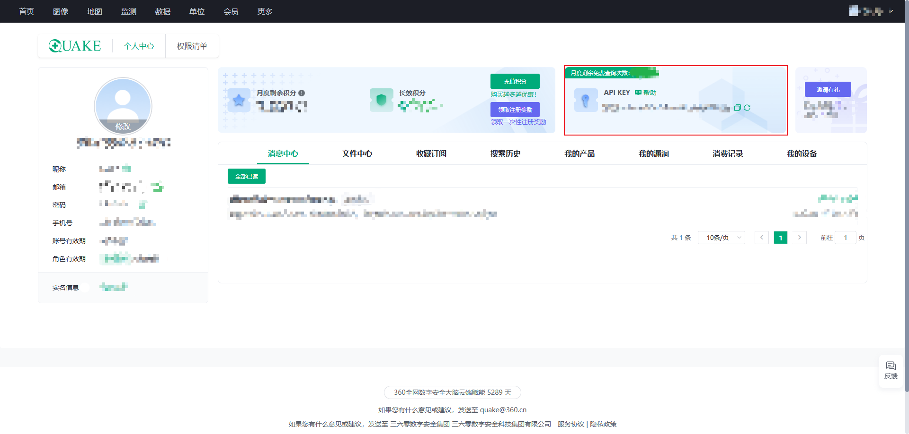
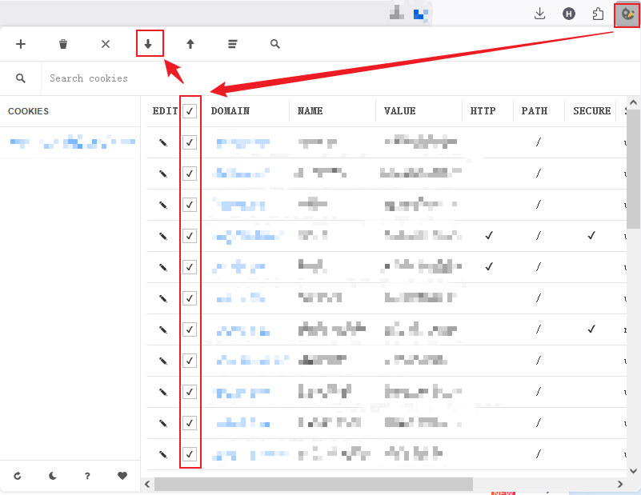
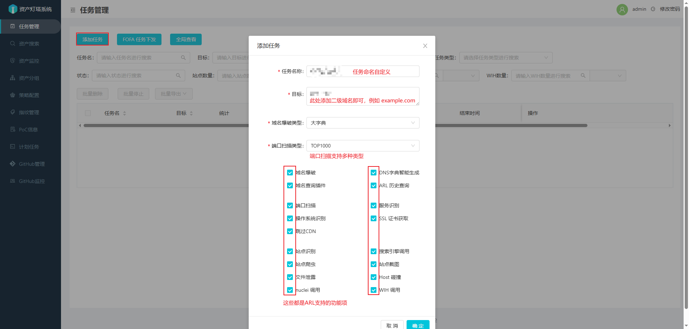
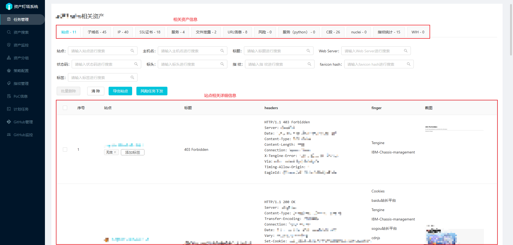
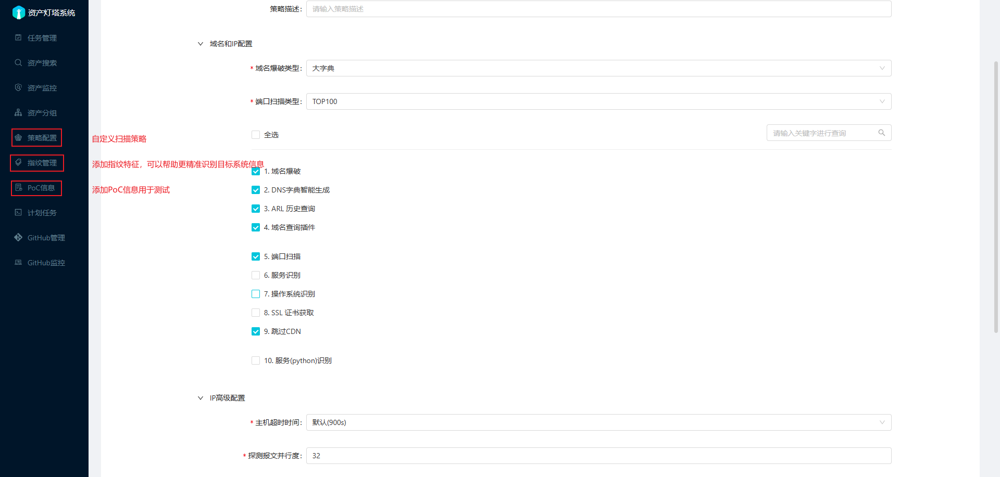
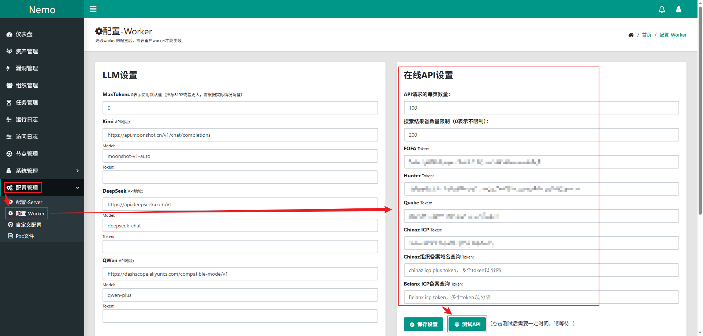
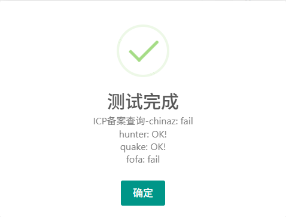
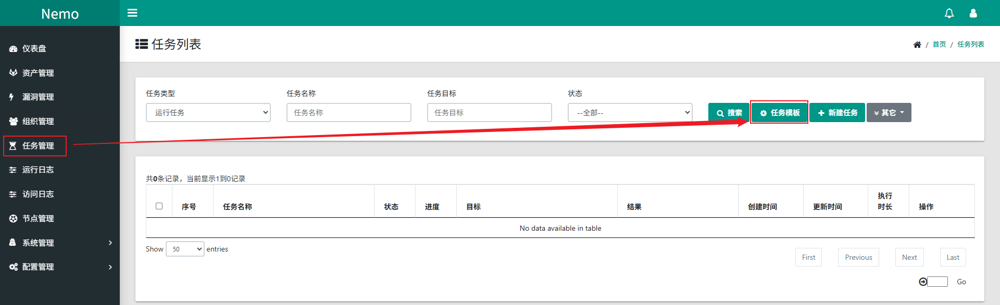

# 自动化工具

本小节全文描述自动化工具的部署和使用，用于提升渗透测试的效率，自动化工具很多，笔录中不会全部记录，其他各类红蓝队优秀工具集合：

https://github.com/guchangan1/All-Defense-Tool

此项目集成了网络上很多优秀的开源攻防武器项目，包含信息收集工具（自动化利用工具、资产发现工具、目录扫描工具、子域名收集工具、指纹识别工具、端口扫描工具、各种插件....etc...），漏洞利用工具（各大CMS、OA利用工具、中间件利用工具、反序列化利用工具、数据库利用工具等项目........），内网渗透工具（隧道代理、密码提取、木马免杀、域渗透.....）、应急响应工具、甲方运维工具、等其他安全攻防资料整理，供攻防双方使用

## 一、武器库部署F8x

[F8x](https://github.com/ffffffff0x/f8x)项目用于解决解决系统环境、安全工具的安装问题，在拿到一个干净的系统后（比如，物理机重装系统、云主机VPS等），首先需要解决的就是安全工具的安装，而安全工具又依赖各种开发环境，这些都是需要用户手动解决的问题。F8x通过其命令参数能够实现快速部署各种开发环境、安全工具，f8x基本上不需要任何依赖，或者说它就是为了帮助用户安装各种依赖而生的

大多数场景下，在不同的云购买一些 vps 服务器用于部署红 / 蓝队设施，不能做到开箱即用，使用 f8x 可以快速部署所需要的各类服务。同时兼顾到本地 VM 虚拟机的需求，可以选择走 socket 代理进行安装部署，Proxychains-ng 也会自动安装，只需做好 Proxychains-ng 配置即可

笔录中不会用f8x命令的所有选项参数，f8x支持的所有选项参数请查看其[说明文档](https://github.com/ffffffff0x/f8x/blob/main/README.zh-cn.md)


## 二、网络空间AsamF

[AsamF](https://github.com/Kento-Sec/AsamF)是一款集成多个网络资产测绘平台的一站式企业信息资产收集工具，集成了Fofa、Quake、Hunter、Shodan、Zoomeye、Chinaz、0.zone及爱企查等网络资产测绘平台。AsamF在使用之前，至少需要在AsamF集成的网络资产测绘平台上有注册过帐号，AsamF需要通过各个平台的Key来实现查询

AsamF工具除了可以用于一站式查询，还支持搜索结果导出。大多数网络资产测绘平台的数据导出都是收费功能，通过AsamF工具可以避免费用问题，但AsamF工具只能解决搜索结果导出的问题，如果用户本身连搜索权限都有限，AsamF工具也无法解决

现在AsamF工具似乎也无法避免费用问题了，使用各平台的API Key进行查询时，需要使用积分或购买查询点数

### 2.1 配置与使用

1. 安装

   ```bash
   wget https://github.com/Kento-Sec/AsamF/releases/download/v0.2.5/AsamF_linux_amd64
   chmod +x AsamF_linux_amd64
   ./AsamF_linux_amd64 info    # 使AsamF自动生成配置文件
   ```

2. 获取用户key（以quake为例）

   AsamF项目的介绍中虽然还保留有爱企查的使用方式介绍，但0.2.5版本的帮助手册上已经没有爱企查的使用参数了，再使用工具时建议安装工具后查看实际版本对应的测绘平台，再收集测绘平台的用户key

   

3. 修改AsamF的配置文件

   每个测绘平台的用户Key要求可能不一样，各个平台的用户Key要求按照配置文件内的要求写入即可，不同平台对于用户Key的写入语法可能也要求不同，建议自行探索后编写

   ```bash
   vim ~/.config/asamf/config.json
   {
           "fofaemail": {
                   "1":"xxxx@xxx.com"
           },
           "fofakey": {
                   "1":"xxxx"
           },
           "quakekey": [
                   "xxxx-xxxx-xxxx-xxxx-xxxx",
                   ""
           ],
           "hunterkey": [
                   "xxxx",
                   ""
           ],
           "zoomeyekey": [
                   "xxxx",
                   ""
           ],
           "shodankey": {
                   "1":"xxxx"
           },
           "chinaz": {
                   "1":"xxxx"
           }
   }
   ```

4. 使用AsamF

   ```bash
   ./AsamF_linux_amd64 -h    # 查看AsamF支持的测绘平台
   ./AsamF_linux_amd64 q -h    # 查看特定测绘平台支持的参数
   ./AsamF_linux_amd64 q -q "weblogic"    # 使用测绘平台查询时仍需遵循对应的查询语法
   ```

   部分测绘平台需要充值才具备查询权限，查询结束后AsamF会将查询结果保存在本地文件中，kali linux默认的保存路径是`/home/hebor/asamf/quake_weblogic_result_20250922105350.csv`，这个表格中记录的中文字符可能存在乱码问题，将编码格式修改为UTF-8或GBK即可

## 三、企查信息ENScan

[ENScan_Go](https://github.com/wgpsec/ENScan_GO)是一款基于各大企业信息API的工具，用于解决在HW/SRC场景下遇到的各种针对国内企业的信息收集难题，一键收集控股公司ICP备案、APP、小程序、微信公众号等信息聚合导出。ENScan_Go在首次使用时需要使用-v参数生成配置文件信息后进行配置

使用程序可能导致⌈账号异常⌋，登录后谨慎使用工具进行搜索

### 3.1 配置与使用

1. 安装

   ```bash
   wget https://github.com/wgpsec/ENScan_GO/releases/download/v1.3.1/enscan-v1.3.1-linux-amd64.tar.gz
   tar -xzf enscan-v1.3.1-linux-amd64.tar.gz
   ./enscan-v1.3.1-linux-amd64 -v    # 首次使用生成配置文件
   ```

2. 获取用户key（以爱企查为例）

   爱企查禁止用户浏览器使用开发者工具，因此需要通过脚本文件或浏览器插件的方式获取Cookie，此处使用Firefox浏览器的Cookie Editor插件，实现导入导出Cookie信息

   

   使用Cookie Editor插件获取的Cookie信息是一个json文件，ENScan工具的配置文件要求使用键值对的方式写入，因此Cookie Editor获取的Cookie信息还需要进一步处理

3. 修改ENScanp配置文件

   ```bash
   vim config.yaml
   version: 0.6
   user_agent: "Mozilla/5.0 (Windows NT 10.0; Win64; x64; rv:143.0) Gecko/20100101 Firefox/143.0"                  # 自定义 User-Agent（可设置为获取Cookie的浏>览器）
   app:
     miit_api: ''          # HG-ha的ICP_Query (非狼组维护 https://github.com/HG-ha/ICP_Query)
   cookies:
     aiqicha: 'KEY1=VALUE1; KEY2=VALUE2; KEY3=VALUE3 ...'           # 爱企查   Cookie
     tianyancha: ''        # 天眼查   Cookie
     tycid: ''             # 天眼查   CApi ID(capi.tianyancha.com)
     auth_token: ''        # 天眼查   Token (capi.tianyancha.com)
     tyc_api_token: ''     # 天眼查   官方API Key(https://open.tianyancha.com)
     risk_bird: ''         # 风鸟     Cookie
     qimai: ''             # 七麦数据 Cookie
   ```

   从配置文件中可以注意到，不同的站点对用户Key的要求不一样，要求Cookie时需要使用完整的Cookie值，要求Token时只需要Token值，部分的Token值可能会写在Cookie里，只是Cookie值中的一个键值对

4. 使用ENScan

   ```bash
   ./enscan-v1.3.1-linux-amd64 -h    # 查看帮助信息
   ./enscan-v1.3.1-linux-amd64 -n "目标企业名称"    # 查询企业信息
   ```

   查询结果涵盖企业名称、法人代表、网站名称、网址、域名、备案号、APP等信息，输出结果的概述会直接输出到命令行，同时会在`./outs/xxxx.xlsx`路径下输出一份表格

## 四、综合架构

### 4.1 ARL

[ARL](https://github.com/Aabyss-Team/ARL)资产侦察灯塔系统，旨在快速侦察与目标关联的互联网资产，构建基础资产信息库。 协助甲方安全团队或者渗透测试人员有效侦察和检索资产，发现存在的薄弱点和攻击面。灯塔ARL的官方开源项目于2024年5月13日停止维护支持，官方建议购买斗象科技企业版产品。对于个人而言仍可以使用开源的历史版本进行研究或学习

#### 4.1.1 配置

1. 安装ARL

   ARL的安装支持源码安装和Docker安装，通过ARL的自动化脚本可以一键式安装。ARL的源码安装只支持特定版本的CentOS、Rocky、Ubuntu系统，通过自动化脚本使用Docker安装ARL时，脚本声明仅支持国外主机，这可能跟网络环境有关

   ARL的自动化脚本不仅只有安装功能，还提供了更新源、安装依赖软件等功能，即便不通过自动化脚本使用Docker安装ARL，也可以先安装依赖

   - 使用自动化脚本安装ARL

     ```bash
     wget https://raw.gitcode.com/msmoshang/ARL/raw/master/misc/setup-arl.sh
     chmod +x setup-arl.sh
     sudo ./setup-arl.sh
     ```

   - 通过github的Docker脚本安装ARL

     ```bash
     # 1.先通过setup-arl.sh脚本安装Docker及其依赖环境
     # 2.使用Docker安装ARL
     git clone https://github.com/honmashironeko/ARL-docker.git
     cd ARL-docker/
     chmod +x setup_docker.sh
     source ~/myenv/bin/active
     sudo bash setup_docker.sh
     ```

     整个安装过程涉及到Docker和python环境，如果使用非root账户配置，需要格外注意sudo的使用和python虚拟环境的配置。科学上网似乎也无法通过Docker直接拉取ARL的镜像，此处我使用云主机拉取镜像、导出镜像到本地使用的方式安装ARL（因为个人想把工具集中存放在一个虚拟机上）

2. ARL的启停

   ARL容器启动后默认监听5003端口，默认账号密码是`admin/honmashironeko`

   ```bash
   docker-compose down    # 关闭ARL命令
   docker-compose up -d    # 启动 ARL 命令
   vim config-docker.yaml    # 编辑配置文件
   ```

#### 4.1.2 使用

1. 创建扫描任务

   

2. 查看扫描详情

   

3. 自定义配置

   

工具考虑到法律风险问题，并不自带指纹信息，且不允许扫描类似`edu.cn`的域名。作为个人工具使用的话，指纹信息可以自定义导入，信息越丰富就越能对目标系统进行精准识别，包括PoC信息、策略信息也是如此

### 4.2 Nemo

[Nemo](https://github.com/hanc00l/nemo_go)用于进行自动化信息收集，通过集成常用的信息收集工具和技术，实现对内网及互联网资产信息的自动收集，提高隐患排查和渗透测试的工作效率

Nemo官方指南声明，Docker方式建议只用于测试和临时使用，由于默认Docker里的用户是root，在获取指纹截图调用chrome有一定安全风险，如果需要长期使用，会建议使用VPS安装方式。同时为更好的发挥分布式Worker的作用，可以在具备多个VPS的情况下，独立部署安装Worker（详细见[安装手册](https://github.com/hanc00l/nemo_go/blob/main/v3/docs/install.md)）

#### 4.2.1 配置

1. 安装Nemo

   ```bash
   wget https://github.com/hanc00l/nemo_go/releases/download/v3.2.0/nemo_linux_amd64.tar
   mkdir nemo
   tar -xvf nemo_linux_amd64.tar -C nemo
   cd nemo
   sudo docker-compose up -d
   ```

2. nemo的启停

   nemo容器启动后默认监听5000端口，默认账号密码是`nemo/nemo`

   ```bash
   docker-compose down    # 关闭ARL命令
   docker-compose up -d    # 启动 ARL 命令
   vim config-docker.yaml    # 编辑配置文件
   ```

   Server端运行后，默认会启用以下端口：

   - 5000：Http，web界面
   - 5001：RPC接口，用于worker将任务结果保存到server
   - 5002：Redis安全代理隧道，用于Worker与Server通信
   - 5500：MCP Server监听地址
   - 27017：mongodb数据库，用于数据存储，默认在127.0.0.1上开放；
   - 6379：服务器Redis，用于存储任务队列，默认在127.0.0.1上开放；使用Redis安全代理隧道后，该端口不需要暴露到公网

   Worker不会开启对外的任务监听端口，但默认开启本地socks5转发和本地Redis转发，监听地址将为本地127.0.0.1

   - 5010：本地socks5转发，用于chrome-headless支持带验证的socks5代理；如果该端口被占用，会自动递增1个可使用的端口
   - 16379：本地Redis转发，worker通过与Server建立Redis安全隧道后，会在该端口进行redis代理

#### 4.2.2 使用

1. 设置API Token

   Nemo本身也需要依赖第三方测绘平台获取信息，通过配置API Token的方式调用第三方测绘平台接口，配置必须先保存、再测试

   

   

   FOFA状态失败是因为没有F点了，chinaz失败可能是由于API设置异常

2. 定义任务模板

   


## 五、Github的其他用法

在Web应用小节中就有提到，通过Github搜索一些代码中的特殊文件名、代码片段、特定邮箱，可以尝试获取到一些敏感信息、源码信息。除了通过文件名、邮箱搜索以外，当然也可以使用一些通用的敏感词，搜索特定范围内的信息

### 5.1 敏感信息搜索

github资源搜索语法

| 语法                   | 说明                                 |
| ---------------------- | ------------------------------------ |
| in:name test           | 仓库标题含有关键词                   |
| in:description test    | 仓库描述含有关键词                   |
| in:readme test         | ReadMe文件含有关键词                 |
| stars:>3000 test       | stars数量大于3000，搜索关键词        |
| stars:>1000..3000 test | stars数量在1000~3000之间，搜索关键词 |
| forks:>3000 test       | forks数量大于1000，搜索关键词        |
| forks:>1000..3000 test | forks数量在1000~3000之间，搜索关键词 |

