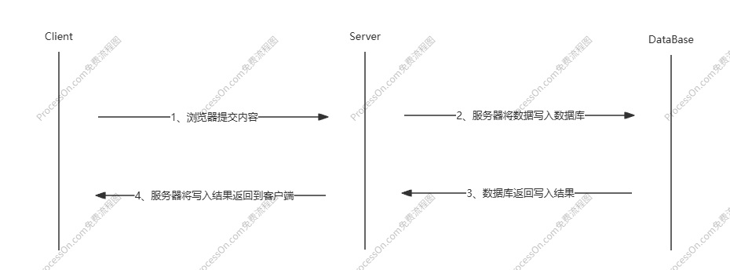
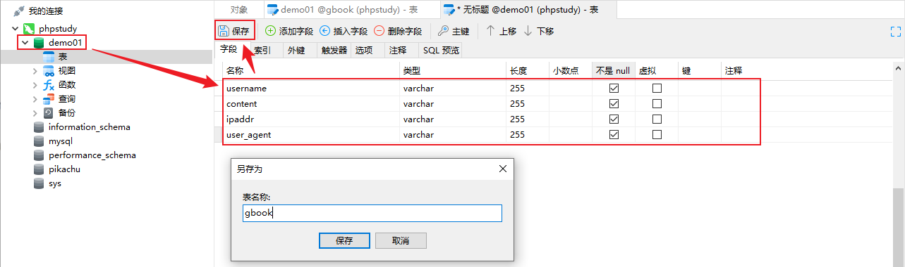
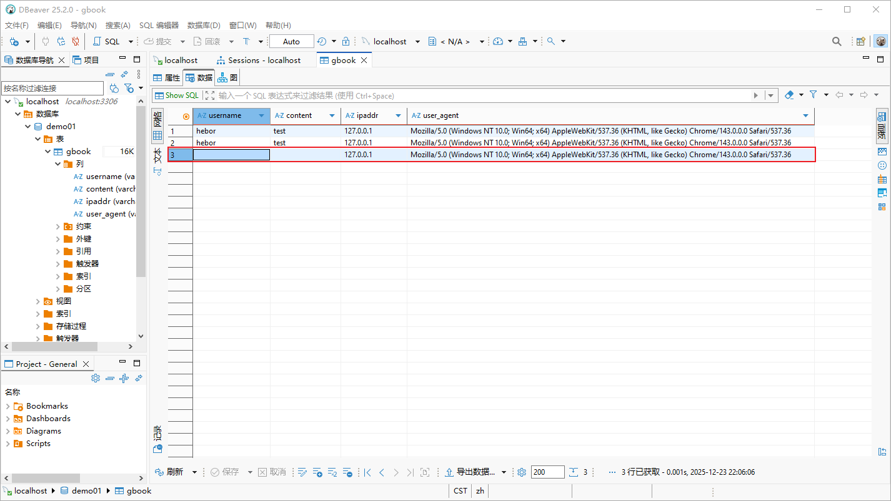

# PHP原生开发

原生开发指的是仅通过PHP本身编写代码，一个完整的Web站点需要通过前端实现页面美化、通过后端实现业务逻辑，对于网络安全人员而言，没有太大必要将精力过多的花费在研究页面美化上。一般的业务流量路径可以简单概括为：客户端 -> 服务端 -> 数据库，服务端可以为客户端提供美观、易懂的操作界面，数据库可以用于存储用户提交的数据

## 一、留言板功能



### 1.1 数据库设计

在进行任意功能实现之前，都需要先定义好数据库，数据库会定义用户存储数据的结构、格式

1. 通过phpstudy启用Nginx+MySQL

2. 通过Navicat或DBeaver连接MySQL，定义数据库结构

   


### 1.2 前端测试代码

前端测试代码主要用于测试HTML的表单提交的数据是否能够被PHP正常接收，通过HTML提交后再通过PHP测试输出，就能够在浏览器中很直观的看到效果

```php
<!-- HTML代码用于创建一个简陋的from表单 -->
<!DOCTYPE html>
<html>
    <head>
        <title>hebor</title>
        <meta charset="UTF-8">
    </head>
    <body>
        <!-- action字段用于指定表单提交的数据发送到哪里去，为空时发送到自身 -->
        <form id="form01" name="form01" method="post" action="">
            <p> username: <input type="text" name="username"/> </p>
            <p> content: <textarea name="content"> </textarea> </p>
            <input type="submit" name="submit" id="submit" value="提交"/>
        </form>
    </body>
</html>

<?php
//一些场景下在访问首页时，由于默认username、content两个值默认为空，PHP可能会直接提示变量不存在错误。@符号被称为错误控制运算符，它的核心作用是抑制表达式可能产生的错误和警告信息，让程序继续执行而非直接显示错误。@符号只是隐藏错误，而非修复错误，且对致命错误无效，对PHP会产生微小的额外开销
$user=@$_POST['username'];    //从表单中获取POST提交的username
$cont=@$_POST['content'];     
echo($user."<br />");         //测试输出获取到的username
echo($cont);
?>
```

### 1.3 数据库操作

PHP函数：连接、选择、执行、结果、关闭

- mysqli_connect()：打开一个新的连接到MySQL
- mysqli_select_db()：更改连接的默认数据库
- mysqli_query()：执行某个针对数据库的查询
- mysqli_fetch_row()：从结果集中取得一行，并作为枚举数组返回
- mysqli_close()：关闭打开的数据库连接

#### 1.3.1 测试数据库连接

PHP接收的数据要写入数据库，首要前提是PHP能够正常连接到数据库

```php
<?php
//编写数据库的通信流程
$database_ip='localhost';     //定义数据库信息，包含主机地址、账户密码、数据库名称
$database_user='root';
$database_pass='root';
$database_name='demo01';
$connect=mysqli_connect($database_ip, $database_user, $database_pass, $database_name);
if (!$connect) {
    die("连接错误：".mysqli_connect_error());    //die()函数与exit()函数作用完全相同，可以视作exit()函数的一个别名，用于终止脚本的执行，并可以选择输出一条信息
} else {
    echo("connection successful.");
}


$user=@$_POST['username'];
$cont=@$_POST['content'];
?>
```

#### 1.3.2 测试数据写入

确保PHP能够正常连接到数据库后，还需要确保SQL语句的语法没有问题，因此通过PHP执行SQL语法后还需要检查数据库的gbook表中是否存在写入的数据，以及写入的数据是否存在异常

```php
<?php
//编写数据库的通信流程
$database_ip='localhost';
$database_user='root';
$database_pass='root';
$database_name='demo01';
$user=@$_POST['username'];    //通过PHP的超级全局变量获取客户端提交的信息
$cont=@$_POST['content'];
$ip=@$_SERVER['REMOTE_ADDR'];
$ua=@$_SERVER['HTTP_USER_AGENT'];
$connect=mysqli_connect($database_ip, $database_user, $database_pass, $database_name);    //连接目标数据库
$sql="insert into gbook(`username`, `content`, `ipaddr`, `user_agent`) value('$user', '$cont', '$ip', '$ua')";    //定义要执行的SQL语句

if (!$connect) {
    die("连接错误：".mysqli_connect_error());
} else {
    mysqli_query($connect, $sql);    //每执行一条SQL语句，都需要指定执行SQL语句的目标数据库
}
?>
```

通过浏览器访问站点并进行测试后能够发现一些异常数据，这是因为只要由客户端访问站点，就会被收集ipaddr、user_agent数据，这些数据就会写入数据库，因此还需要在PHP代码中添加一些条件判断



```php
<?php
//编写数据库的通信流程
$database_ip='localhost';
$database_user='root';
$database_pass='root';
$database_name='demo01';
$user=@$_POST['username'];
$cont=@$_POST['content'];
$ip=@$_SERVER['REMOTE_ADDR'];
$ua=@$_SERVER['HTTP_USER_AGENT'];
$connect=mysqli_connect($database_ip, $database_user, $database_pass, $database_name);
$sql="insert into gbook(`username`, `content`, `ipaddr`, `user_agent`) value('$user', '$cont', '$ip', '$ua')";

if (!$connect) {
    die("连接错误：".mysqli_connect_error());
} else if (! isset($user)) {    //判断$user变量是否存在，不存在时立即终止脚本执行
    exit(); 
} else {
    mysqli_query($connect, $sql);    //每执行一条SQL语句，都需要指定执行SQL语句的目标数据库
}
?>
```

### 1.4 优化体验

目前代码仅实现数据写入，但对于用户而言还需要一些信息回显提示，例如数据是否写入成功、数据写入成功后将写入的数据展示给用户等

```php
<?php
//编写数据库的通信流程
$database_ip='localhost';
$database_user='root';
$database_pass='root';
$database_name='demo01';
$user=@$_POST['username'];
$cont=@$_POST['content'];
$ip=@$_SERVER['REMOTE_ADDR'];
$ua=@$_SERVER['HTTP_USER_AGENT'];
$connect=mysqli_connect($database_ip, $database_user, $database_pass, $database_name);
$sql="insert into gbook(`username`, `content`, `ipaddr`, `user_agent`) value('$user', '$cont', '$ip', '$ua')";

if (!$connect) {
    die("连接错误：".mysqli_connect_error());
} else if (! isset($user)) {
    exit(); 
} else {
    mysqli_query($connect, $sql);
    echo("<script>alert('留言成功.')</script>");    //SQL执行成功后通过JavaScript为客户端回显提示信息
    $sql_query = "select * from gbook";    //SQL语句查询gbook表的所有信息
    $data = mysqli_query($connect, $sql_query);    //通过PHP执行SQL语句，并保存到变量
    while ($row_data=mysqli_fetch_row($data)) {    //mysqli_fetch_row()函数用于从结果集中取一行数据，并以数值数组的方式返回
        echo("<hr />");
        printf("%s : %s", $row_data[0], $row_data[1]);    //$row_data数组中，每一个数组都存在4个元素，此处仅输出了前2个元素，即用户名:留言内容
    }
}
?>
```

### 1.5 管理页面

针对与用户页面基本结束，对于管理员而言还需要一个单独的页面对数据进行管理，此时部分代码就会产生复用的需求，所以针对会被复用的代码，单独使用一个代码文件进行保存，在项目中其他的代码文件中需要复用这部分代码时直接调用即可

```
目录树：
demo01/
├── admin/
│   └── gbook-admin.php
├── config.php
└── gbook.php
```

```php
//config.php代码
<?php
$database_ip = 'localhost';
$database_user = 'root';
$database_pass = 'root';
$database_name = 'demo01';
$connect = mysqli_connect($database_ip, $database_user, $database_pass, $database_name);
?>
```

```php
//gbook.php代码（省略了HTML部分）
<?php
include './config.php';    //引用config.php配置文件
$user=@$_POST['username'];
$cont=@$_POST['content'];
$ip=@$_SERVER['REMOTE_ADDR'];
$ua=@$_SERVER['HTTP_USER_AGENT'];

$sql="insert into gbook(`username`, `content`, `ipaddr`, `user_agent`) value('$user', '$cont', '$ip', '$ua')";

if (!$connect) {
    die("连接错误：".mysqli_connect_error());
} else if (! isset($user)) {
    exit(); 
} else {
    mysqli_query($connect, $sql);
    echo("<script>alert('留言成功.')</script>");
    $sql_query = "select * from gbook";
    $data = mysqli_query($connect, $sql_query);
    while ($row_data=mysqli_fetch_row($data)) {
        echo("<hr />");
        printf("%s : %s", $row_data[0], $row_data[1]);
    }
}
?>
```

```php
//gbook-admin.php代码
<?php
include '../config.php';
$sql_query = "select * from gbook";
$data = mysqli_query($connect, $sql_query);
while ($row_data=mysqli_fetch_row($data)){
    printf("<hr />");
    printf("用户名: %s ", $row_data[0]);
    printf("留言内容: %s ", $row_data[1]);
}
?>
```

此时，管理页面已经实现了查看留言内容功能，再为其添加删除留言内容功能

```php
//gbook-admin.php代码
<?php
include '../config.php';
$sql_query = "select * from gbook";
$data = mysqli_query($connect, $sql_query);
while ($row_data=mysqli_fetch_row($data)){
    printf("<hr />");
    printf("用户名: %s ", $row_data[0]."<br />");
    printf("留言内容: %s ", $row_data[1]."<br />");
    printf("<a href='gbook-admin.php?del=$row_data[0]'>删除</a>");    //点击删除时就会访问a标签的href指定的URL，即访问gbook-admin.php文件本身，并携带有用户名参数
}
$row_del = @$_GET['del'];    //通过PHP超级全局变量接收del参数的值
$sql_del = "delete from gbook where username='$row_del'";    //删除数据的SQL语句
if (isset($row_del)){    //判断URL中是否携带del参数
    mysqli_query($connect, $sql_del);
    echo("<script>alert('删除成功')</script>");
} else {
    exit();
}
?>
```

### 1.6 最终版本

至此留言板功能的基础功能已经实现，但从感官上看代码还是比较复杂，再通过自定义函数将代码进行整合后输出最终版本

```
目录树：
demo01/
├── admin/
│   └── gbook-admin.php
├── config.php
├── gbook.php
└── index.html
```

```html
<!--index.html-->
<!DOCTYPE html>
<html>
<head>
    <title>hebor</title>
    <meta charset="UTF-8">
</head>
<body>
<!-- action字段用于指定表单提交的数据发送到哪里去，为空时发送到自身 -->
<form id="form01" name="form01" method="post" action="./gbook.php">
    <p> username: <input type="text" name="username"/> </p>
    <p> content: <textarea name="content"> </textarea> </p>
    <input type="submit" name="submit" id="submit" value="提交"/>
</form>
</body>
</html>
```

```php
//config.php
<?php
$database_ip = 'localhost';
$database_user = 'root';
$database_pass = 'root';
$database_name = 'demo01';
$connect = mysqli_connect($database_ip, $database_user, $database_pass, $database_name);
?>
```

```php
//gbook.php
<?php
include './config.php';

function add_data($connect){    //添加数据
    $user=@$_POST['username'];
    $cont=@$_POST['content'];
    $ip=@$_SERVER['REMOTE_ADDR'];
    $ua=@$_SERVER['HTTP_USER_AGENT'];
    $sql="insert into gbook(`username`, `content`, `ipaddr`, `user_agent`) value('$user', '$cont', '$ip', '$ua')";

    if (!$connect) {
        die("连接错误：".mysqli_connect_error());
    } else if (! isset($user)) {
        exit();
    } else {
        mysqli_query($connect, $sql);
        echo("<script>alert('留言成功.')</script>");
    }
}

function show_data($connect, $del){    //查询数据
    $sql_query = "select * from gbook";
    $data = mysqli_query($connect, $sql_query);
    while ($row_data=mysqli_fetch_row($data)) {
        echo("<hr />");
        echo("用户名：$row_data[0]<br />");
        echo("留言内容：$row_data[1]");
    }
}

add_data($connect);
show_data($connect);
?>
```

```php
//gbook-admin.php
<?php
include '../config.php';

function show_data($connect){    //查询数据
    $sql_query = "select * from gbook";
    $data = mysqli_query($connect, $sql_query);
    while ($row_data=mysqli_fetch_row($data)) {
        echo("<hr />");
        echo("用户名：$row_data[0]<br />");
        echo("留言内容：$row_data[1]");
        echo("<a href='gbook-admin.php?del=$row_data[0]'>删除</a>");
    }
}

show_data($connect);
$row_del = @$_GET['del'];
$sql_del = "delete from gbook where username='$row_del'";
if (isset($row_del)){
    mysqli_query($connect, $sql_del);
    echo("<script>alert('删除成功')</script>");
} else {
    exit();
}
?>
```

### 1.7 第三方插件

此部分作为补充内容，留言板的基础功能已经通过原生代码实现，但比较常见的留言板还存在图片上传、格式调整等功能，此处可以借助第三方插件实现扩展功能。[UEditor](https://github.com/fex-team/ueditor#ueditor) 是由百度「FEX前端研发团队」开发的所见即所得富文本web编辑器，具有轻量，可定制，注重用户体验等特点，开源基于MIT协议，允许自由使用和修改代码

```php
目录树：
demo01/
├── admin/
│   └── gbook-admin.php
├── ueditor/
├── config.php
├── gbook.php
└── index.html
```

```HTML
<!DOCTYPE html>
<html>
<head>
    <title>hebor</title>
    <meta charset="UTF-8">
    <script src="ueditor/ueditor.config.js">/*引入配置文件*/</script>
    <script src="ueditor/ueditor.all.js">/*引入源码文件*/</script>
</head>
<body>
<form id="form01" name="form01" method="post" action="./gbook.php">
    <p> username: <input type="text" name="username"/> </p>
    <p>
        content: <textarea id="content" rows="10" cols="70" style="border:1px solid #E5E5E5;" name="content"> </textarea>
        <script type="text/javascript">
            UE.getEditor("content");    //实例化编辑器传参，id为将要被替换的容器
        </script>
    </p>
    <input type="submit" name="submit" id="submit" value="提交"/>
</form>
</body>
</html>
```

再次访问网站首页就能看到富文本编辑器

### 1.8 小结

留言板功能实现完成后，通过浏览器的开发者工具可以看到PHP代码是看不到的，只能看到PHP代码执行逻辑后的结果，所以在PHP代码中直接写`echo("<script>alert('删除成功')</script>");`，到达浏览器后就只能看到`<script>alert('删除成功')</script>`，因此浏览器会将这一段视作JavaScript代码来执行，而非输出文本

整个留言板功能对于用户而言体验最明显的地方实际上来自第三方插件，用户所有的内容提交都是通过编辑器实现的，那么用户提交的内容是否安全实际上是由编辑器负责检测，而编辑器本身的代码又不是自己写的，那么编辑器是否具备对内容的安全检测功能，全都取自于第三方插件的开发者是否在代码里写了安全检测逻辑，有就是有、没有就是没有，因此也才会产生所谓的第三方组件安全、第三方框架安全等。本质上就是你开发的程序引用了别人的代码，那么别人的代码里是否具备安全检测逻辑不是你可以控制的

对于自己写的代码，可以通过`gbook-admin.php`文件直接访问到后台数据并具备删除权限，说明不具备身份验证功能或身份验证逻辑不严谨

## 二、后台模块

### 2.1 cookie

生成cookie的原理：

1、客户端向服务器发送HTTP请求。
2、服务器检查请求头中是否包含cookie信息。
3、如果请求头中包含cookie信息，则服务器使用该cookie来识别客户端，否则服务器
将生成一个新的cookie。
4、服务器在响应头中设置cookie信息并将其发送回客户端
5、客户端接收响应并将cookie保存在本地。
6、当客户端发送下一次HTTP请求时，它会将cookie信息附加到请求头中。
7、服务器收到请求并检査cookie的有效性。
如果cookie有效，则服务器响应请求。否则，服务器可能会要求客户端重新登录


```php+HTML
1、接收输入的账号密码
2、判断账号密码的正确性
3、正确后生成cookie进行保存
4、错误的账号密码进行提示
5、跳转到成功登录的首页

include config.php

$user=$_POST['username'];
$pass=$_POST['password'];

#连接数据库，进行数据库查询将数据进行对比。最好先判断一下连接数据库能否成功
$sql="select * from admin where username='$user' and password='$pass'";
$data=mysqli_query($con, $sql);
if(mysql_num_rows($data) > 0){
	
	//echo('<script>alert("登录成功")</script>');
	header('Location: index-c.php');    #判断登录成功后跳转到登录成功的首页
} else {
	echo('<script>alert("登录失败")</script>');
}
```


