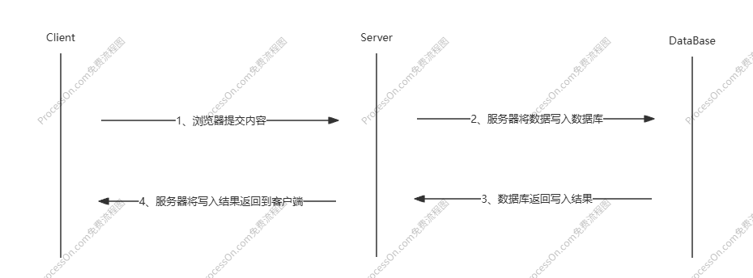
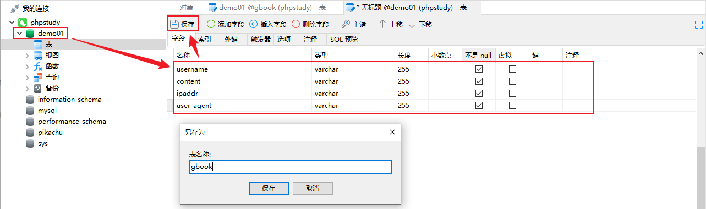
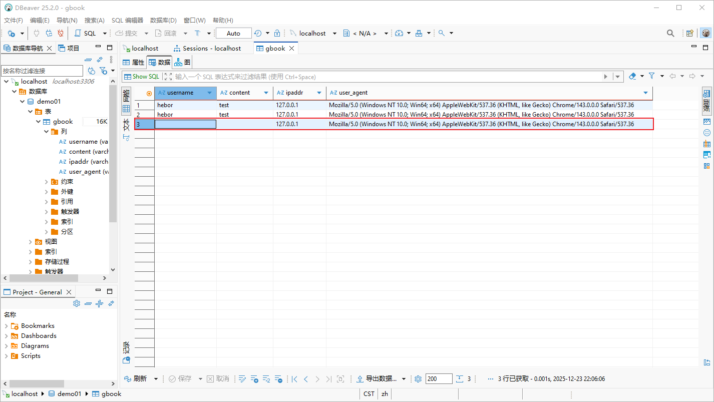
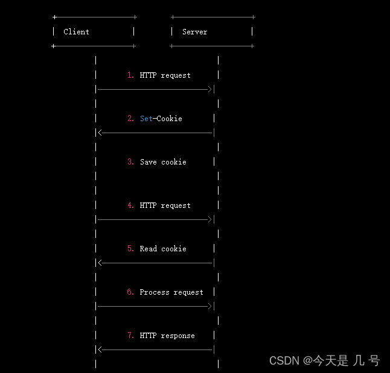
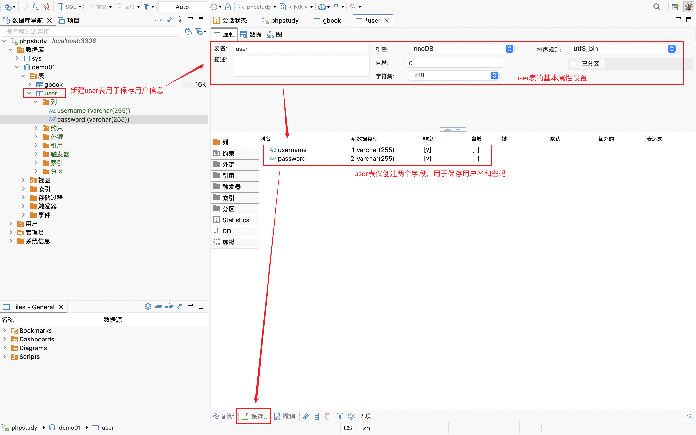
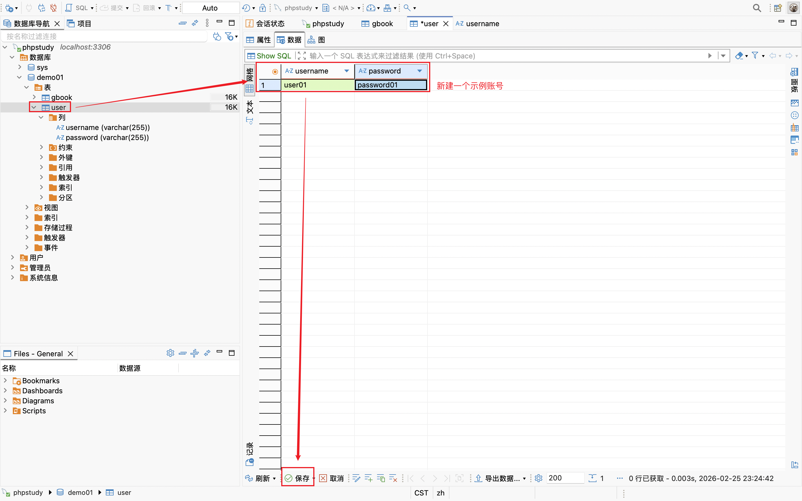
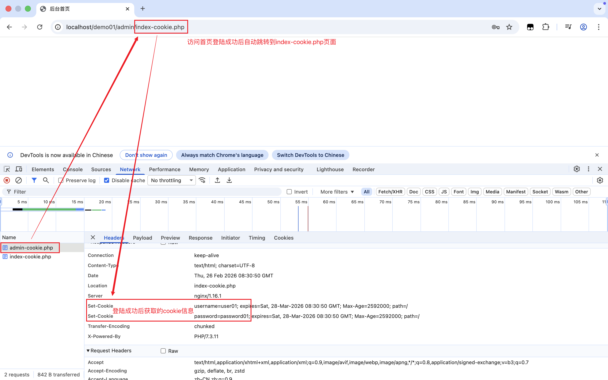
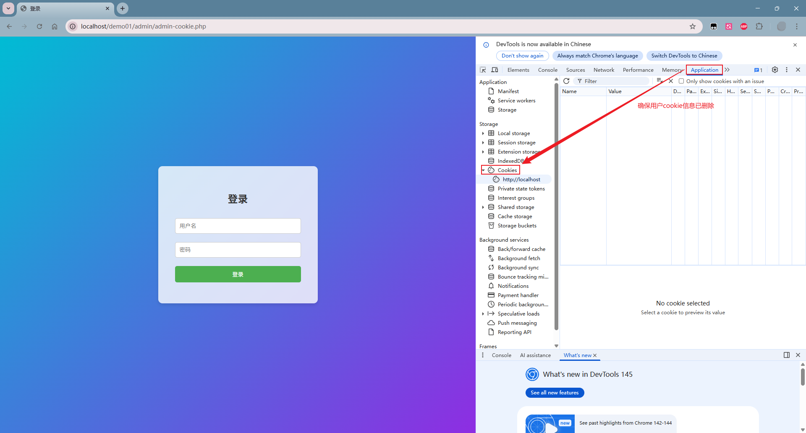
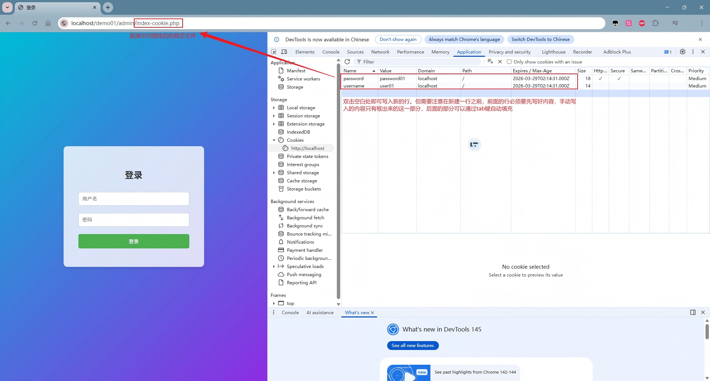
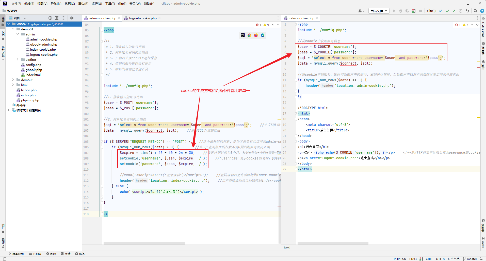

# PHP原生开发

原生开发指的是仅通过PHP本身编写代码，一个完整的Web站点需要通过前端实现页面美化、通过后端实现业务逻辑，对于网络安全人员而言，没有太大必要将精力过多的花费在研究页面美化上。一般的业务流量路径可以简单概括为：客户端 -> 服务端 -> 数据库，服务端可以为客户端提供美观、易懂的操作界面，数据库可以用于存储用户提交的数据

## 一、留言板功能



### 1.1 数据库设计

在进行任意功能实现之前，都需要先定义好数据库，数据库会定义用户存储数据的结构、格式

1. 通过phpstudy启用Nginx+MySQL

2. 通过Navicat或DBeaver连接MySQL，定义数据库结构

   


### 1.2 前端测试代码

前端测试代码主要用于测试HTML的表单提交的数据是否能够被PHP正常接收，通过HTML提交后再通过PHP测试输出，就能够在浏览器中很直观的看到效果

```php
<!-- HTML代码用于创建一个简陋的from表单 -->
<!DOCTYPE html>
<html>
    <head>
        <title>hebor</title>
        <meta charset="UTF-8">
    </head>
    <body>
        <!-- action字段用于指定表单提交的数据发送到哪里去，为空时发送到自身 -->
        <form id="form01" name="form01" method="post" action="">
            <p> username: <input type="text" name="username"/> </p>
            <p> content: <textarea name="content"> </textarea> </p>
            <input type="submit" name="submit" id="submit" value="提交"/>
        </form>
    </body>
</html>

<?php
//一些场景下在访问首页时，由于默认username、content两个值默认为空，PHP可能会直接提示变量不存在错误。@符号被称为错误控制运算符，它的核心作用是抑制表达式可能产生的错误和警告信息，让程序继续执行而非直接显示错误。@符号只是隐藏错误，而非修复错误，且对致命错误无效，对PHP会产生微小的额外开销
$user=@$_POST['username'];    //从表单中获取POST提交的username
$cont=@$_POST['content'];     
echo($user."<br />");         //测试输出获取到的username
echo($cont);
?>
```

### 1.3 数据库操作

PHP函数：连接、选择、执行、结果、关闭

- mysqli_connect()：打开一个新的连接到MySQL
- mysqli_select_db()：更改连接的默认数据库
- mysqli_query()：执行某个针对数据库的查询
- mysqli_fetch_row()：从结果集中取得一行，并作为枚举数组返回
- mysqli_close()：关闭打开的数据库连接

#### 1.3.1 测试数据库连接

PHP接收的数据要写入数据库，首要前提是PHP能够正常连接到数据库

```php
<?php
//编写数据库的通信流程
$database_ip='localhost';     //定义数据库信息，包含主机地址、账户密码、数据库名称
$database_user='root';
$database_pass='root';
$database_name='demo01';
$connect=mysqli_connect($database_ip, $database_user, $database_pass, $database_name);
if (!$connect) {
    die("连接错误：".mysqli_connect_error());    //die()函数与exit()函数作用完全相同，可以视作exit()函数的一个别名，用于终止脚本的执行，并可以选择输出一条信息
} else {
    echo("connection successful.");
}


$user=@$_POST['username'];
$cont=@$_POST['content'];
?>
```

#### 1.3.2 测试数据写入

确保PHP能够正常连接到数据库后，还需要确保SQL语句的语法没有问题，因此通过PHP执行SQL语法后还需要检查数据库的gbook表中是否存在写入的数据，以及写入的数据是否存在异常

```php
<?php
//编写数据库的通信流程
$database_ip='localhost';
$database_user='root';
$database_pass='root';
$database_name='demo01';
$user=@$_POST['username'];    //通过PHP的超级全局变量获取客户端提交的信息
$cont=@$_POST['content'];
$ip=@$_SERVER['REMOTE_ADDR'];
$ua=@$_SERVER['HTTP_USER_AGENT'];
$connect=mysqli_connect($database_ip, $database_user, $database_pass, $database_name);    //连接目标数据库
$sql="insert into gbook(`username`, `content`, `ipaddr`, `user_agent`) value('$user', '$cont', '$ip', '$ua')";    //定义要执行的SQL语句

if (!$connect) {
    die("连接错误：".mysqli_connect_error());
} else {
    mysqli_query($connect, $sql);    //每执行一条SQL语句，都需要指定执行SQL语句的目标数据库
}
?>
```

通过浏览器访问站点并进行测试后能够发现一些异常数据，这是因为只要由客户端访问站点，就会被收集ipaddr、user_agent数据，这些数据就会写入数据库，因此还需要在PHP代码中添加一些条件判断



```php
<?php
//编写数据库的通信流程
$database_ip='localhost';
$database_user='root';
$database_pass='root';
$database_name='demo01';
$user=@$_POST['username'];
$cont=@$_POST['content'];
$ip=@$_SERVER['REMOTE_ADDR'];
$ua=@$_SERVER['HTTP_USER_AGENT'];
$connect=mysqli_connect($database_ip, $database_user, $database_pass, $database_name);
$sql="insert into gbook(`username`, `content`, `ipaddr`, `user_agent`) value('$user', '$cont', '$ip', '$ua')";

if (!$connect) {
    die("连接错误：".mysqli_connect_error());
} else if (! isset($user)) {    //判断$user变量是否存在，不存在时立即终止脚本执行
    exit(); 
} else {
    mysqli_query($connect, $sql);    //每执行一条SQL语句，都需要指定执行SQL语句的目标数据库
}
?>
```

### 1.4 优化体验

目前代码仅实现数据写入，但对于用户而言还需要一些信息回显提示，例如数据是否写入成功、数据写入成功后将写入的数据展示给用户等

```php
<?php
//编写数据库的通信流程
$database_ip='localhost';
$database_user='root';
$database_pass='root';
$database_name='demo01';
$user=@$_POST['username'];
$cont=@$_POST['content'];
$ip=@$_SERVER['REMOTE_ADDR'];
$ua=@$_SERVER['HTTP_USER_AGENT'];
$connect=mysqli_connect($database_ip, $database_user, $database_pass, $database_name);
$sql="insert into gbook(`username`, `content`, `ipaddr`, `user_agent`) value('$user', '$cont', '$ip', '$ua')";

if (!$connect) {
    die("连接错误：".mysqli_connect_error());
} else if (! isset($user)) {
    exit(); 
} else {
    mysqli_query($connect, $sql);
    echo("<script>alert('留言成功.')</script>");    //SQL执行成功后通过JavaScript为客户端回显提示信息
    $sql_query = "select * from gbook";    //SQL语句查询gbook表的所有信息
    $data = mysqli_query($connect, $sql_query);    //通过PHP执行SQL语句，并保存到变量
    while ($row_data=mysqli_fetch_row($data)) {    //mysqli_fetch_row()函数用于从结果集中取一行数据，并以数值数组的方式返回
        echo("<hr />");
        printf("%s : %s", $row_data[0], $row_data[1]);    //$row_data数组中，每一个数组都存在4个元素，此处仅输出了前2个元素，即用户名:留言内容
    }
}
?>
```

### 1.5 管理页面

针对与用户页面基本结束，对于管理员而言还需要一个单独的页面对数据进行管理，此时部分代码就会产生复用的需求，所以针对会被复用的代码，单独使用一个代码文件进行保存，在项目中其他的代码文件中需要复用这部分代码时直接调用即可

```
目录树：
demo01/
├── admin/
│   └── gbook-admin.php
├── config.php
└── gbook.php
```

```php
//config.php代码
<?php
$database_ip = 'localhost';
$database_user = 'root';
$database_pass = 'root';
$database_name = 'demo01';
$connect = mysqli_connect($database_ip, $database_user, $database_pass, $database_name);
?>
```

```php
//gbook.php代码（省略了HTML部分）
<?php
include './config.php';    //引用config.php配置文件
$user=@$_POST['username'];
$cont=@$_POST['content'];
$ip=@$_SERVER['REMOTE_ADDR'];
$ua=@$_SERVER['HTTP_USER_AGENT'];

$sql="insert into gbook(`username`, `content`, `ipaddr`, `user_agent`) value('$user', '$cont', '$ip', '$ua')";

if (!$connect) {
    die("连接错误：".mysqli_connect_error());
} else if (! isset($user)) {
    exit(); 
} else {
    mysqli_query($connect, $sql);
    echo("<script>alert('留言成功.')</script>");
    $sql_query = "select * from gbook";
    $data = mysqli_query($connect, $sql_query);
    while ($row_data=mysqli_fetch_row($data)) {
        echo("<hr />");
        printf("%s : %s", $row_data[0], $row_data[1]);
    }
}
?>
```

```php
//gbook-admin.php代码
<?php
include '../config.php';
$sql_query = "select * from gbook";
$data = mysqli_query($connect, $sql_query);
while ($row_data=mysqli_fetch_row($data)){
    printf("<hr />");
    printf("用户名: %s ", $row_data[0]);
    printf("留言内容: %s ", $row_data[1]);
}
?>
```

此时，管理页面已经实现了查看留言内容功能，再为其添加删除留言内容功能

```php
//gbook-admin.php代码
<?php
include '../config.php';
$sql_query = "select * from gbook";
$data = mysqli_query($connect, $sql_query);
while ($row_data=mysqli_fetch_row($data)){
    printf("<hr />");
    printf("用户名: %s ", $row_data[0]."<br />");
    printf("留言内容: %s ", $row_data[1]."<br />");
    printf("<a href='gbook-admin.php?del=$row_data[0]'>删除</a>");    //点击删除时就会访问a标签的href指定的URL，即访问gbook-admin.php文件本身，并携带有用户名参数
}
$row_del = @$_GET['del'];    //通过PHP超级全局变量接收del参数的值
$sql_del = "delete from gbook where username='$row_del'";    //删除数据的SQL语句
if (isset($row_del)){    //判断URL中是否携带del参数
    mysqli_query($connect, $sql_del);
    echo("<script>alert('删除成功')</script>");
} else {
    exit();
}
?>
```

### 1.6 最终版本

至此留言板功能的基础功能已经实现，但从感官上看代码还是比较复杂，再通过自定义函数将代码进行整合后输出最终版本

```
目录树：
demo01/
├── admin/
│   └── gbook-admin.php
├── config.php
├── gbook.php
└── index.html
```

```html
<!--index.html-->
<!DOCTYPE html>
<html>
<head>
    <title>hebor</title>
    <meta charset="UTF-8">
</head>
<body>
<!-- action字段用于指定表单提交的数据发送到哪里去，为空时发送到自身 -->
<form id="form01" name="form01" method="post" action="./gbook.php">
    <p> username: <input type="text" name="username"/> </p>
    <p> content: <textarea name="content"> </textarea> </p>
    <input type="submit" name="submit" id="submit" value="提交"/>
</form>
</body>
</html>
```

```php
//config.php
<?php
$database_ip = 'localhost';
$database_user = 'root';
$database_pass = 'root';
$database_name = 'demo01';
$connect = mysqli_connect($database_ip, $database_user, $database_pass, $database_name);
?>
```

```php
//gbook.php
<?php
include './config.php';

function add_data($connect){    //添加数据
    $user=@$_POST['username'];
    $cont=@$_POST['content'];
    $ip=@$_SERVER['REMOTE_ADDR'];
    $ua=@$_SERVER['HTTP_USER_AGENT'];
    $sql="insert into gbook(`username`, `content`, `ipaddr`, `user_agent`) value('$user', '$cont', '$ip', '$ua')";

    if (!$connect) {
        die("连接错误：".mysqli_connect_error());
    } else if (! isset($user)) {
        exit();
    } else {
        mysqli_query($connect, $sql);
        echo("<script>alert('留言成功.')</script>");
    }
}

function show_data($connect){    //查询数据
    $sql_query = "select * from gbook";
    $data = mysqli_query($connect, $sql_query);
    while ($row_data=mysqli_fetch_row($data)) {
        echo("<hr />");
        echo("用户名：$row_data[0]<br />");
        echo("留言内容：$row_data[1]");
    }
}

add_data($connect);
show_data($connect);
?>
```

```php
//gbook-admin.php
<?php
include '../config.php';

function show_data($connect){    //查询数据
    $sql_query = "select * from gbook";
    $data = mysqli_query($connect, $sql_query);
    while ($row_data=mysqli_fetch_row($data)) {
        echo("<hr />");
        echo("用户名：$row_data[0]<br />");
        echo("留言内容：$row_data[1]");
        echo("<a href='gbook-admin.php?del=$row_data[0]'>删除</a>");
    }
}

show_data($connect);
$row_del = @$_GET['del'];
$sql_del = "delete from gbook where username='$row_del'";
if (isset($row_del)){
    mysqli_query($connect, $sql_del);
    echo("<script>alert('删除成功')</script>");
} else {
    exit();
}
?>
```

### 1.7 第三方插件

此部分作为补充内容，留言板的基础功能已经通过原生代码实现，但比较常见的留言板还存在图片上传、格式调整等功能，此处可以借助第三方插件实现扩展功能。[UEditor](https://github.com/fex-team/ueditor#ueditor) 是由百度「FEX前端研发团队」开发的所见即所得富文本web编辑器，具有轻量，可定制，注重用户体验等特点，开源基于MIT协议，允许自由使用和修改代码

```php
目录树：
demo01/
├── admin/
│   └── gbook-admin.php
├── ueditor/
├── config.php
├── gbook.php
└── index.html
```

```HTML
<!DOCTYPE html>
<html>
<head>
    <title>hebor</title>
    <meta charset="UTF-8">
    <script src="ueditor/ueditor.config.js">/*引入配置文件*/</script>
    <script src="ueditor/ueditor.all.js">/*引入源码文件*/</script>
</head>
<body>
<form id="form01" name="form01" method="post" action="./gbook.php">
    <p> username: <input type="text" name="username"/> </p>
    <p>
        content: <textarea id="content" rows="10" cols="70" style="border:1px solid #E5E5E5;" name="content"> </textarea>
        <script type="text/javascript">
            UE.getEditor("content");    //实例化编辑器传参，id为将要被替换的容器
        </script>
    </p>
    <input type="submit" name="submit" id="submit" value="提交"/>
</form>
</body>
</html>
```

再次访问网站首页就能看到富文本编辑器

### 1.8 小结

留言板功能实现完成后，通过浏览器的开发者工具可以看到PHP代码是看不到的，只能看到PHP代码执行逻辑后的结果，所以在PHP代码中直接写`echo("<script>alert('删除成功')</script>");`，到达浏览器后就只能看到`<script>alert('删除成功')</script>`，因此浏览器会将这一段视作JavaScript代码来执行，而非输出文本

整个留言板功能对于用户而言体验最明显的地方实际上来自第三方插件，用户所有的内容提交都是通过编辑器实现的，那么用户提交的内容是否安全实际上是由编辑器负责检测，而编辑器本身的代码又不是自己写的，那么编辑器是否具备对内容的安全检测功能，全都取自于第三方插件的开发者是否在代码里写了安全检测逻辑，有就是有、没有就是没有，因此也才会产生所谓的第三方组件安全、第三方框架安全等。本质上就是你开发的程序引用了别人的代码，那么别人的代码里是否具备安全检测逻辑不是你可以控制的

对于自己写的代码，可以通过`gbook-admin.php`文件直接访问到后台数据并具备删除权限，说明不具备身份验证功能或身份验证逻辑不严谨

## 二、后台模块

### 2.1 cookie

cookie是服务端为了辨别用户身份、进行会话管理而发送到用户本地终端上的一小段文本信息数据，它的核心作用是为了解决HTTP协议无状态的问题。用户本地终端会存储cookie，向同一服务端再次发起请求时会携带cookie，服务端可以通过cookie来判断多个请求是否来自同一个用户终端，以此实现保持用户的登录状态等功能。



cookie的生成原理：

1、客户端向服务器发送HTTP请求。
2、服务器检查请求头中是否包含cookie信息。
3、如果请求头中包含cookie信息，则服务器使用该cookie来识别客户端，否则服务器将生成一个新的cookie。
4、服务器在响应头中设置cookie信息并将其发送回客户端
5、客户端接收响应并将cookie保存在本地。
6、当客户端发送下一次HTTP请求时，它会将cookie信息附加到请求头中。
7、服务器收到请求并检査cookie的有效性。

如果cookie有效，则服务器响应请求。否则，服务器可能会要求客户端重新登录

#### 2.1.1 cookie模块示例

```
目录树：
demo01/
├── admin/
│   ├── admin-cookie.php     //登陆文件
│   ├── index-cookie.php     //登陆后首页文件
│   ├── logout-cookie.php    //登出文件
│   └── gbook-admin.php
├── config.php
├── gbook.php
└── index.html
```

cookie模块示例需要基于留言板功能的代码。cookie模块涉及到判断用户的登录状态功能，因此首先需要一个登录页面，和用于保存用户身份信息的数据库，其次通过PHP代码对前端页面提交的登录信息进行校验

1. 编辑`admin-cookie.php`文件，通过AI生成一个HTML登陆页面代码写入`admin-cookie.php`文件

    ```php
    <!DOCTYPE html>
    <html lang="zh">
    <head>
        <meta charset="UTF-8">
        <meta name="viewport" content="width=device-width, initial-scale=1.0">
        <title>登录</title>
        <style>
            body {
                margin: 0;
                padding: 0;
                height: 100vh;
                display: flex;
                justify-content: center;
                align-items: center;
                background: linear-gradient(135deg, #00bcd4, #8e2de2); /* 渐变色背景 */
                font-family: Arial, sans-serif;
            }
    
            .login-container {
                background-color: rgba(255, 255, 255, 0.8); /* 背景透明度 */
                padding: 40px;
                border-radius: 10px;
                box-shadow: 0 4px 8px rgba(0, 0, 0, 0.1);
                width: 300px;
                text-align: center;
            }
    
            h2 {
                margin-bottom: 20px;
                color: #333;
            }
    
            input {
                width: 100%;
                padding: 10px;
                margin: 10px 0;
                border-radius: 5px;
                border: 1px solid #ccc;
                box-sizing: border-box;
            }
    
            input[type="submit"] {
                background-color: #4CAF50;
                color: white;
                border: none;
                cursor: pointer;
            }
    
            input[type="submit"]:hover {
                background-color: #45a049;
            }
    
            .link {
                margin-top: 10px;
                font-size: 14px;
            }
    
            .link a {
                color: #007bff;
                text-decoration: none;
            }
    
            .link a:hover {
                text-decoration: underline;
            }
        </style>
    </head>
    <body>
    
    <div class="login-container">
        <h2>登录</h2>
        <form action="#" method="post">
            <input type="text" name="username" placeholder="用户名" required><br>
            <input type="password" name="password" placeholder="密码" required><br>
            <input type="submit" value="登录">
        </form>
    <!--    <div class="link">-->
    <!--        <p>还没有账号? <a href="/register">注册</a></p>-->
    <!--    </div>-->
    </div>
    
    </body>
    </html>
    ```

2. 创建用户身份信息数据库

    

    

    生产环境下，账号密码大多数情况下存储的是加密值，需要使用对应的加密函数，此处示例简化配置，直接使用明文进行示例

3. 编辑`admin-cookie.php`文件，对HTML表单转发的数据进行校验（下文中不再对`admin-cookie.php`文件的HTML代码重复展示）

    ```php
    <html>...</html>
    
    <?php
    /**
      * 1、接收输入的账号密码
      * 2、判断账号密码的正确性
      * 3、正确后生成cookie进行保存
      * 4、错误的账号密码进行提示
      * 5、跳转到成功登录的首页
      */
      
    include "../config.php";
    
    //1、接收输入的账号密码
    $user=$_POST['username'];
    $pass=$_POST['password'];
    
    //2、判断账号密码的正确性
    $sql = "select * from user where username='$user' and password='$pass';";    //定义SQL语句
    $data = mysqli_query($connect, $sql);    //返回SQL查询的结果
    
    if ($_SERVER["REQUEST_METHOD"] == "POST") {    //这个最外层的判断，是为了避免首次访问到admin-cookie.php页面时，直接触发“登陆失败”的弹窗。用户没有通过“POST”提交表单信息时，就不会触发登陆是否成功的判断
        //3、正确后生成cookie进行保存
        if (mysqli_num_rows($data) > 0) {        //当SQL查询结果的行数不为0则判断账号密码正确
            $expire = time() + 60 * 60 * 24 * 30;    //设置过期时间为1个月，秒钟*分钟*小时*天数=30天超时
            setcookie('username', $user, $expire, '/');    //‘username’表示cookie的名称；$user表示cookie的值；$expire表示cookie的过期时间；'/'表示cookie的有效路径，/表示整个网站下都可以访问这个cookie
            setcookie('password', $pass, $expire, '/');
    
            //echo('<script>alert("登录成功")</script>');    //登陆成功后会自动跳转到index-cookie.php文件，所以是否需要登陆成功提示就不再重要
            //5、跳转到成功登录的首页
            header('Location: index-cookie.php');    //用户登陆成功后自动跳转到index-cookie.php文件
        } else {
            //4、错误的账号密码进行提示
            echo('<script>alert("登录失败")</script>');
        }
    }
    ?>
    ```

    访问`admin-cookie.php`页面并成功登陆后，通过浏览器的开发者工具能够看到获取的cookie

    

    虽然现在已经实现了对用户身份的校验，并且在用户登陆成功后为用户设置了cookie，但很显然用户仍可以跳过登陆页面`admin-cookie.php`，直接访问`index-cookie.php`页面，此时在`index-cookie.php`页面也需要对用户身份进行校验

4. 编辑`index-cookie.php`文件，对用户身份进行校验

   ```php
   <?php
   include "../config.php";
   
   //从cookie中获取账号信息
   $user = $_COOKIE['username'];
   $pass = $_COOKIE['password'];
   $sql = "select * from user where username='$user' and password='$pass';";
   $data = mysqli_query($connect, $sql);
   
   //将cookie中的账号、密码与数据库中的账号、密码进行核对，当数据库中检测不到数据时重定向到登陆页面
   if (mysqli_num_rows($data) == 0) {
       header('Location: admin-cookie.php');
   }
   ?>
   
   <!DOCTYPE html>
   <html>
   <head>
       <meta charset="utf-8">
       <title>后台首页</title>
   </head>
   <body>
   <h1>后台首页</h1>
   <p>欢迎，<?php echo($_COOKIE['username']); ?></p>    <!--从HTTP请求中读取名称为username的cookie值。如果用户成功登陆过，页面上会输出用户名；如果用户未登陆过或cookie已失效，页面上可能什么都不会显示，在设置了严格错误报告的情况下，页面上可能会产生错误提示-->
   <p><a href="logout-cookie.php">退出登陆</a></p>
   </body>
   </html>
   ```

5. 编辑`logout-cookie.php`文件，`logout-cookie.php`文件用于实现用户登出功能，用户登出就需要清理掉用户的cookie。比较常见的清理cookie的方式是将cookie的值设置为空或将cookie的过期时间设置为过去时

   ```php
   <?php
   setcookie('username', '', time() - 3600, '/');    //设置‘username’的cookie值为空，且过期时间为过去一小时
   setcookie('password', '', time() - 3600, '/');
   header('Location: admin-cookie.php');
   exit();    //退出程序
   ?>`
   ```
   
   编辑`logout-cookie.php`文件后，可以通过浏览器访问`admin-cookie.php`页面，同时开启浏览器开发者工具观察cookie的变化，从`admin-cookie.php`页面登录后产生cookie，自动跳转到`index-cookie.php`页面并输出登录的用户名，用户登出后自动跳转到`admin-cookie.php`页面，同时浏览器自动删除cookie

#### 2.1.2 cookie逻辑解析

从cookie身份验证模块的这个流程下来我们可以发现，用户需要访问的核心页面是`index-cookie.php`，但`index-cookie.php`页面在身份验证异常的情况下不允许直接访问（重定向到登录页面、或返回错误页面等），政哥身份验证的流程完全依赖用户cookie实现。那么只要能够在用户cookie的有效期内获取到用户cookie，就可以越过`admin-cookie.php`登录页面直接访问`index-cookie.php`首页

1. 登出`index-cookie.php`页面（确保用户cookie已删除）

   

2. 手动写入cookie后访问`index-cookie.php`页面，可以直接访问成功

   

从攻击者的角度来看，只要能够获取到有效的cookie，就能够直接访问网站内容。那么从如何获取有效cookie来说分两种方向：

- 用户cookie：cookie数据保存在用户浏览器本地，所以攻击者的目标可以是用户本身，而非服务端。获取用户的有效cookie最直接粗暴的方式，就是从用户电脑上的浏览器中，直接导出所有cookie，平时不注意个人隐私保护的机器有可能被窃取；更广泛的一种方式是互联网上的钓鱼网站。

- 伪造cookie：从cookie模块示例中可以看到，服务端cookie的生成算法、cookie的格式都是固定的，那么攻击者只要能够获取到cookie的生成算法，就有可能直接本地伪造生成cookie，从而访问目标站点

  

无论使用什么方式获取到cookie，只要用户cookie被窃取，那么用户平时访问的网站信息也会被一起泄露

### 2.2 session

#### 2.2.1 cookie与session的区别

cookie和session都是用来在Web应用中跟踪用户状态的机制，两者各有优劣，选择使用那种方式，取决于具体的应用场景和需求。一般来说，如果需要存储敏感信息或者数据较大，建议使用session；如果只需要存储少量的数据，并且需要在客户端进行访问，可以选择使用cookie

| 区别         | cookie                                                       | session                                                 |
| ------------ | ------------------------------------------------------------ | ------------------------------------------------------- |
| 存储位置不同 | cookie存储在客户端浏览器                                     | session存储在服务端                                     |
| 安全性不同   | cookie存储在客户端，可能被攻击者利用窃取信息                 | session存储在服务端，更加安全                           |
| 存储容量不同 | cookie存储容量有限，一般为4KB                                | session存储容量理论上没有限制，取决于服务端的硬件和配置 |
| 生命周期不同 | cookie能够设置过期时间，即便关闭浏览器或重启PC，cookie仍然存在，直到过期或删除 | session默认在浏览器关闭后就过期                         |
| 访问方式不同 | cookie可以通过JavaScript访问                                 | session只能在服务端进行访问                             |
| 使用场景不同 | cookie一般用于存储小型数据，例如用户名、密码等信息           | session一般用于存储大型数据，例如购物车、登录状态等信息 |

获取cookie和获取session对于攻击者而言完全两种不同的测试流程，获取cookie时攻击者的目标主要是用户本身、获取session时攻击者的目标是服务端。但是获取session本身似乎就与攻击的目标相悖，获取session意味着攻击目标是服务端，攻击者能够获取session文件的时候，说明已经拿到服务端的部分权限了，此时似乎无须再纠结某个用户的登录权限

从session的生命周期来看，一旦客户端与服务端会话终止，session就会失效，攻击者需要在客户端与服务端保持正常会话的期间，获取到客户端与服务端的session id，以这个session id与服务端建立连接，会话才会成功。从安全性方面来看，session的安全性更高，但同样的，session对服务端的性能损耗更大，特别是在大量用户访问的场景下，每个用户的session id都需要保存在服务端，这对服务端来说就是成本。


1、客户端向服务器发送HTTP请求。

 2、服务器为客户端生成一个唯一的session ID，并将其存储在服务器端的存储器中（如文件、数据库等）。 

3、服务器将生成的session ID作为一个cookie发送给客户端。 

4、客户端将session ID保存为一个cookie，通常是在本地浏览器中存储。 

5、当客户端在发送下一次HTTP请求时，它会将该cookie信息附加到请求头中，以便服务器可以通过该session ID来识别客户端。 

6、服务器使用session ID来检索存储在服务器端存储器中的与该客户端相关的session数据，从而在客户端和服务器之间共享数据。

session_start(): 启动会话，用于开始或恢复一个已经存在的会话。
$_SESSION: 用于存储和访问当前会话中的所有变量。
session_destroy(): 销毁当前会话中的所有数据。
session_unset(): 释放当前会话中的所有变量。
Session存储路径：PHP.INI中session.save_path设置路径


## 唯一性判断-Token使用

1、生成Token并将其存储在Session
2、生成Token并将其绑定在Cookie触发
3、尝试登录表单中带入Token验证逻辑
4、思考Token安全特性

Token保证每次请求的唯一性，表单每次刷新都会重新生成token，增加暴力破解成本


### 在Web应用程序中，使用token和不使用token的主要差异在于身份验证和安全性

1.身份验证：采用token机制的Web应用程序，用户在登录成功后会收到一个token，这个token可以在每次请求时发送给服务器进行身份验证。而不采用token机制的Web应用程序，一般会使用session机制来保存用户登录状态，服务器会在用户登录成功后创建一个session，之后的每个请求都需要在HTTP头中附带这个session ID，以便服务器能够验证用户身份。
2、安全性：采用token机制的Web应用程序，在服务器上不会存储用户的登录状态，只需要存储token即可。因此，即使token被盗取，黑客也无法获得用户的密码或者其他敏感信息。而不采用token机制的Web应用程序，一般会在服务器上存储用户的登录状态，因此如果服务器被黑客攻击，黑客可能会获得用户的敏感信息。
3、跨域访问：采用token机制的Web应用程序，在跨域访问时，可以使用HTTP头中的Authorization字段来传递token信息，方便实现跨域访问。而不采用token机制的Web应用程序，在跨域访问时，需使用cookie或session来传递用户身份信息，比较麻烦。
总之，采用token机制可以提高Web应用程序的安全性，并且方便实现跨域访问。不过，使用token机制也需要开发者自己来实现身份验证和token的生成和验证，相对来说比较复杂。而不采用token机制，使用session机制则相对简单，但是安全性相对较低。因此，具体采用哪种机制，需要根据实际情况进行权衡和选择。